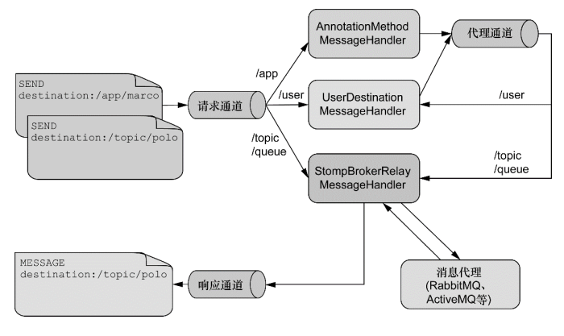
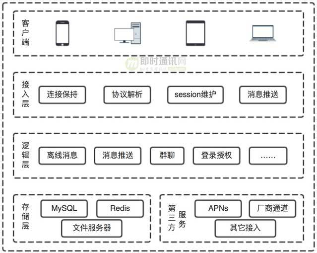
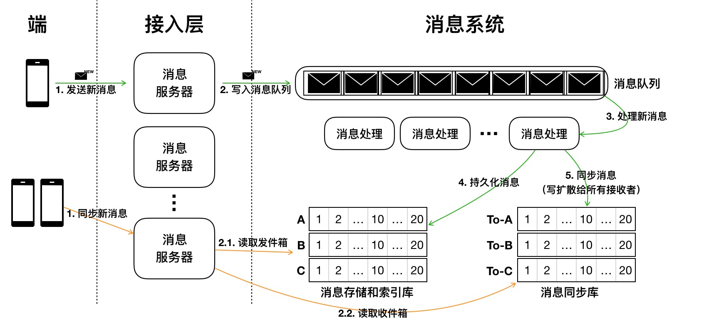

# STOMP & Websocket 

## STOMP
>1，STOMP：Simple (or Streaming) Text Orientated Messaging Protocol，简单(流)文本定向消息协议
>2，基于文本

### 帧结构：三部分
>1，Frame：command，header，body
```
例如：
>>> SEND
transaction:tx-0
destination:/app/marco
content-length:20

{"message":"Marco!"}
```
```
java发送的消息结构
GenericMessage [payload=byte[80], 
                headers={
                    simpMessageType=MESSAGE, contentType=application/json;
                    charset=UTF-8, 
                    simpDestination=/topic/public/100}]
```
```
command：
       1，CONNECT
　　　　2，SEND
　　　　3，SUBSCRIBE
　　　　4，UNSUBSCRIBE
　　　　5，BEGIN
　　　　6，COMMIT
　　　　7，ABORT
　　　　8，ACK
　　　　9，NACK
　　　　10，DISCONNECT
```

>代理: 消息队列管理者. 记录哪些client订阅了哪个destination


### 为什么需要STOMP
>1，常规的websocket连接和普通的TCP基本上没有什么差别的。
>2，那我们如果像http一样加入一些响应和请求层。
>3，所以STOMP在websocket上提供了一中基于帧线路格式（frame-based wire format）。
>4，简单一点，就是在我们的websocket（TCP）上面加了一层协议，使双方遵循这种协议来发送消息。
>5，总的来说，有点类似，http之于TCP，STOMP之于websocket，STOMP使用上更方便了


## java 对于STOMP的概要逻辑

* [在线websocket测试工具]](http://coolaf.com/tool/chattest)


### 源码案例
* [springboot之websocket，stomp协议](https://www.cnblogs.com/ll409546297/p/10655392.html)
* [注解详细](https://www.cnblogs.com/jmcui/p/8999998.html)

```
   如果 @MessageMapping 注解的控制器方法有返回值的话，返回值会被发送到消息代理，只不过会添加上"/topic"前缀。可以使用@SendTo 重写消息目的地；

    如果 @SubscribeMapping 注解的控制器方法有返回值的话，返回值会直接发送到客户端，不经过代理。如果加上@SendTo 注解的话，则要经过消息代理。
/**
 * 消息接收处理
 */
@RestController
public class MessageResource {

    //spring提供的推送方式
    @Autowired
    private SimpMessagingTemplate messagingTemplate;

    /**
     * 广播模式
     * @param requestMsg
     * @return
     */
    @MessageMapping("/broadcast")
    @SendTo("/topic/broadcast")
    public String broadcast(RequestMsg requestMsg) {
        //这里是有return，如果不写@SendTo默认和/topic/broadcast一样
        return "server:" + requestMsg.getBody().toString();
    }

    /**
     * 订阅模式，只是在订阅的时候触发，可以理解为：访问——>返回数据
     * @param id
     * @return
     */
    @SubscribeMapping("/subscribe/{id}")
    public String subscribe(@DestinationVariable Long id) {
        return "success";
    }

    /**
     * 用户模式
     * @param requestMsg
     * @param principal
     */
    @MessageMapping("/one")
    //@SendToUser("/queue/one") 如果存在return,可以使用这种方式
    public void one(RequestMsg requestMsg, Principal principal) {
        //这里使用的是spring的security的认证体系，所以直接使用Principal获取用户信息即可。
        //注意为什么使用queue，主要目的是为了区分广播和队列的方式。实际采用topic，也没有关系。但是为了好理解
        messagingTemplate.convertAndSendToUser(principal.getName(), "/queue/one", requestMsg.getBody());
    }
}
```

```
<!DOCTYPE html>
<html lang="en">
<head>
    <meta charset="UTF-8">
    <title>webSocket</title>
    <script src="js/jquery.js"></script>
    <script src="js/sockjs.min.js"></script>
    <script src="js/stomp.js"></script>
</head>
<body>
    <div>
        <button id="connect">连接</button>
        <button id="disconnect" disabled="disabled">断开</button>
    </div>
    <div>
        <h3>广播形式</h3>
        <button id="broadcastButton">发送</button><input id="broadcastText" type="text">
        <label>广播消息：</label><input id="broadcastMsg" type="text" disabled="disabled">
    </div>
    <div>
        <h3>订阅形式</h3>
        <label>订阅消息：</label><input id="subscribeMsg" type="text" disabled="disabled">
    </div>
    <div>
        <h3>角色形式</h3>
        <button id="userButton">发送</button><input id="userText" type="text">
        <label>用户消息：</label><input id="userMsg" type="text" disabled="disabled">
    </div>
    <div>
        <h3>无APP</h3>
        <button id="appButton">发送</button><input id="appText" type="text">
        <label>前端消息：</label><input id="appMsg" type="text" disabled="disabled">
    </div>
</body>
<script>
    var stomp = null;
    $("#connect").click(function () {
        var url = "http://localhost:8080/webSocket"
        var socket = new SockJS(url);
        stomp = Stomp.over(socket);
        //连接
        stomp.connect({}, function (frame) {
            //订阅广播
            stomp.subscribe("/topic/broadcast", function (res) {
                $("#broadcastMsg").val(res.body);
            });
            //订阅，一般只有订阅的时候在返回
            stomp.subscribe("/app/subscribe/1", function (res) {
                $("#subscribeMsg").val(res.body);
            });
            //用户模式
            stomp.subscribe("/user/queue/one", function (res) {
                $("#userMsg").val(res.body);
            });
            //无APP
            stomp.subscribe("/topic/app", function (res) {
                $("#appMsg").val(res.body);
            });
            setConnect(true);
        });
    });

    $("#disconnect").click(function () {
        if (stomp != null) {
            stomp.disconnect();
        }
        setConnect(false);
    });
    //设置按钮
    function setConnect(connectStatus) {
        $("#connect").attr("disabled", connectStatus);
        $("#disconnect").attr("disabled", !connectStatus);
    }

    //发送广播消息
    $("#broadcastButton").click(function () {
        stomp.send("/app/broadcast", {}, JSON.stringify({"body":$("#broadcastText").val()}))
    });

    //发送用户消息
    $("#userButton").click(function () {
        stomp.send("/app/one", {}, JSON.stringify({"body":$("#userText").val()}))
    });

    //发送web消息
    $("#appButton").click(function () {
        stomp.send("/topic/app", {}, JSON.stringify({"body":$("#appText").val()}))
    });
</script>
</html>

```


# IM
>1，局域网内：P2P
>2，互联网IM：服务器中转。离线消息，群组，聊天室

## 序列化和反序列化

## 保活，以及失活之后的逻辑
>1，心跳包，在空闲时间发送

>2，message id
>3，去重
>4，文件上传
>5，内容，序列化，加密


### 消息同步

### 消息存储

### 消息检索

### 离线，在线

### 先存储后同步，还是先同步后存储，消息索引


### 消息发送接收，需要ack确认吗

### 多端同步是什么意思？


### stomp 是怎么实现，不给自己重复发的

### 消息结构
message struct{
    message_id，
    room_id,
    from_user_info,
    to_user_info, //
    type,//广播（平台所有链接的用户都传），单播（一对一单聊，聊天室单聊），组播（聊天室或直播间的广播）
    message_type,//1,文本 2，xxx
    message_content,//是一个消息结构
    timestamp,
}



>1，端：作为消息的发送和接收端，通过连接消息服务器来发送和接收消息。
消息服务器：一组无状态的服务器，可水平扩展，处理消息的发送和接收请求，连接后端消息系统。
>2，消息队列：新写入消息的缓冲队列，消息系统的前置消息存储，用于削峰填谷以及异步消费。
>3,消息处理：一组无状态的消费处理服务器，用于异步消费消息队列中的消息数据，处理消息的持久化和写扩散同步。
>4，消息存储和索引库：持久化存储消息，每个会话对应一个 Timeline 进行消息存储，存储的消息建立索引来实现消息检索。
>5，消息同步库：写扩散形式同步消息，每个用户的收件箱对应一个 Timeline，同步库内消息不需要永久保存，通常对消息设定一个生命周期。
新消息会由端发出，通常消息体中会携带消息 ID（用于去重）、逻辑时间戳（用于排序）、消息类型（控制消息、图片消息或者文本消息等）、消息体等内容。消息会先写入消息队列，作为底层存储的一个临时缓冲区。消息队列中的消息会由消息处理服务器消费，可以允许乱序消费。消息处理服务器对消息先存储后同步，先写入发件箱 Timeline（存储库），后写扩散至各个接收端的收件箱（同步库）。消息数据写入存储库后，会被近实时的构建索引，索引包括文本消息的全文索引以及多字段索引（发送方、消息类型等）。


### 如何选协议
#### 1 XMPP
>1，优点：协议开源，可拓展性强，在各个端(包括服务器)有各种语言的实现，开发者接入方便；
>2，缺点：缺点也是不少，XML表现力弱、有太多冗余信息、流量大，实际使用时有大量天坑。XMPP使用的是XML这种格式来传递数据

#### 2 SIP
>1，SIP协议多用于VOIP相关的模块，是一种文本协议，由于我并没有实际用过，所以不做评论，但从它是文本协议这一点几乎可以断定它的流量不会小。

#### 3 MQTT
>1，优点：协议简单，流量少；
>2，缺点：它并不是一个专门为IM设计的协议，多使用于推送。

>IBM和St. Jude 医疗中心通过MQTT开发了一套Merlin系统，该系统使用了用于家庭保健的传感器。St. Jude医疗中心设计了一个叫做Merlin@home的心脏装置，这种无线发射器可以用来监控那些已经植入复律-除颤器和起搏器（两者都是基本的传感器）的心脏病人。该产品利用MQTT把病人的即时更新信息传给医生/医院，然后医院进行保存。这样的话，病人就不用亲自去医院检查心脏仪器了，医生可以随时查看病人的数据，给出建议，病人在家里就可以自行检查
>主流的MQTT是基于TCP连接进行数据推送的，但是同样有基于UDP的版本，叫做MQTT-SN
>小型传输，开销很小（固定长度的头部是2字节），协议交换最小化，以降低网络流量

* [详解MQTT协议](http://www.52im.net/thread-318-1-1.html)

#### 4 私有协议
>1，市面上几乎所有主流IM APP都是是使用私有协议，一个被良好设计的私有协议优点非常明显。
>2，优点：高效，节约流量(一般使用二进制协议)，安全性高，难以破解；
>3，缺点：在开发初期没有现有样列可以参考，对于设计者的要求比较高。
>4，websocket ，socket.io

#### 有三种消息发布服务质量
>1，至多一次，可能消息丢失
>2，至少一次，可能消息重复
>3，只有一次，要求高

##### 主流推送方案
>1，APNS（Apple Push Notification Service）和GCM（Google Cloud Messaging）：APNS和GCM是iOS和Android两大阵营提出的官方推送方案，这两者的技术架构较为相似。都是由系统来统一的维护一个长连接，所有的APP统一发送心跳和接收推送。
>2，XMPP
>3，MQTT
>4，HTTP轮询
>5，第三方推送：友盟，极光，个推等

##### UDP协议包最大数据量
>1.局域网环境下，建议将UDP数据控制在1472字节以下：以太网(Ethernet)数据帧的长度必须在46-1500字节之间,这是由以太网的物理特性决定的，这个1500字节被称为链路层的MTU(最大传输单元)。MTU指的是链路层的数据区，并不包括链路层的首部和尾部的18个字节。所以，事实上这个1500字节就是网络层IP数据报的长度限制。因为IP数据报的首部为20字节，所以IP数据报的数据区长度最大为1480字节。UDP数据报的首部8字节，所以UDP数据报的数据区最大长度为1472字节
>2，当我们发送的UDP数据大于1472的时候会怎样呢？ 这也就是说IP数据报大于1500字节，大于MTU，这个时候发送方IP层就需要分片(fragmentation)。把数据报分成若干片，使每一片都小于MTU，而接收方IP层则需要进行数据报的重组。这样就会多做许多事情，而更严重的是，由于UDP的特性，当某一片数据传送中丢失时，接收方无法重组数据报，将导致丢弃整个UDP数据报。
>3，Internet编程时，建议将UDP数据控制在548字节以下:因为Internet上的路由器可能会将MTU设为不同的值。如果我们假定MTU为1500来发送数据，而途经的某个网络的MTU值小于1500字节，那么系统将会使用一系列的机制来调整MTU值，使数据报能够顺利到达目的地，这样就会做许多不必要的操作。鉴于Internet上的标准MTU值为576字节，所以我建议在进行Internet的UDP编程时， 最好将UDP的数据长度控件在548字节(576-8-20)以内。

#### 5 结论
>1,一个好的协议需要满足如下条件:高效，简洁，可读性好，节约流量，易于拓展，同时又能够匹配当前团队的技术堆栈。基于如上原则，我们可以得出:如果团队小，团队技术在IM上积累不够可以考虑使用XMPP或者MQTT+HTTP短连接的实现。反之可以考虑自己设计和实现私有协议。


### websocket ，ws，wss
>1，WS协议和WSS协议两个均是WebSocket协议的SCHEM，两者一个是非安全的，一个是安全的。也是统一的资源标志符。就好比HTTP协议和HTTPS协议的差别。非安全的没有证书，安全的需要SSL证书

>2，WS一般默认是80端口，而WSS默认是443端口     

* [springboot里websocket--重要](https://juejin.im/post/6844903976727494669#heading-17)