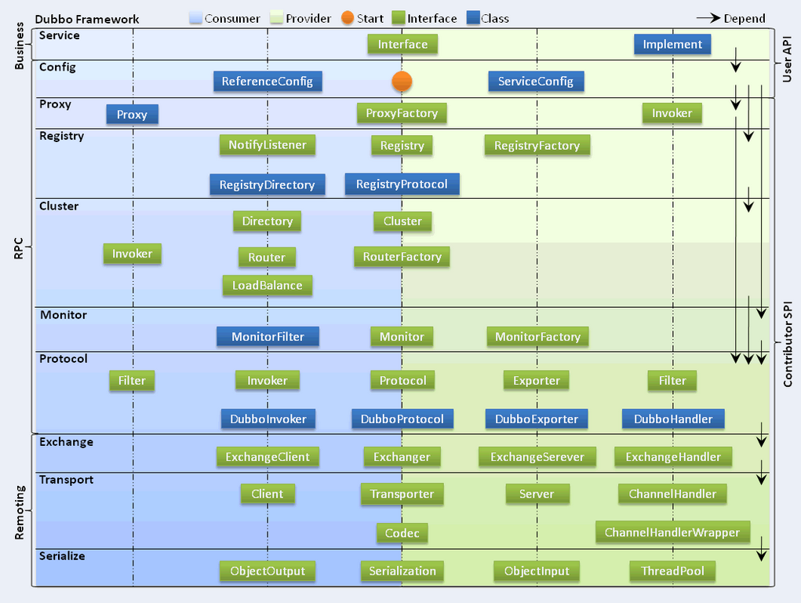
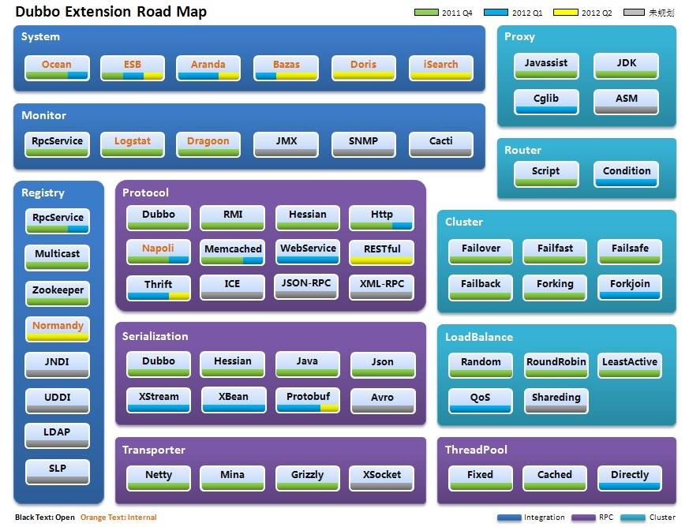
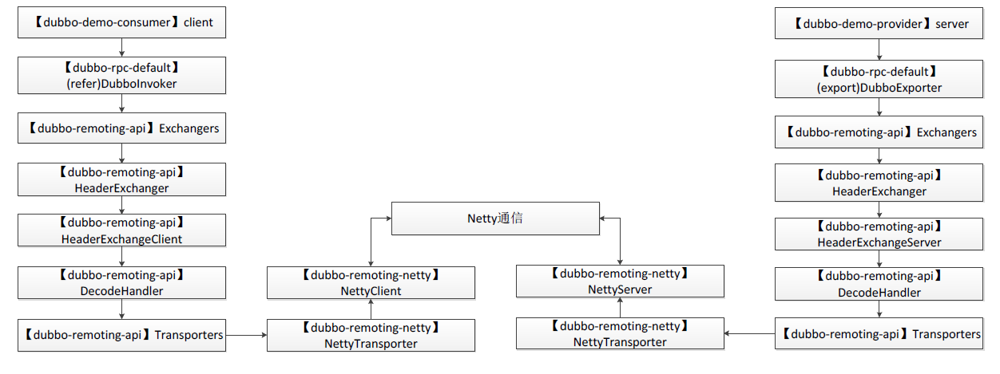
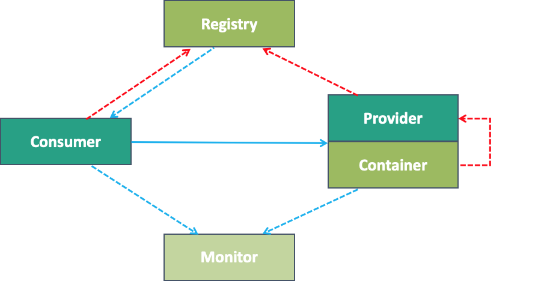
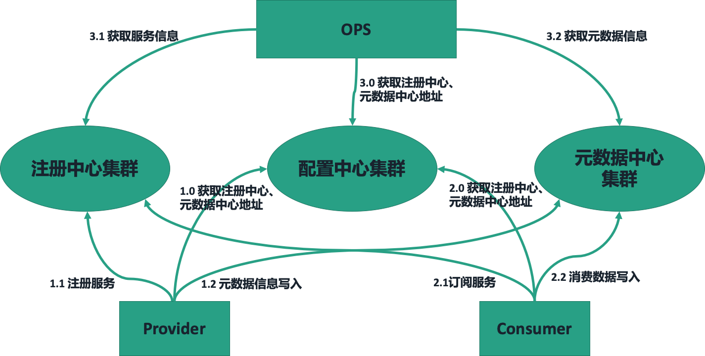
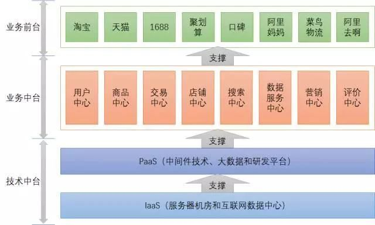

# dubbo & nacos

## 备注
>1，理解ExtensionLoader是理解Dubbo的SPI的基础，也是理解Dubbo扩展机制的基础 参照：[Dubbo SPI机制详解](https://www.jianshu.com/p/a72856c77b6a)

## 重要链接
* [dubbo官网文档](http://dubbo.apache.org/zh-cn/docs/user/quick-start.html)
* [负载均衡算法](https://juejin.im/post/5ee8a2e351882543216f1d9a)
* [如何参与开源项目-fork代码到自己仓库，修改，自测，pull request（注意符号格式等），等待结果](https://juejin.im/post/5d59efaff265da03e1687650)
* [service mesh](https://zhuanlan.zhihu.com/p/61901608)





## Javassist实现JDK动态代理
>1，Java 字节码以二进制的形式存储在 class 文件中，每一个 class 文件包含一个 Java 类或接口。Javaassist 就是一个用来处理 Java 字节码的类库
``` 
public class Hello {
    public void say() {
        System.out.println("Hello");
    }
}

public class Test {
    public static void main(String[] args) throws Exception {
        ClassPool cp = ClassPool.getDefault();
        CtClass cc = cp.get("Hello");
        CtMethod m = cc.getDeclaredMethod("say");
        m.insertBefore("{ System.out.println(\"Hello.say():\"); }");
        Class c = cc.toClass();
        Hello h = (Hello)c.newInstance();
        h.say();
    }
}
``` 
>2，注意：上面的程序要正常运行，Hello 类在调用 toClass() 之前不能被加载。 如果 JVM 在 toClass() 调用之前加载了原始的 Hello 类，后续加载修改的 Hello 类将会失败（LinkageError 抛出）。
例如，如果 Test 中的 main() 是这样的
``` 
public static void main(String[] args) throws Exception {
    Hello orig = new Hello();//那么，原始的 Hello 类在 main 的第一行被加载，toClass() 调用会抛出一个异常，因为类加载器不能同时加载两个不同版本的 Hello 类
    ClassPool cp = ClassPool.getDefault();
    CtClass cc = cp.get("Hello");
        :
}
``` 

* [讲了一下类加载器](https://www.jianshu.com/p/43424242846b)


## dubbo处理过程
>dubbo的启动入口： org.apache.dubbo.container ，结合官网上的框架，第0个步骤就是container的启动



### 注解

#### 只有标注了@Adaptive注释的函数会在运行时动态的决定扩展点实现

#### @SPI

##### JDK ServiceLoader：share/classes/java/lang/util/ServiceLoader.java

* [SPI & ServiceLoader](https://juejin.im/post/5de37b5551882520aa66c80c)
>动态加载类

## nacos本地缓存，Nacos Server宕机后，Consumer依旧可以调用成功

## java SPI & Dubbo SPI：service provider interface
>1，一种服务发现机制。SPI 的本质是将接口实现类的全限定名配置在文件中（META-INF/services/），并由服务加载器读取配置文件，加载实现类

## JDK 标准的 SPI 扩展机制，参见：java.util.ServiceLoader

## API（application programming interface） & SPI
>1，一个是使用者，一个是扩展者。API (Application Programming Interface) 是给使用者用的，而 SPI (Service Provide Interface) 是给扩展者用的。在设计时，尽量把它们隔离开，而不要混在一起。也就是说，使用者是看不到扩展者写的实现的

## dubbo基于zookeeper构建
>1，zookeeper解决分布式系统中一致性问题

## 默认情况下，Dubbo 使用 Netty 作为底层的通信框架
>1，netty和tomcat


* [netty概要讲解](https://www.jianshu.com/p/b9f3f6a16911)

## 日志：严格约定WARN、ERROR级别记录的内容
>1，WARN 表示可以恢复的问题，无需人工介入。
>2，ERROR 表示需要人工介入问题

## 异常信息给出解决方案

## 微核心+插件式:OCP原则
>1，OPC：一个软件实体如类、模块和函数应该对扩展开放，对修改关闭。开闭原则（Open Closed Principle）是Java世界里最基础的设计原则，它指导我们如何建立一个稳定的、灵活的系统


### @SPI & @Adaptive
>1. 在类上加上@Adaptive注解的类，是最为明确的创建对应类型Adaptive类。所以他优先级最高。2. @SPI注解中的value是默认值，如果通过URL获取不到关于取哪个类作为Adaptive类的话，就使用这个默认值，当然如果URL中可以获取到，就用URL中的。3. 可以再方法上增加@Adaptive注解，注解中的value与链接中的参数的key一致，链接中的key对应的value就是spi中的name,获取相应的实现类

``` 
resource文件加下的配置：
dubbo=shuqi.dubbotest.spi.adaptive.DubboAdaptiveExt2
cloud=shuqi.dubbotest.spi.adaptive.SpringCloudAdaptiveExt2
thrift=shuqi.dubbotest.spi.adaptive.ThriftAdaptiveExt2

@SPI("dubbo")
public interface AdaptiveExt2 {   
    @Adaptive({"t"})
    String echo(String msg, URL url);
}
测试：
    @Test
    public void test1() {
        ExtensionLoader<AdaptiveExt2> loader = ExtensionLoader.getExtensionLoader(AdaptiveExt2.class);
        AdaptiveExt2 adaptiveExtension = loader.getAdaptiveExtension();
        URL url = URL.valueOf("test://localhost/test?t=cloud");
        System.out.println(adaptiveExtension.echo("d", url));
    }
结果：
    cloud
``` 

### 属性配置优先级
>1，方法 > 接口 > 全局
>2，同级别下消费 > 生产
>3，默认超时是1s，如果不显示声明，消费端就会按照服务端的配置时长操作
>4，同时配置了 XML 和 properties 文件，则 properties 中的配置无效，只有 XML 没有配置时，properties 才生效。


## 阅读技术分享
* [阿里技术专家详解 Dubbo 实践，演进及未来规划](https://www.infoq.cn/article/iwzcap3jo_h5fjfbwozu)
  
>注册中心成为瓶颈：减少网格式NxM的信息推送量，服务分组
>应用级维度和服务级维度？
>CAP 理论：现在大部分主流而且在使用中的注册中心都是满足 CP 的，但是在互联网大集群环境下，期望的结果是满足 AP 的同时，能够满足最终一致性。在大集群环境下，可用性往往比强一致性的优先级更高
>Eureka 是一个 AP 的应用，而且它是去中心化的。但是它有几点不足：1，性能；2，应用维度的服务注册，需要改造成服务维度的注册 
>Consul 是一个比较专业的服务注册中心，但是性能是稍微差一点，且是要求数据的强一致性而牺牲部分可用性
>Etcd 是 Zookeeper 的升级版，它参考了 Zookeeper 的很多实现，同时进行了较多优化
>Nacos，去中心化，满足AP以及最终一致性，性能和Zookeeper相近

>为什么Zookeeper 作为服务注册中心的公司在减少？因为Zookeeper是leader机制，是单点中心化，而且leader选举耗时很长且期间对外不可用
>服务变更通知机制？能够控制变更通知的频率，合并变更通知，以减少网络数据

>Dubbo 路由规则，按照覆盖范围可分为应用级别，服务级别，方法级别路由规则；按照功能纬度，可以分为黑名单，条件路由 ，TAG 路由规则。大部分路由需求都是可以通过组合来实现的，如应用级的黑名单可以通过应用级别+黑名单路由规则方式组合

>全链路灰度发布:



   

## 中台
>1,核心本质是服务共享（一组可复用的服务），目标是支持前台的快速创新或试错，而实现的手段是微服务架构、敏捷基础设施和公共基础服务
>2，来自阿里官方的定义：
企业中台就是，将企业的核心能力随着业务不断发展以数字化形式沉淀到平台，形成以服务为中心，由业务中台和数据中台构建起数据闭环运转的运营体系，供企业更高效的进行业务探索和创新，实现以数字化资产的形态构建企业核心差异化竞争力。
>结论：1、中台架构，简单地说，就是企业级能力的复用，一个种方法论，企业治理思想。
>2、微服务，是可独立开发、维护、部署的小型业务单元，是一种技术架构方式。
>3、中台并不是微服务，中台是一种企业治理思想和方法论，微服务是技术架构方式。
>4、中台化的落地，需要使用微服务架构，通过微服务架构搭建中台架构所需要的原子服务，其核心是服务设计的原则和思想





>1，服务有多个不同的版本
>2，只订阅
>3，只注册
>4，灰度测试
>5，多注册中心
>6，多协议机制
>7，负载均衡：权重随机，权重轮询，最少活跃，一致性hash
>8，直连服务提供者
>9，集群容错：failover，failfast，failsafe，failback，forking，broadcast


##

模块 | 功能点 
---------|----------
dubbo-common模块|公共模块，提供了Dubbo SPI的实现、时间轮的实现、动态编译等通用的功能
dubbo-remoting模块|远程通信模块，其中，dubbo-remoting-api是对整个模块的核心抽象，其他子模块基于其他开源框架对dubbo-remoting-api进行实现
dubbo-rpc模块|RPC模块，依赖dubbo-remoting模块。其中，dubbo-remoting-api是整个dubbo-rpc模块的核心抽象，其他模块是对dubbo-remoting-api的实现
dubbo-registry模块|与注册中心交互的模块。其中dubbo-registry-api是整个dubbo-registry的核心抽象，其他模块是对dubbo-registry-api的具体实现
dubbo-config模块|解析对外暴露的配置的模块。其中，dubbo-config-api 子模块负责处理以API 方式使用Dubbo时的相关配置，dubbo-config-spring 子模块负责处理与 Spring 集成使用时的相关配置方式
dubbo-metadata模块|元数据模块。其中，dubbo-metadata-api是对整个dubbo-metadata的抽象，其他模块是对dubbo-metadata-api的实现
dubbo-configcenter模块|配置中心模块，其中，提供了多种服务发现的方式并接入了多种服务发现组件
dubbo-monitor模块|主要用于统计服务调用次数、调用时间以及实现调用链跟踪的服务
dubbo-cluster模块|集群管理模块，主要提供负载均衡、容错、路由等功能

### 服务路由
>1，Dubbo 一共有三种路由分别是：条件路由 ConditionRouter、脚本路由 ScriptRouter 和标签路由 TagRouter


## kill 之前先 dump
``` 
JAVA_HOME=/usr/java  
OUTPUT_HOME=~/output  
DEPLOY_HOME=`dirname $0`  
HOST_NAME=`hostname`  
  
DUMP_PIDS=`ps  --no-heading -C java -f --width 1000 | grep "$DEPLOY_HOME" |awk '{print $2}'`  
if [ -z "$DUMP_PIDS" ]; then  
    echo "The server $HOST_NAME is not started!"  
    exit 1;  
fi  
  
DUMP_ROOT=$OUTPUT_HOME/dump  
if [ ! -d $DUMP_ROOT ]; then  
    mkdir $DUMP_ROOT  
fi  
  
DUMP_DATE=`date +%Y%m%d%H%M%S`  
DUMP_DIR=$DUMP_ROOT/dump-$DUMP_DATE  
if [ ! -d $DUMP_DIR ]; then  
    mkdir $DUMP_DIR  
fi  
  
echo -e "Dumping the server $HOST_NAME ...\c"  
for PID in $DUMP_PIDS ; do  
    $JAVA_HOME/bin/jstack $PID > $DUMP_DIR/jstack-$PID.dump 2>&1  
    echo -e ".\c"  
    $JAVA_HOME/bin/jinfo $PID > $DUMP_DIR/jinfo-$PID.dump 2>&1  
    echo -e ".\c"  
    $JAVA_HOME/bin/jstat -gcutil $PID > $DUMP_DIR/jstat-gcutil-$PID.dump 2>&1  
    echo -e ".\c"  
    $JAVA_HOME/bin/jstat -gccapacity $PID > $DUMP_DIR/jstat-gccapacity-$PID.dump 2>&1  
    echo -e ".\c"  
    $JAVA_HOME/bin/jmap $PID > $DUMP_DIR/jmap-$PID.dump 2>&1  
    echo -e ".\c"  
    $JAVA_HOME/bin/jmap -heap $PID > $DUMP_DIR/jmap-heap-$PID.dump 2>&1  
    echo -e ".\c"  
    $JAVA_HOME/bin/jmap -histo $PID > $DUMP_DIR/jmap-histo-$PID.dump 2>&1  
    echo -e ".\c"  
    if [ -r /usr/sbin/lsof ]; then  
    /usr/sbin/lsof -p $PID > $DUMP_DIR/lsof-$PID.dump  
    echo -e ".\c"  
    fi  
done  
if [ -r /usr/bin/sar ]; then  
/usr/bin/sar > $DUMP_DIR/sar.dump  
echo -e ".\c"  
fi  
if [ -r /usr/bin/uptime ]; then  
/usr/bin/uptime > $DUMP_DIR/uptime.dump  
echo -e ".\c"  
fi  
if [ -r /usr/bin/free ]; then  
/usr/bin/free -t > $DUMP_DIR/free.dump  
echo -e ".\c"  
fi  
if [ -r /usr/bin/vmstat ]; then  
/usr/bin/vmstat > $DUMP_DIR/vmstat.dump  
echo -e ".\c"  
fi  
if [ -r /usr/bin/mpstat ]; then  
/usr/bin/mpstat > $DUMP_DIR/mpstat.dump  
echo -e ".\c"  
fi  
if [ -r /usr/bin/iostat ]; then  
/usr/bin/iostat > $DUMP_DIR/iostat.dump  
echo -e ".\c"  
fi  
if [ -r /bin/netstat ]; then  
/bin/netstat > $DUMP_DIR/netstat.dump  
echo -e ".\c"  
fi  
echo "OK!"
``` 