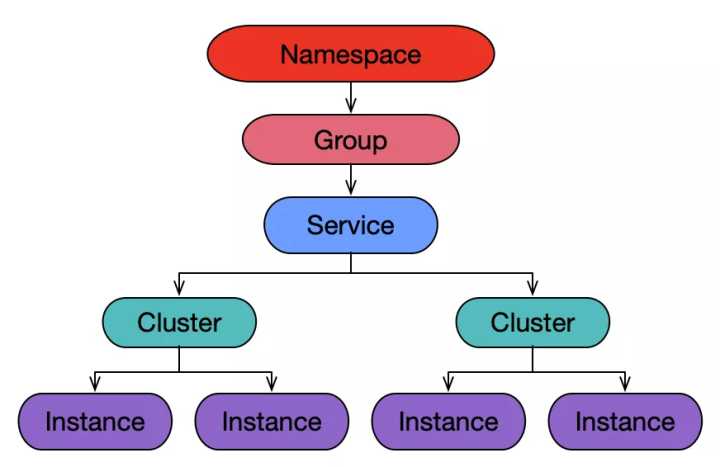

# dubbo & nacos

## 备注
>1，理解ExtensionLoader是理解Dubbo的SPI的基础，也是理解Dubbo扩展机制的基础 参照：[Dubbo SPI机制详解](https://www.jianshu.com/p/a72856c77b6a)

## 重要链接
* [dubbo官网文档](http://dubbo.apache.org/zh-cn/docs/user/quick-start.html)
* [负载均衡算法](https://juejin.im/post/5ee8a2e351882543216f1d9a)
* [如何参与开源项目-fork代码到自己仓库，修改，自测，pull request（注意符号格式等），等待结果](https://juejin.im/post/5d59efaff265da03e1687650)
* [service mesh](https://zhuanlan.zhihu.com/p/61901608)


## Javassist实现JDK动态代理
>1，Java 字节码以二进制的形式存储在 class 文件中，每一个 class 文件包含一个 Java 类或接口。Javaassist 就是一个用来处理 Java 字节码的类库
``` 
public class Hello {
    public void say() {
        System.out.println("Hello");
    }
}

public class Test {
    public static void main(String[] args) throws Exception {
        ClassPool cp = ClassPool.getDefault();
        CtClass cc = cp.get("Hello");
        CtMethod m = cc.getDeclaredMethod("say");
        m.insertBefore("{ System.out.println(\"Hello.say():\"); }");
        Class c = cc.toClass();
        Hello h = (Hello)c.newInstance();
        h.say();
    }
}
``` 
>2，注意：上面的程序要正常运行，Hello 类在调用 toClass() 之前不能被加载。 如果 JVM 在 toClass() 调用之前加载了原始的 Hello 类，后续加载修改的 Hello 类将会失败（LinkageError 抛出）。
例如，如果 Test 中的 main() 是这样的
``` 
public static void main(String[] args) throws Exception {
    Hello orig = new Hello();//那么，原始的 Hello 类在 main 的第一行被加载，toClass() 调用会抛出一个异常，因为类加载器不能同时加载两个不同版本的 Hello 类
    ClassPool cp = ClassPool.getDefault();
    CtClass cc = cp.get("Hello");
        :
}
``` 

* [讲了一下类加载器](https://www.jianshu.com/p/43424242846b)


## dubbo处理过程
>dubbo的启动入口： org.apache.dubbo.container ，结合官网上的框架，第0个步骤就是container的启动


### 注解

#### 只有标注了@Adaptive注释的函数会在运行时动态的决定扩展点实现

#### @SPI

##### JDK ServiceLoader：share/classes/java/lang/util/ServiceLoader.java

* [SPI & ServiceLoader](https://juejin.im/post/5de37b5551882520aa66c80c)
>动态加载类

## nacos本地缓存，Nacos Server宕机后，Consumer依旧可以调用成功

## java SPI & Dubbo SPI：service provider interface
>1，一种服务发现机制。SPI 的本质是将接口实现类的全限定名配置在文件中（META-INF/services/），并由服务加载器读取配置文件，加载实现类

## JDK 标准的 SPI 扩展机制，参见：java.util.ServiceLoader

## API（application programming interface） & SPI
>1，一个是使用者，一个是扩展者。API (Application Programming Interface) 是给使用者用的，而 SPI (Service Provide Interface) 是给扩展者用的。在设计时，尽量把它们隔离开，而不要混在一起。也就是说，使用者是看不到扩展者写的实现的

## dubbo基于zookeeper构建
>1，zookeeper解决分布式系统中一致性问题

## 默认情况下，Dubbo 使用 Netty 作为底层的通信框架
>1，netty和tomcat


* [netty概要讲解](https://www.jianshu.com/p/b9f3f6a16911)

## 日志：严格约定WARN、ERROR级别记录的内容
>1，WARN 表示可以恢复的问题，无需人工介入。
>2，ERROR 表示需要人工介入问题

## 异常信息给出解决方案

## 微核心+插件式:OCP原则
>1，OPC：一个软件实体如类、模块和函数应该对扩展开放，对修改关闭。开闭原则（Open Closed Principle）是Java世界里最基础的设计原则，它指导我们如何建立一个稳定的、灵活的系统


### @SPI & @Adaptive
>1. 在类上加上@Adaptive注解的类，是最为明确的创建对应类型Adaptive类。所以他优先级最高。2. @SPI注解中的value是默认值，如果通过URL获取不到关于取哪个类作为Adaptive类的话，就使用这个默认值，当然如果URL中可以获取到，就用URL中的。3. 可以再方法上增加@Adaptive注解，注解中的value与链接中的参数的key一致，链接中的key对应的value就是spi中的name,获取相应的实现类

``` 
resource文件加下的配置：
dubbo=shuqi.dubbotest.spi.adaptive.DubboAdaptiveExt2
cloud=shuqi.dubbotest.spi.adaptive.SpringCloudAdaptiveExt2
thrift=shuqi.dubbotest.spi.adaptive.ThriftAdaptiveExt2

@SPI("dubbo")
public interface AdaptiveExt2 {   
    @Adaptive({"t"})
    String echo(String msg, URL url);
}
测试：
    @Test
    public void test1() {
        ExtensionLoader<AdaptiveExt2> loader = ExtensionLoader.getExtensionLoader(AdaptiveExt2.class);
        AdaptiveExt2 adaptiveExtension = loader.getAdaptiveExtension();
        URL url = URL.valueOf("test://localhost/test?t=cloud");
        System.out.println(adaptiveExtension.echo("d", url));
    }
结果：
    cloud
``` 

### 属性配置优先级
>1，方法 > 接口 > 全局
>2，同级别下消费 > 生产
>3，默认超时是1s，如果不显示声明，消费端就会按照服务端的配置时长操作
>4，同时配置了 XML 和 properties 文件，则 properties 中的配置无效，只有 XML 没有配置时，properties 才生效。


## 阅读技术分享
* [阿里技术专家详解 Dubbo 实践，演进及未来规划](https://www.infoq.cn/article/iwzcap3jo_h5fjfbwozu)
  
>注册中心成为瓶颈：减少网格式NxM的信息推送量，服务分组
>应用级维度和服务级维度？
>CAP 理论：现在大部分主流而且在使用中的注册中心都是满足 CP 的，但是在互联网大集群环境下，期望的结果是满足 AP 的同时，能够满足最终一致性。在大集群环境下，可用性往往比强一致性的优先级更高
>Eureka 是一个 AP 的应用，而且它是去中心化的。但是它有几点不足：1，性能；2，应用维度的服务注册，需要改造成服务维度的注册 
>Consul 是一个比较专业的服务注册中心，但是性能是稍微差一点，且是要求数据的强一致性而牺牲部分可用性
>Etcd 是 Zookeeper 的升级版，它参考了 Zookeeper 的很多实现，同时进行了较多优化
>Nacos，去中心化，满足AP以及最终一致性，性能和Zookeeper相近

>为什么Zookeeper 作为服务注册中心的公司在减少？因为Zookeeper是leader机制，是单点中心化，而且leader选举耗时很长且期间对外不可用
>服务变更通知机制？能够控制变更通知的频率，合并变更通知，以减少网络数据

>Dubbo 路由规则，按照覆盖范围可分为应用级别，服务级别，方法级别路由规则；按照功能纬度，可以分为黑名单，条件路由 ，TAG 路由规则。大部分路由需求都是可以通过组合来实现的，如应用级的黑名单可以通过应用级别+黑名单路由规则方式组合

>全链路灰度发布:


   

## 中台
>1,核心本质是服务共享（一组可复用的服务），目标是支持前台的快速创新或试错，而实现的手段是微服务架构、敏捷基础设施和公共基础服务
>2，来自阿里官方的定义：
企业中台就是，将企业的核心能力随着业务不断发展以数字化形式沉淀到平台，形成以服务为中心，由业务中台和数据中台构建起数据闭环运转的运营体系，供企业更高效的进行业务探索和创新，实现以数字化资产的形态构建企业核心差异化竞争力。
>结论：1、中台架构，简单地说，就是企业级能力的复用，一个种方法论，企业治理思想。
>2、微服务，是可独立开发、维护、部署的小型业务单元，是一种技术架构方式。
>3、中台并不是微服务，中台是一种企业治理思想和方法论，微服务是技术架构方式。
>4、中台化的落地，需要使用微服务架构，通过微服务架构搭建中台架构所需要的原子服务，其核心是服务设计的原则和思想


>1，服务有多个不同的版本
>2，只订阅
>3，只注册
>4，灰度测试
>5，多注册中心
>6，多协议机制
>7，负载均衡：权重随机，权重轮询，最少活跃，一致性hash
>8，直连服务提供者
>9，集群容错：failover，failfast，failsafe，failback，forking，broadcast


##

模块 | 功能点 
---------|----------
dubbo-common模块|公共模块，提供了Dubbo SPI的实现、时间轮的实现、动态编译等通用的功能
dubbo-remoting模块|远程通信模块，其中，dubbo-remoting-api是对整个模块的核心抽象，其他子模块基于其他开源框架对dubbo-remoting-api进行实现
dubbo-rpc模块|RPC模块，依赖dubbo-remoting模块。其中，dubbo-remoting-api是整个dubbo-rpc模块的核心抽象，其他模块是对dubbo-remoting-api的实现
dubbo-registry模块|与注册中心交互的模块。其中dubbo-registry-api是整个dubbo-registry的核心抽象，其他模块是对dubbo-registry-api的具体实现
dubbo-config模块|解析对外暴露的配置的模块。其中，dubbo-config-api 子模块负责处理以API 方式使用Dubbo时的相关配置，dubbo-config-spring 子模块负责处理与 Spring 集成使用时的相关配置方式
dubbo-metadata模块|元数据模块。其中，dubbo-metadata-api是对整个dubbo-metadata的抽象，其他模块是对dubbo-metadata-api的实现
dubbo-configcenter模块|配置中心模块，其中，提供了多种服务发现的方式并接入了多种服务发现组件
dubbo-monitor模块|主要用于统计服务调用次数、调用时间以及实现调用链跟踪的服务
dubbo-cluster模块|集群管理模块，主要提供负载均衡、容错、路由等功能

### 服务路由
>1，Dubbo 一共有三种路由分别是：条件路由 ConditionRouter、脚本路由 ScriptRouter 和标签路由 TagRouter


## nacos


### 核心功能
>1,服务注册：Nacos Client 会通过发送 REST 请求的方式向 Nacos Server 注册自己的服务，提供自身的元数据，比如 ip 地址、端口等信息。Nacos Server 接收到注册请求后，就会把这些元数据信息存储在一个双层的内存 Map 中。
>2,服务心跳：在服务注册后，Nacos Client 会维护一个定时心跳来持续通知 Nacos Server，说明服务一直处于可用状态，防止被剔除。默认 5s 发送一次心跳。
>3,服务同步：Nacos Server 集群之间会互相同步服务实例，用来保证服务信息的一致性。
>4,服务发现：服务消费者（Nacos Client）在调用服务提供者的服务时，会发送一个 REST 请求给 Nacos Server，获取上面注册的服务清单，并且缓存在 Nacos Client 本地，同时会在 Nacos Client 本地开启一个定时任务定时拉取服务端最新的注册表信息更新到本地缓存。
>5,服务健康检查：Nacos Server 会开启一个定时任务用来检查注册服务实例的健康情况，对于超过 15s 没有收到客户端心跳的实例会将它的 healthy 属性置为 false(客户端服务发现时不会发现)，如果某个实例超过 30 秒没有收到心跳，直接剔除该实例(被剔除的实例如果恢复发送心跳则会重新注册)。

* [nacos源码简要讲解-不错](https://zhuanlan.zhihu.com/p/70478036)


>核心内容就集中在nacos-console，nacos-naming，nacos-config,再借助nacos-examples促进理解

>请求方是nacos-client，接收方最终都是落到nacos-config服务上，最后使用JdbcTemplate进行数据持久化


### Nacos Server 宕机后，Consumer 依旧可以调用成功
>1，Nacos 本地缓存的作用：当应用与服务注册中心发生网络分区或服务注册中心完全宕机后，应用进行了重启操作，内存里没有数据，此时应用可以通过读取本地缓存文件的数据来获取到最后一次订阅到的内容
>2，可以在本机的 **/home/${user}/​nacos/naming/** （qa环境下/home/appuser/nacos/naming/public 有根据service分的文件，内容如下）下看到各个命名空间发布的所有服务的信息，其内容格式如下：

```
{"metadata":{},"dom":"DEFAULT_GROUP@@main-service","cacheMillis":10000,"useSpecifiedURL":false,"hosts":[{"valid":true,"marked":false,"metadata":{"dubbo.metadata-service.urls":"[ \"dubbo://10.147.28.11:20882/com.alibaba.cloud.dubbo.service.DubboMetadataService?anyhost=true&application=main-service&bind.ip=10.147.28.11&bind.port=20882&deprecated=false&dubbo=2.0.2&dynamic=true&generic=false&group=main-service&heartbeat=10000&interface=com.alibaba.cloud.dubbo.service.DubboMetadataService&methods=getAllServiceKeys,getServiceRestMetadata,getExportedURLs,getAllExportedURLs&payload=10485760&pid=6103&qos.enable=false&release=2.7.4.1&revision=2.2.0.RELEASE&side=provider&timestamp=1621845964662&version=1.0.0\" ]","dubbo.protocols.dubbo.port":"20882","preserved.register.source":"SPRING_CLOUD"},"instanceId":"10.147.28.11#8090#DEFAULT#DEFAULT_GROUP@@main-service","port":8090,"healthy":true,"ip":"10.147.28.11","clusterName":"DEFAULT","weight":1.0,"ephemeral":true,"serviceName":"DEFAULT_GROUP@@main-service","enabled":true}],"name":"DEFAULT_GROUP@@main-service","checksum":"ba2fd75b5ea964a57613bd2188b868f8","lastRefTime":1621845965710,"env":"","clusters":""}

```
### 为什么 Consumer 重启后，没有按照预期加载本地缓存文件
缓存文件正常，问题只有可能出现在读取缓存文件的逻辑上。

可能是 nacos-client 出了问题
可能是 Dubbo 的 nacos-registry 出了问题
一番排查，在 Nacos 研发的协助下，找到了 naocs-client 的一个参数： namingLoadCacheAtStart ，该配置参数控制启动时是否加载缓存文件，默认值为 false。也就是说，使用 nacos-client，默认是不会加载本地缓存文件的。终于定位到线上问题的原因了：需要手动开启加载本地缓存，才能让 Nacos 加载本地缓存文件。

该参数设置为 true 和 false 的利弊：

设置为 true，认为可用性 & 稳定性优先，宁愿接受可能出错的数据，也不能因为没有数据导致调用完全出错
设置为 false，则认为 Server 的可用性较高，更能够接受没有数据，也不能接受错误的数据

### Istio
>Istio 作为 Service Mesh 解决方案事实上的标准，解决了开发人员和运维人员所面临的从单体应用向分布式微服务架构转变的挑战。Istio 提供了对整个服务网格的行为洞察和操作控制的能力，以及一个完整的满足微服务应用各种需求的解决方案

>MCP实现
MCP为轻松集成外部系统打开了大门。我们可以自己实现一个MCP服务器，并将其和Istio集成起来。MCP服务器提供两个主要功能：

连接并监视外部服务注册系统以获取最新的服务信息（例如Spring Cloud中的Eureka Server和Apache Dubbo的Zookeeper）。
将外部服务信息转换为Istio ServiceEntry并通过MCP资源发布


```
public class ServiceManager implements RecordListener<Service> {

    /**
     * Map<namespace, Map<group::serviceName, Service>>
     */
    private Map<String, Map<String, Service>> serviceMap = new ConcurrentHashMap<>();

    //com.alibaba.nacos.naming.core.Service，Service是包含了Instance，一个Service下有多个Instance，即可组成一个Cluster。

    //service下有
    //private Map<String, Cluster> clusterMap = new HashMap<>();
}
```


* [nacos-大致源码讲解-不错](https://blog.csdn.net/weixin_39890332/article/details/111631748)
  
### 服务下线
>1，InstanceController中可以看到下线接口：delete /nacos/v1/ns/instance
>2,删除掉要下线的instance，把剩余的所有，再更新，如果有集群，还需要基于udp 同步到其他子节点

* [优雅的nacos下线服务实例](https://zhuanlan.zhihu.com/p/346675620)


### 如何做到服务发现和注册
>从提供者（被调用方）的角度看，NACOS是通过定时器来实时更新ServiceInfo，主要业务逻辑是在HostReactor中实现的。与前述的serviceMap不一样，HostReactor中维护的是serviceInfoMap。
```
private Map<String, ServiceInfo> serviceInfoMap; 
```

>从消费者（调用方）的角度来看，集成的starter项目中有个类：NacosServerList，最重要的是继承了AbstractServerList，实现了两个关键的接口方法，相当于是NACOS与Ribbon的对接点。
```
public interface ServerList<T extends Server> {

    public List<T> getInitialListOfServers();
    
    /**
     * Return updated list of servers. This is called say every 30 secs
     * (configurable) by the Loadbalancer's Ping cycle
     * 
     */
    public List<T> getUpdatedListOfServers();   

}
```
>NACOS对于这个两个接口的实现，都使用了getServers方法，而进入到getServers方法体里面，其实就是利用了上述所说的NacosNamingService.selectInstances方法，通过serviceId获取到ServiceInfo对象，然后获取到Service下面的所有有效的Instance。


## nacos 源码阅读

## 注册表

### RaftConsistency
>1，主要存入datums，raft.store 存入磁盘

###
>1,DataStore{ private Map<String, Datum> dataMap = new ConcurrentHashMap<>(1024);}

### 服务注册

>1，在idea左侧看maven：spring-cloud-starter-alibaba-nacos-discovery
>2，找到register模块下有
```
public class NacosAutoServiceRegistration
		extends AbstractAutoServiceRegistration<Registration> {

	@Override
	protected void register() {
		if (!this.registration.getNacosDiscoveryProperties().isRegisterEnabled()) {
			log.debug("Registration disabled.");
			return;
		}
		if (this.registration.getPort() < 0) {
			this.registration.setPort(getPort().get());
		}
		super.register();
	}
}
AbstractAutoServiceRegistration {
public void onApplicationEvent(WebServerInitializedEvent event) {
    this.bind(event);
  }

  /** @deprecated */
  @Deprecated
  public void bind(WebServerInitializedEvent event) {
    ApplicationContext context = event.getApplicationContext();
    if (!(context instanceof ConfigurableWebServerApplicationContext) || !"management".equals(((ConfigurableWebServerApplicationContext)context).getServerNamespace())) {
      this.port.compareAndSet(0, event.getWebServer().getPort());
      this.start();
    }
  }
public void start() {
    if (!this.isEnabled()) {
      if (logger.isDebugEnabled()) {
        logger.debug("Discovery Lifecycle disabled. Not starting");
      }

    } else {
      if (!this.running.get()) {
        this.context.publishEvent(new InstancePreRegisteredEvent(this, this.getRegistration()));
        this.register();//调用
        if (this.shouldRegisterManagement()) {
          this.registerManagement();
        }

        this.context.publishEvent(new InstanceRegisteredEvent(this, this.getConfiguration()));
        this.running.compareAndSet(false, true);
      }

    }
  }

}
```

>3，继而找到spring-cloud-common 下的 AbstractAutoServiceRegistration

```
  protected void register() {
    this.serviceRegistry.register(this.getRegistration());
  }
```
>4，继而定位到spring-cloud-starter-alibaba-nacos-discovery下NacosServiceRegistry


```
public class NacosServiceRegistry implements ServiceRegistry<Registration> {
@Override
	public void register(Registration registration) {

		if (StringUtils.isEmpty(registration.getServiceId())) {
			log.warn("No service to register for nacos client...");
			return;
		}

		String serviceId = registration.getServiceId();
		String group = nacosDiscoveryProperties.getGroup();

		Instance instance = getNacosInstanceFromRegistration(registration);

		try {
            //注册
			namingService.registerInstance(serviceId, group, instance);
			log.info("nacos registry, {} {} {}:{} register finished", group, serviceId,
					instance.getIp(), instance.getPort());
		}
		catch (Exception e) {
			log.error("nacos registry, {} register failed...{},", serviceId,
					registration.toString(), e);
			// rethrow a RuntimeException if the registration is failed.
			// issue : https://github.com/alibaba/spring-cloud-alibaba/issues/1132
			rethrowRuntimeException(e);
		}
	}


private Instance getNacosInstanceFromRegistration(Registration registration) {
		Instance instance = new Instance();
		instance.setIp(registration.getHost());
		instance.setPort(registration.getPort());
		instance.setWeight(nacosDiscoveryProperties.getWeight());
		instance.setClusterName(nacosDiscoveryProperties.getClusterName());
		instance.setMetadata(registration.getMetadata());

		return instance;
	}
}


namingService.registerInstance(serviceId, group, instance)：调用http：
 public void registerInstance(String serviceName, String groupName, Instance instance) throws NacosException {
    if (instance.isEphemeral()) {
      BeatInfo beatInfo = new BeatInfo();
      beatInfo.setServiceName(NamingUtils.getGroupedName(serviceName, groupName));
      beatInfo.setIp(instance.getIp());
      beatInfo.setPort(instance.getPort());
      beatInfo.setCluster(instance.getClusterName());
      beatInfo.setWeight(instance.getWeight());
      beatInfo.setMetadata(instance.getMetadata());
      beatInfo.setScheduled(false);
      long instanceInterval = instance.getInstanceHeartBeatInterval();
      beatInfo.setPeriod(instanceInterval == 0L ? DEFAULT_HEART_BEAT_INTERVAL : instanceInterval);
      //心跳请求
      this.beatReactor.addBeatInfo(NamingUtils.getGroupedName(serviceName, groupName), beatInfo);
    }

    this.serverProxy.registerService(NamingUtils.getGroupedName(serviceName, groupName), groupName, instance);
  }
  /**
    WEB_CONTEXT = "/nacos";
    NACOS_URL_BASE = WEB_CONTEXT + "/v1/ns";
    NACOS_URL_INSTANCE = NACOS_URL_BASE + "/instance";
    NACOS_URL_SERVICE = NACOS_URL_BASE + "/service";
    UtilAndComs.NACOS_URL_BASE + "/instance/beat";//心跳接口 /nacos/v1/ns/instance/beat
**/
  public void registerService(String serviceName, String groupName, Instance instance) throws NacosException {
    LogUtils.NAMING_LOGGER.info("[REGISTER-SERVICE] {} registering service {} with instance: {}", new Object[]{this.namespaceId, serviceName, instance});
    Map<String, String> params = new HashMap(9);
    params.put("namespaceId", this.namespaceId);
    params.put("serviceName", serviceName);
    params.put("groupName", groupName);
    params.put("clusterName", instance.getClusterName());
    params.put("ip", instance.getIp());
    params.put("port", String.valueOf(instance.getPort()));
    params.put("weight", String.valueOf(instance.getWeight()));
    params.put("enable", String.valueOf(instance.isEnabled()));
    params.put("healthy", String.valueOf(instance.isHealthy()));
    params.put("ephemeral", String.valueOf(instance.isEphemeral()));
    params.put("metadata", JSON.toJSONString(instance.getMetadata()));
    this.reqAPI(UtilAndComs.NACOS_URL_INSTANCE, params, (String)"POST");
  }

/**
*api=/nacos/v1/ns/instance
*params=和instance内容差不多，因为是map，拷贝不了内容
*servers=[127.0.0.1:8848]
*method=POST
*/
 public String reqAPI(String api, Map<String, String> params, List<String> servers, String method) {
    params.put("namespaceId", this.getNamespaceId());
    if (CollectionUtils.isEmpty(servers) && StringUtils.isEmpty(this.nacosDomain)) {
      throw new IllegalArgumentException("no server available");
    } else {
      Exception exception = new Exception();
      if (servers != null && !servers.isEmpty()) {
        Random random = new Random(System.currentTimeMillis());
        int index = random.nextInt(servers.size());

        for(int i = 0; i < servers.size(); ++i) {
            //集群节点都同步?
          String server = (String)servers.get(index);

          try {
              //callServer见下面源码，是对http/https请求的封装
            return this.callServer(api, params, server, method);
          } catch (NacosException var11) {
            exception = var11;
            LogUtils.NAMING_LOGGER.error("request {} failed.", server, var11);
          } catch (Exception var12) {
            exception = var12;
            LogUtils.NAMING_LOGGER.error("request {} failed.", server, var12);
          }

          index = (index + 1) % servers.size();
        }

        throw new IllegalStateException("failed to req API:" + api + " after all servers(" + servers + ") tried: " + ((Exception)exception).getMessage());
      } else {
        int i = 0;

        while(i < 3) {
          try {
            return this.callServer(api, params, this.nacosDomain);
          } catch (Exception var13) {
            exception = var13;
            LogUtils.NAMING_LOGGER.error("[NA] req api:" + api + " failed, server(" + this.nacosDomain, var13);
            ++i;
          }
        }

        throw new IllegalStateException("failed to req API:/api/" + api + " after all servers(" + servers + ") tried: " + ((Exception)exception).getMessage());
      }
    }
  }

public String callServer(String api, Map<String, String> params, String curServer, String method) throws NacosException {
    long start = System.currentTimeMillis();
    long end = 0L;
    this.checkSignature(params);
    List<String> headers = this.builderHeaders();
    String url;
    if (!curServer.startsWith("https://") && !curServer.startsWith("http://")) {
      if (!curServer.contains(":")) {
        curServer = curServer + ":" + this.serverPort;
      }

      url = HttpClient.getPrefix() + curServer + api;
    } else {
      url = curServer + api;
    }

    HttpResult result = HttpClient.request(url, headers, params, "UTF-8", method);
    end = System.currentTimeMillis();
    MetricsMonitor.getNamingRequestMonitor(method, url, String.valueOf(result.code)).observe((double)(end - start));
    if (200 == result.code) {
      return result.content;
    } else if (304 == result.code) {
      return "";
    } else {
      throw new NacosException(500, "failed to req API:" + curServer + api + ". code:" + result.code + " msg: " + result.content);
    }
  }

```

### debug主动服务

#### 注册调用栈：
>demo.main->SpringApplication.run->org.springframework.boot.SpringApplication.refreshContext->SpringApplication.refresh->org.springframework.boot.web.servlet.context.ServletWebServerApplicationContext.refresh->org.springframework.context.support.AbstractApplicationContext.refresh->org.springframework.boot.web.servlet.context.ServletWebServerApplicationContext.finishRefresh->org.springframework.context.support.AbstractApplicationContext.publishEvent(事件机制)->org.springframework.context.event.SimpleApplicationEventMulticaster.multicastEvent->invokeListener->doInvokeListener->org.springframework.cloud.client.serviceregistry.AbstractAutoServiceRegistration.onApplicationEvent->bind->start->com.alibaba.cloud.nacos.registry.NacosAutoServiceRegistration.register(主动nacos注册，调用httpReq[post /nacos/v1/ns/instance])->com.alibaba.cloud.nacos.registry.NacosServiceRegistry.register->com.alibaba.nacos.client.naming.NacosNamingService.registerInstance->reqAPI(post /nacos/v1/ns/instance)


>1，在idea左侧maven：spring-cloud-starter-alibaba-nacos-discovery下NacosServiceRegistry register方法打断点
>2，debug执行，可以看到一些具体的数据，以便理解
### serviceId
main-service
### group
DEFAULT_GROUP 
### instance
```
instance：{"clusterName":"DEFAULT","enabled":true,"ephemeral":true,"healthy":true,"instanceHeartBeatInterval":5000,"instanceHeartBeatTimeOut":15000,"ip":"10.2.100.44","ipDeleteTimeout":30000,"metadata":{"dubbo.metadata-service.urls":"[ \"dubbo://10.2.100.44:20880/com.alibaba.cloud.dubbo.service.DubboMetadataService?anyhost=true&application=main-service&bind.ip=10.2.100.44&bind.port=20880&deprecated=false&dubbo=2.0.2&dynamic=true&generic=false&group=main-service&heartbeat=10000&interface=com.alibaba.cloud.dubbo.service.DubboMetadataService&methods=getAllServiceKeys,getServiceRestMetadata,getExportedURLs,getAllExportedURLs&payload=10485760&pid=13836&qos.enable=false&release=2.7.4.1&revision=2.2.0.RELEASE&side=provider&timestamp=1621508376534&version=1.0.0\" ]","dubbo.protocols.dubbo.port":"20880","preserved.register.source":"SPRING_CLOUD"},"port":8080,"weight":1.0}
```
### NacosRegistration
```
NacosRegistration{nacosDiscoveryProperties=NacosDiscoveryProperties{serverAddr='127.0.0.1:8848', endpoint='', namespace='', watchDelay=30000, logName='', service='main-service', weight=1.0, clusterName='DEFAULT', group='DEFAULT_GROUP', namingLoadCacheAtStart='false', metadata={dubbo.metadata-service.urls=[ "dubbo://10.2.100.44:20880/com.alibaba.cloud.dubbo.service.DubboMetadataService?anyhost=true&application=main-service&bind.ip=10.2.100.44&bind.port=20880&deprecated=false&dubbo=2.0.2&dynamic=true&generic=false&group=main-service&heartbeat=10000&interface=com.alibaba.cloud.dubbo.service.DubboMetadataService&methods=getAllServiceKeys,getServiceRestMetadata,getExportedURLs,getAllExportedURLs&payload=10485760&pid=13836&qos.enable=false&release=2.7.4.1&revision=2.2.0.RELEASE&side=provider&timestamp=1621508376534&version=1.0.0" ], dubbo.protocols.dubbo.port=20880, preserved.register.source=SPRING_CLOUD}, registerEnabled=true, ip='10.2.100.44', networkInterface='', port=8080, secure=false, accessKey='', secretKey='', heartBeatInterval=null, heartBeatTimeout=null, ipDeleteTimeout=null}}
```

### beatInfo：服务注册时会开启心跳请求，由ScheduledExecutorService线程定时执行，this.executorService.schedule(new BeatReactor.BeatTask(beatInfo), beatInfo.getPeriod(), TimeUnit.MILLISECONDS);

>心跳请求接口：/nacos/v1/ns/instance/beat
```
{"cluster":"DEFAULT","ip":"10.2.100.44","metadata":{"dubbo.metadata-service.urls":"[ \"dubbo://10.2.100.44:20880/com.alibaba.cloud.dubbo.service.DubboMetadataService?anyhost=true&application=main-service&bind.ip=10.2.100.44&bind.port=20880&deprecated=false&dubbo=2.0.2&dynamic=true&generic=false&group=main-service&heartbeat=10000&interface=com.alibaba.cloud.dubbo.service.DubboMetadataService&methods=getAllServiceKeys,getServiceRestMetadata,getExportedURLs,getAllExportedURLs&payload=10485760&pid=13836&qos.enable=false&release=2.7.4.1&revision=2.2.0.RELEASE&side=provider&timestamp=1621508376534&version=1.0.0\" ]","dubbo.protocols.dubbo.port":"20880","preserved.register.source":"SPRING_CLOUD"},"period":5000,"port":8080,"scheduled":false,"serviceName":"DEFAULT_GROUP@@main-service","stopped":false,"weight":1.0}
```

## 一致性 CAP 【重要】

* [数据一致性同步总览](https://blog.csdn.net/qq_19414183/article/details/112468193)


## 负载均衡
>namespace->service->instance
>1，可以基于namespace，group，cluster等进行环境隔离
>2，在同一个领域空间做负载均衡，例如权重随机等




### 为什么nacos需要负载均衡？

### 服务暴露：绑定自己的TCP port

>本地暴露是暴露在 JVM 中，不需要网络通信；
>远程暴露是将 ip、端口等信息暴露给远程客户端,调用时需要网络通信。
>本地暴露服务的时候 url 是以 injvm 开头的，而远程服务是以 registry 开头的


>1，DubboComponentScanRegistrar作用负责DubboComponentScan包路径下的beandefinition扫描
负责将扫描到的beanDefinition转换成ServiceBean实例
具体查看ServiceAnnotationBeanPostProcessor#buildServiceBeanDefinition


>dubbo-parent dubbo-config-api ServiceConfig （暴露服务 doExportUrlsFor1Protocol）
>ServiceBean 继承ServiceConfig ：public class ServiceBean<T> extends ServiceConfig<T> implements InitializingBean, DisposableBean,
        ApplicationContextAware, BeanNameAware, ApplicationEventPublisherAware {}

>**ServiceBean继承体系,它继承了 ApplicationListener.这个就是 spring 的事件机制，spring 容器初始化完成之后就会触发 ServiceBean 的 onApplicationEvent 方法。这个就是整个 dubbo 服务启动的入口了**


>服务暴露从export()方法开始，才真正进入了dubbo的服务暴露流程，在这个过程中就会涉及到多协议暴露服务、注册zk、暴露本地和远程服务，获取invoker，将invoker转化成exporter等一系列操作

* [dubbo服务暴露-源码讲解]](https://www.infoq.cn/article/svypb5g3kaiy5fmdiieu)
* [和上面一起，就解析了，注册和服务暴露的过程](https://blog.csdn.net/m0_43430744/article/details/108647548)

>总结如上，文字描述：
>1.DubboComponentScanRegistrar作用负责DubboComponentScan包路径下的beandefinition扫描
负责将扫描到的beanDefinition转换成ServiceBean实例
>ServiceBean，通过事件机制，调用serviceConfig相关，例如doExportUrlsFor1Protocol，实现服务注册和服务暴露

### 服务订阅-重点看 
* [注册订阅和服务暴露的过程-重点看](https://blog.csdn.net/m0_43430744/article/details/108647548)
  
AbstractSpringCloudRegistry:

>SpringCloudRegistryFactory通过spring环境获取对应discoveryClient实例

ReferenceBean.createProxy概述

调用RegistryProtocol#doRefer创建本地Invoker实例
调用org.apache.dubbo.registry.integration.RegistryDirectory#subscribe订阅远程服务
调用SpringCloudRegistry#subscribeDubboServiceURLs
调用DubboServiceMetadataRepository#initSubscribedDubboMetadataService

```

protected void initSubscribedDubboMetadataService(String serviceName) {
    //调用discoveryClient获取实例列表 这里就衔接到了NacosDiscoveryClient
    this.metadataServiceInstanceSelector.choose(this.discoveryClient.getInstances(serviceName)).map(this::getDubboMetadataServiceURLs).ifPresent((dubboMetadataServiceURLs) -> {
      dubboMetadataServiceURLs.forEach((dubboMetadataServiceURL) -> {
        try {
          this.initSubscribedDubboMetadataServiceURL(dubboMetadataServiceURL);
          this.initDubboMetadataServiceProxy(dubboMetadataServiceURL);
        } catch (Throwable var3) {
          if (this.logger.isErrorEnabled()) {
            this.logger.error(var3.getMessage(), var3);
          }
        }

      });
    });
    this.initDubboRestServiceMetadataRepository(serviceName);
  }

com.alibaba.cloud.nacos.discovery.NacosServiceDiscovery#getInstances：
public List<ServiceInstance> getInstances(String serviceId) throws NacosException {
   String group = discoveryProperties.getGroup();
   //初始化nacos命名服务 并且调用nacos获取实例列表
   List<Instance> instances = discoveryProperties.namingServiceInstance()
         .selectInstances(serviceId, group, true);
   return hostToServiceInstanceList(instances, serviceId);
}


```
```
com.alibaba.cloud.dubbo.registry.SpringCloudRegistryFactory#init
protected void init() {
   if (initialized || applicationContext == null) {
      return;
   }
   //从spring上下文获取DiscoveryClient实例
   this.discoveryClient = applicationContext.getBean(DiscoveryClient.class);
   this.dubboServiceMetadataRepository = applicationContext
         .getBean(DubboServiceMetadataRepository.class);
   this.dubboMetadataConfigServiceProxy = applicationContext
         .getBean(DubboMetadataServiceProxy.class);
   this.jsonUtils = applicationContext.getBean(JSONUtils.class);
   this.dubboGenericServiceFactory = applicationContext
         .getBean(DubboGenericServiceFactory.class);
}


```

>配置文件中dubbo.cloud.subscribed-services写了服务，然后根据serviceName遍历获取nacos上的服务，并使用updateServiceNow基于/instance/list获取实例信息，启用scheduleUpdateIfAbsent调用HostReactor.UpdateTask 去获取实例信息 （调用的是DiscoveryClient）
```
AbstractSpringCloudRegistry：

 private void doSubscribeDubboServiceURLs(URL url, NotifyListener listener) {
    Set<String> subscribedServices = this.repository.getSubscribedServices();
    subscribedServices.forEach((service) -> {
      this.subscribeDubboServiceURL(url, listener, service, this::getServiceInstances);
    });
  }
  

public ServiceInfo getServiceInfo(String serviceName, String clusters) {
    LogUtils.NAMING_LOGGER.debug("failover-mode: " + this.failoverReactor.isFailoverSwitch());
    String key = ServiceInfo.getKey(serviceName, clusters);
    if (this.failoverReactor.isFailoverSwitch()) {
      return this.failoverReactor.getService(key);
    } else {
      ServiceInfo serviceObj = this.getServiceInfo0(serviceName, clusters);
      if (null == serviceObj) {
        serviceObj = new ServiceInfo(serviceName, clusters);
        this.serviceInfoMap.put(serviceObj.getKey(), serviceObj);
        this.updatingMap.put(serviceName, new Object());
        this.updateServiceNow(serviceName, clusters);
        this.updatingMap.remove(serviceName);
      } else if (this.updatingMap.containsKey(serviceName)) {
        synchronized(serviceObj) {
          try {
            serviceObj.wait(5000L);
          } catch (InterruptedException var8) {
            LogUtils.NAMING_LOGGER.error("[getServiceInfo] serviceName:" + serviceName + ", clusters:" + clusters, var8);
          }
        }
      }

      this.scheduleUpdateIfAbsent(serviceName, clusters);
      return (ServiceInfo)this.serviceInfoMap.get(serviceObj.getKey());
    }
  }
  
  public void updateServiceNow(String serviceName, String clusters) {
    ServiceInfo oldService = this.getServiceInfo0(serviceName, clusters);
    boolean var15 = false;

    label121: {
      try {
        var15 = true;
        String result = this.serverProxy.queryList(serviceName, clusters, this.pushReceiver.getUDPPort(), false);
        if (StringUtils.isNotEmpty(result)) {
          this.processServiceJSON(result);
          var15 = false;
        } else {
          var15 = false;
        }
        break label121;
      } catch (Exception var19) {
        LogUtils.NAMING_LOGGER.error("[NA] failed to update serviceName: " + serviceName, var19);
        var15 = false;
      } finally {
        if (var15) {
          if (oldService != null) {
            synchronized(oldService) {
              oldService.notifyAll();
            }
          }

        }
      }

      if (oldService != null) {
        synchronized(oldService) {
          oldService.notifyAll();
        }
      }

      return;
    }

    if (oldService != null) {
      synchronized(oldService) {
        oldService.notifyAll();
      }
    }

  }
  public String queryList(String serviceName, String clusters, int udpPort, boolean healthyOnly) throws NacosException {
    Map<String, String> params = new HashMap(8);
    params.put("namespaceId", this.namespaceId);
    params.put("serviceName", serviceName);
    params.put("clusters", clusters);
    params.put("udpPort", String.valueOf(udpPort));
    params.put("clientIP", NetUtils.localIP());
    params.put("healthyOnly", String.valueOf(healthyOnly));
    return this.reqAPI(UtilAndComs.NACOS_URL_BASE + "/instance/list", params, (String)"GET");
  }
  
    public void scheduleUpdateIfAbsent(String serviceName, String clusters) {
    if (this.futureMap.get(ServiceInfo.getKey(serviceName, clusters)) == null) {
      synchronized(this.futureMap) {
        if (this.futureMap.get(ServiceInfo.getKey(serviceName, clusters)) == null) {
          ScheduledFuture<?> future = this.addTask(new HostReactor.UpdateTask(serviceName, clusters));
          this.futureMap.put(ServiceInfo.getKey(serviceName, clusters), future);
        }
      }
    }
  }

//registry://localhost:9090/org.apache.dubbo.registry.RegistryService?application=main-service&dubbo=2.0.2&pid=24056&qos.enable=false&refer=application%3Dmain-service%26check%3Dfalse%26dubbo%3D2.0.2%26interface%3Dcom.ihuman.recite.api.service.courseService.CourseService%26lazy%3Dfalse%26methods%3DdeleteLessons%2CgetLessonList%2CbatchCreateCDKeys%2CdeleteCourse%2CgetLabelByCourseId%2CgetLesson%2CsearchCourseChannels%2CeditChannel%2CgetCourseSalePage%2CchangeCourseState%2CexpireCDKS%2CcopyLessons%2CgetValidCourse%2CaddCourse%2CgetMyCourse%2CsearchQRCodeHistory%2CcreateChannelQRCode%2CaddLesson%2CgetCourseByCourseId%2CsearchChannels%2CsearchCDKeys%2CsearchCourse%2CgetCoursesByUid%26pid%3D24056%26qos.enable%3Dfalse%26register.ip%3D10.2.100.44%26release%3D2.7.4.1%26revision%3D0.0.34%26side%3Dconsumer%26sticky%3Dfalse%26timeout%3D30000%26timestamp%3D1622181900926&registry=spring-cloud&release=2.7.4.1&timestamp=1622181900962


  public <T> Invoker<T> refer(Class<T> type, URL url) throws RpcException {
    return (Invoker)("registry".equals(url.getProtocol()) ? this.protocol.refer(type, url) : new ListenerInvokerWrapper(this.protocol.refer(type, url), Collections.unmodifiableList(ExtensionLoader.getExtensionLoader(InvokerListener.class).getActivateExtension(url, "invoker.listener"))));
  }

```

## 总结

### 服务注册
>注册调用栈：
```


demo.main->SpringApplication.run->org.springframework.boot.SpringApplication.refreshContext->SpringApplication.refresh->org.springframework.boot.web.servlet.context.ServletWebServerApplicationContext.refresh->org.springframework.context.support.AbstractApplicationContext.refresh
->org.springframework.boot.web.servlet.context.ServletWebServerApplicationContext.finishRefresh->org.springframework.context.support.AbstractApplicationContext.publishEvent(事件机制)->org.springframework.context.event.SimpleApplicationEventMulticaster.multicastEvent
->invokeListener->doInvokeListener->org.springframework.cloud.client.serviceregistry.AbstractAutoServiceRegistration.onApplicationEvent->bind->start->com.alibaba.cloud.nacos.registry.NacosAutoServiceRegistration.register(主动nacos注册，调用httpReq[post /nacos/v1/ns/instance])
->com.alibaba.cloud.nacos.registry.NacosServiceRegistry.register->com.alibaba.nacos.client.naming.NacosNamingService.registerInstance->reqAPI(post /nacos/v1/ns/instance)
```

### 服务暴露
>1.DubboComponentScanRegistrar作用负责DubboComponentScan包路径下的beandefinition扫描
负责将扫描到的beanDefinition转换成ServiceBean实例
>2，ServiceBean，通过事件机制，调用serviceConfig相关，例如doExportUrlsFor1Protocol，实现服务注册和服务暴露


### 服务订阅
>配置文件中dubbo.cloud.subscribed-services写了服务，然后根据serviceName遍历获取nacos上的服务，并使用updateServiceNow基于/instance/list获取实例信息，启用scheduleUpdateIfAbsent调用HostReactor.UpdateTask 去获取实例信息 （调用的是DiscoveryClient）


### 重要，但是可能有些已经调整

* [dubbo服务暴露-源码讲解]](https://www.infoq.cn/article/svypb5g3kaiy5fmdiieu)
* [和上面一起，就解析了，注册和服务暴露的过程](https://blog.csdn.net/m0_43430744/article/details/108647548)


```
2021-05-28 10:21:53 361 [,] [main] AbstractRegistry.java 280 register INFO  c.a.c.d.r.SpringCloudRegistry -  [DUBBO] Register: consumer://10.2.100.44/com.ihuman.recite.api.service.courseService.CourseService?application=main-service&category=consumers&check=false&dubbo=2.0.2&interface=com.ihuman.recite.api.service.courseService.CourseService&lazy=false&methods=deleteLessons,getLessonList,batchCreateCDKeys,deleteCourse,getLabelByCourseId,getLesson,searchCourseChannels,editChannel,getCourseSalePage,changeCourseState,expireCDKS,copyLessons,getValidCourse,addCourse,getMyCourse,searchQRCodeHistory,createChannelQRCode,addLesson,getCourseByCourseId,searchChannels,searchCDKeys,searchCourse,getCoursesByUid&pid=23816&qos.enable=false&release=2.7.4.1&revision=0.0.34&side=consumer&sticky=false&timeout=30000&timestamp=1622168513239, dubbo version: 2.7.4.1, current host: 10.2.100.44
2021-05-28 10:21:53 368 [,] [main] AbstractRegistry.java 305 subscribe INFO  c.a.c.d.r.SpringCloudRegistry -  [DUBBO] Subscribe: consumer://10.2.100.44/com.ihuman.recite.api.service.courseService.CourseService?application=main-service&category=providers,configurators,routers&check=false&dubbo=2.0.2&interface=com.ihuman.recite.api.service.courseService.CourseService&lazy=false&methods=deleteLessons,getLessonList,batchCreateCDKeys,deleteCourse,getLabelByCourseId,getLesson,searchCourseChannels,editChannel,getCourseSalePage,changeCourseState,expireCDKS,copyLessons,getValidCourse,addCourse,getMyCourse,searchQRCodeHistory,createChannelQRCode,addLesson,getCourseByCourseId,searchChannels,searchCDKeys,searchCourse,getCoursesByUid&pid=23816&qos.enable=false&release=2.7.4.1&revision=0.0.34&side=consumer&sticky=false&timeout=30000&timestamp=1622168513239, dubbo version: 2.7.4.1, current host: 10.2.100.44
2021-05-28 10:21:53 375 [,] [main] AbstractSpringCloudRegistry.java 215 subscribeDubboServiceURL INFO  c.a.c.d.r.SpringCloudRegistry - The Dubbo Service URL[ID : consumer://10.2.100.44/com.ihuman.recite.api.service.courseService.CourseService] is being subscribed for service[name : search-service]

```


## kill 之前先 dump
``` 
JAVA_HOME=/usr/java  
OUTPUT_HOME=~/output  
DEPLOY_HOME=`dirname $0`  
HOST_NAME=`hostname`  
  
DUMP_PIDS=`ps  --no-heading -C java -f --width 1000 | grep "$DEPLOY_HOME" |awk '{print $2}'`  
if [ -z "$DUMP_PIDS" ]; then  
    echo "The server $HOST_NAME is not started!"  
    exit 1;  
fi  
  
DUMP_ROOT=$OUTPUT_HOME/dump  
if [ ! -d $DUMP_ROOT ]; then  
    mkdir $DUMP_ROOT  
fi  
  
DUMP_DATE=`date +%Y%m%d%H%M%S`  
DUMP_DIR=$DUMP_ROOT/dump-$DUMP_DATE  
if [ ! -d $DUMP_DIR ]; then  
    mkdir $DUMP_DIR  
fi  
  
echo -e "Dumping the server $HOST_NAME ...\c"  
for PID in $DUMP_PIDS ; do  
    $JAVA_HOME/bin/jstack $PID > $DUMP_DIR/jstack-$PID.dump 2>&1  
    echo -e ".\c"  
    $JAVA_HOME/bin/jinfo $PID > $DUMP_DIR/jinfo-$PID.dump 2>&1  
    echo -e ".\c"  
    $JAVA_HOME/bin/jstat -gcutil $PID > $DUMP_DIR/jstat-gcutil-$PID.dump 2>&1  
    echo -e ".\c"  
    $JAVA_HOME/bin/jstat -gccapacity $PID > $DUMP_DIR/jstat-gccapacity-$PID.dump 2>&1  
    echo -e ".\c"  
    $JAVA_HOME/bin/jmap $PID > $DUMP_DIR/jmap-$PID.dump 2>&1  
    echo -e ".\c"  
    $JAVA_HOME/bin/jmap -heap $PID > $DUMP_DIR/jmap-heap-$PID.dump 2>&1  
    echo -e ".\c"  
    $JAVA_HOME/bin/jmap -histo $PID > $DUMP_DIR/jmap-histo-$PID.dump 2>&1  
    echo -e ".\c"  
    if [ -r /usr/sbin/lsof ]; then  
    /usr/sbin/lsof -p $PID > $DUMP_DIR/lsof-$PID.dump  
    echo -e ".\c"  
    fi  
done  
if [ -r /usr/bin/sar ]; then  
/usr/bin/sar > $DUMP_DIR/sar.dump  
echo -e ".\c"  
fi  
if [ -r /usr/bin/uptime ]; then  
/usr/bin/uptime > $DUMP_DIR/uptime.dump  
echo -e ".\c"  
fi  
if [ -r /usr/bin/free ]; then  
/usr/bin/free -t > $DUMP_DIR/free.dump  
echo -e ".\c"  
fi  
if [ -r /usr/bin/vmstat ]; then  
/usr/bin/vmstat > $DUMP_DIR/vmstat.dump  
echo -e ".\c"  
fi  
if [ -r /usr/bin/mpstat ]; then  
/usr/bin/mpstat > $DUMP_DIR/mpstat.dump  
echo -e ".\c"  
fi  
if [ -r /usr/bin/iostat ]; then  
/usr/bin/iostat > $DUMP_DIR/iostat.dump  
echo -e ".\c"  
fi  
if [ -r /bin/netstat ]; then  
/bin/netstat > $DUMP_DIR/netstat.dump  
echo -e ".\c"  
fi  
echo "OK!"
``` 