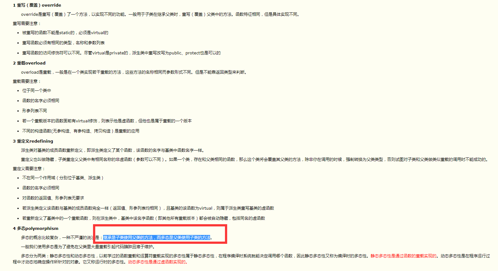
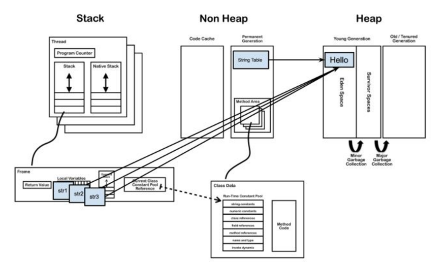
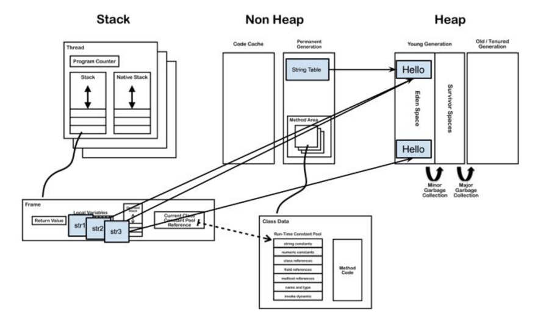

# Java 面试问题

### final, finally, finalize的区别
>1，final—修饰符（关键字）如果一个类被声明为final，意味着它 **不能再派生出新的子类**，不能作为父类被继承。因此一个类不能既被声明为 abstract的，又被声明为final的。**将变量或方法声明为final，可以保证它们在使用中不被改变。** 被声明为final的变量必须在声明时给定初值，而在以后的引用中只能读取，不可修改。被声明为final的方法也同样只能使用，不能重载
>2，finally—再异常处理时提供 finally 块来执行任何清除操作。如果抛出一个异常，那么相匹配的 catch 子句就会执行，然后控制就会进入 finally 块（如果有的话）
>3，finalize—方法名。Java 技术允许使用 finalize()方法在垃圾收集器将对象从内存中清除出去之前做必要的清理工作。**这个方法是由垃圾收集器在确定这个对象没有被引用时对这个对象调用的。** 它是在 Object 类中定义的，因此所有的类都继承了它。子类覆盖 finalize() 方法以整理系统资源或者执行其他清理工作。finalize() 方法是在垃圾收集器删除对象之前对这个对象调用的

### is-a & is-like-a
>1，is-a：继承只覆盖基类的方法，子类父类相同
>2，is-like-a：继承覆盖了基类的方法，且拓展新的成员元素

### 面向对象编程三特性
>1，封装,继承,多态
>2，继承是子类使用父类的方法，而多态是父类使用子类的方法
>3，如何实现多态，其对象内存模型什么样的？
>4，java单继承于Object，c++多继承

### 覆盖（override），重载（overload），重写（overwrite）


### finalize()
>1，对象可能不被垃圾回收
>2，垃圾回收不等同于析构
>3，创建的对象不是通过 new 来分配内存的，而垃圾回收器只知道如何释放用 new 创建的对象的内存，所以它不知道如何回收不是 new 分配的内存
>4，当垃圾回收器准备回收对象的内存时，首先会调用其 finalize() 方法，并在下一轮的垃圾回收动作发生时，才会真正回收对象占用的内存

### String str=new String("hello")和String str="hello"的区别
>1，String str1 = "Hello"; String str2 = "Hello";String str3 = "Hello";3个变量统一指向同一个堆内存地址，"Hello"放在堆内存常量池



###  extends 继承类；implements 实现接口

### =赋值与clone，赋值，浅克隆和深度克隆
```
浅克隆：
 @Override  
    public Object clone() {              // 下面 这个是重点
        Address addr = null;  
        try{  
            addr = (Address)super.clone();  
        }catch(CloneNotSupportedException e) {  
            e.printStackTrace();  
        }  
        return addr;  
    } 
```
```
深度克隆：如果引用类型里面还包含很多引用类型，或者内层引用类型的类里面又包含引用类型，使用clone方法就会很麻烦。这时我们可以用序列化的方式来实现对象的深克隆

public class Outer implements Serializable{
  private static final long serialVersionUID = 369285298572941L;  //最好是显式声明ID
  public Inner inner;
　//Discription:[深度复制方法,需要对象及对象所有的对象属性都实现序列化]　
  public Outer myclone() {
      Outer outer = null;
      try { // 将该对象序列化成流,因为写在流里的是对象的一个拷贝，而原对象仍然存在于JVM里面。所以利用这个特性可以实现对象的深拷贝
          ByteArrayOutputStream baos = new ByteArrayOutputStream();
          ObjectOutputStream oos = new ObjectOutputStream(baos);
          oos.writeObject(this);
　　　　　　// 将流序列化成对象
          ByteArrayInputStream bais = new ByteArrayInputStream(baos.toByteArray());
          ObjectInputStream ois = new ObjectInputStream(bais);
          outer = (Outer) ois.readObject();
      } catch (IOException e) {
          e.printStackTrace();
      } catch (ClassNotFoundException e) {
          e.printStackTrace();
      }
      return outer;
  }
}
```
>实现对象克隆有两种方式：
>1). 实现Cloneable接口并重写Object类中的clone()方法；
>2). 实现Serializable接口，通过对象的序列化和反序列化实现克隆，可以实现真正的深度克隆

### https
>1，CA ROOT 给server生成证书（CA的私钥加密server的信息（1，公钥：Public-Key 2，签名：Signature
3,签名算法： Signature Algorithm: sha256WithRSAEncryption4，证书颁布机构：Issuer 5，过期时间：Validity...））
>2，client 有CA ROOT的证书公钥
>3，client发起https请求
>4，server回应client证书
>5，client用CA的公钥解开server证书，拿到server的公钥
>6，client生成随机对称秘钥，用server的公钥加密，给server
>7，server拿到client的加密数据，用自己的私钥解开，拿到client的对称秘钥
>8，用对称秘钥加解密传输数据