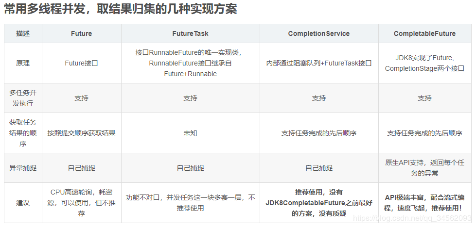
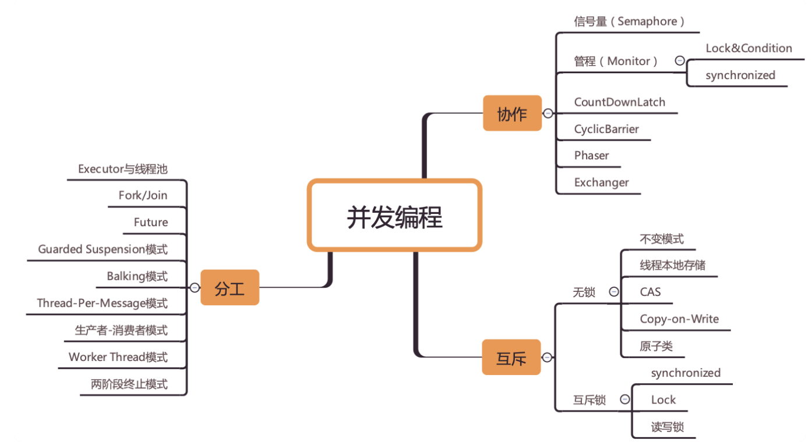
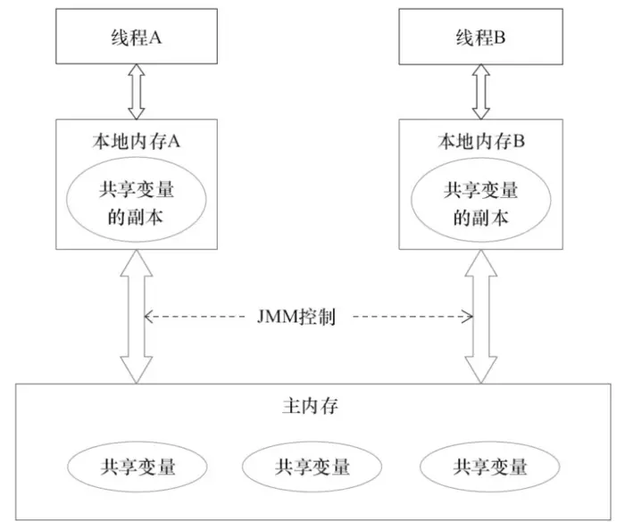
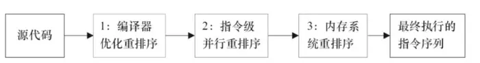
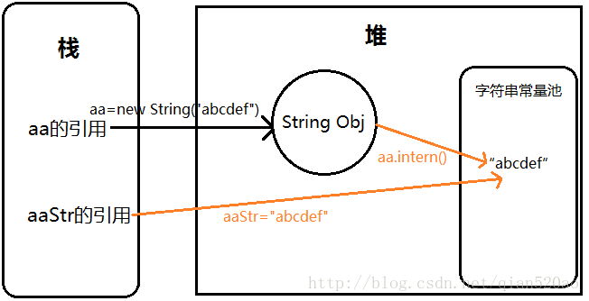

## java编程思想

### 阅读书籍
* [Java编程思想](https://lingcoder.gitee.io/onjava8/#/sidebar)

### 思维导图

>1,javac ase.java
>2,java ase  | java --classpath ase
### java入门基础

### 并发编程

#### 线程:线程池不允许用Executor(包括1，2，3，4)，而要用ThreadPoolExecutor
>1，FixedThreadPool
>2，SingleThreadPool=FixedThreadPool(1)
>3，CachedThreadPool
>4，ScheduledThreadPool

#### 线程任务返回值
>1，Runnable:不返回值
>2，Callable：返回值

##### Thread.sleep(0)手动触发一次操作系统分配时间片的操作，这也是平衡CPU控制权的一种操作

#### happens-before，即先行发生原则，定义了操作A必然先行发生于操作B的一些规则，比如在同一个线程内控制流前面的代码一定先行发生于控制流后面的代码、一个释放锁unlock的动作一定先行发生于后面对于同一个锁进行锁定lock的动作等等，只要符合这些规则，则不需要额外做同步措施，如果某段代码不符合所有的happens-before规则，则这段代码一定是线程非安全的    

#### CAS：Compare and Swap

### 关键字

#### volatile
>1，各个线程会将共享变量从主内存中拷贝到工作内存（缓存），然后执行引擎会基于工作内存中的数据进行操作处理。线程在工作内存进行操作后何时会写到主内存中？这个时机对普通变量是没有规定的，而针对volatile修饰的变量给java虚拟机特殊的约定，线程对volatile变量的修改会立刻被其他线程所感知，即不会出现数据脏读的现象，从而保证数据的“可见性”。被volatile修饰的变量能够保证每个线程能够获取该变量的最新值，从而避免出现数据脏读的现象               
>2，在生成汇编代码时会在volatile修饰的共享变量进行写操作的时候会多出Lock前缀的指令，其影响：1）将当前处理器缓存行的数据写回系统内存，2）这个写回内存的操作会使得其他CPU里缓存了该内存地址的数据无效      

#### synchronized：修饰代码块和方法
>1，对于特定对象，其所有synchronized方法共享同一个锁，防止多个任务同时访问被编码的对象内存     
>2，synchronized关键字不能继承
>3，在定义接口方法时不能使用synchronized关键字
>4，构造方法不能使用synchronized关键字，但可以使用synchronized代码块来进行同步

##### 锁 & synchronized ：对象锁和类锁
>1，在java中，每个对象有一个监视器（对象锁）  synchronized (this) {}，修饰非静态方法
>2，每个类有一个锁，类锁synchronized (SyncThread.class) {}，修饰静态方法
>3，类中同时有对象锁和类锁，对象锁和类锁是独立的，互不干扰
>4，对于同一个类的不同对象的类锁是同一个
>5，对象锁，对于同一个对象的对象锁是同步的，对于不同对象的对象锁是不胡干扰的

#### extends (延伸) & impliment （实现）
>1，Extends可以理解为全盘继承了父类的功能
>2，implements可以理解为为这个类附加一些额外的功能
>3，interface定义一些方法,并没有实现,需要implements来实现才可用
>4，extend可以继承一个接口,但仍是一个接口,也需要implements之后才可用
>5，对于class而言，Extends用于(单)继承一个类（class），而implements用于实现一个接口(interface)
>6，JAVA中不支持多重继承，继承只能继承一个类，但implements可以实现多个接口，比如 class A extends B implements C,D,E
>7，implements，实现父类，子类不可以覆盖父类的方法或者变量。即使子类定义与父类相同的变量或者函数，也会被父类取代掉   
>8，implements一般是实现接口。extends 是继承类

### 泛型

### 反射：class和Class
>Class c3 = Class.forName("com.cmower.java_demo.fifteen.Writer");

### 注解：元数据，annotation
>1，每当需要创建描述符性质的类或接口时，一旦其中包含了重复性的工作，那就可以考虑使用注解来简化和自动化该过程   
>2，自定义注解，大多数时候，需要自定义注解处理器

### 自定义注解：对象注入到方法中
>1，得到想要类中注入的属性
>2，得到该属性的对象
>3，得到属性对应的写方法
>4，通过写方法得到注解
>5，获取注解详细的信息
>6，将注解的信息注入到对象上
>7，调用属性写方法，将已填充数据的对象注入到方法中

### JMM：java内存模型：共享内存的并发模型，线程之间主要通过读-写共享变量来完成隐式通信
* [java内存模型](https://juejin.im/post/5ae6d309518825673123fd0e)

#### 指令重排：为了提高性能，编译器和处理器常常会对指令进行重排序

>1，编译器优化的重排序。编译器在不改变单线程程序语义的前提下，可以重新安排语句的执行顺序；
>2，指令级并行的重排序。现代处理器采用了指令级并行技术来将多条指令重叠执行。如果不存在数据依赖性，处理器可以改变语句对应机器指令的执行顺序；
>3，内存系统的重排序。由于处理器使用缓存和读/写缓冲区，这使得加载和存储操作看上去可能是在乱序执行的。

### 阅读常用的String源码-以点带面，知其然在知其所以然

* [string源码解读](https://blog.csdn.net/qian520ao/article/details/78966179)
* [string源码解读](https://juejin.im/post/5d8c74c4f265da5b8820a095)