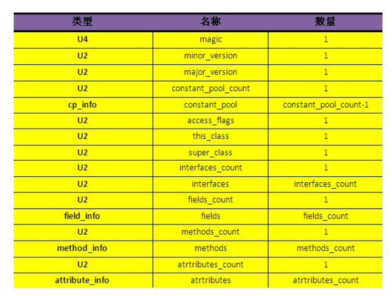
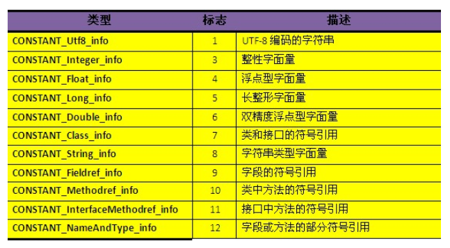
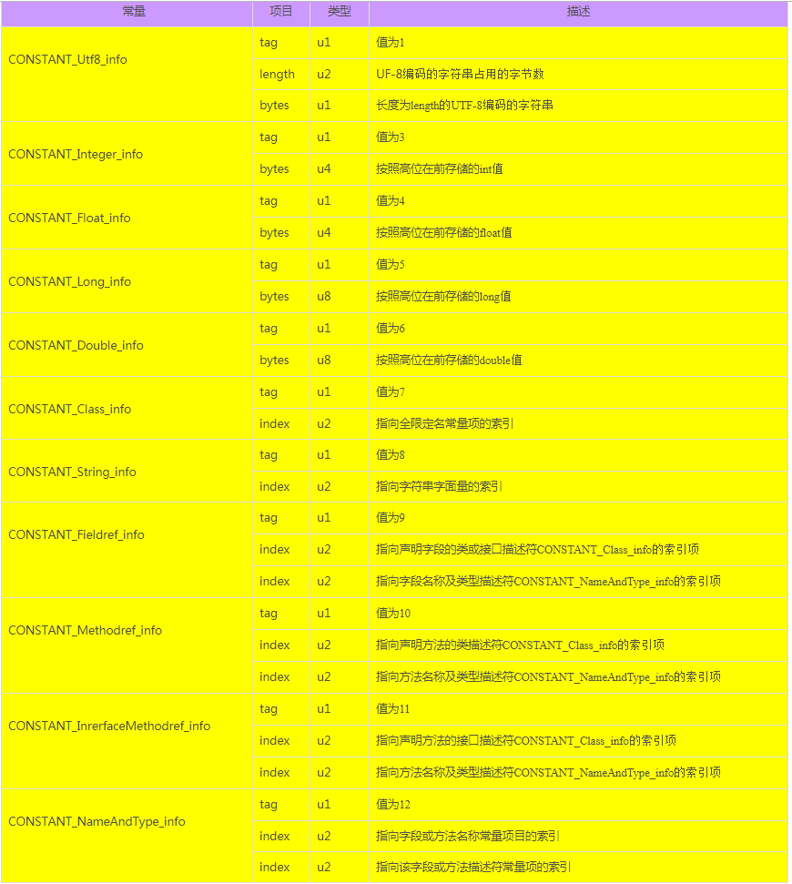
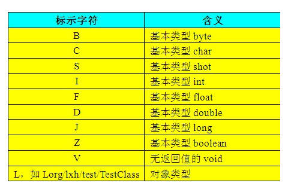
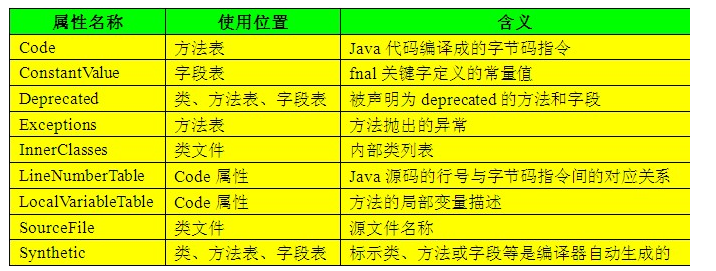
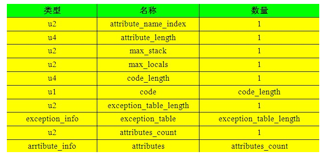
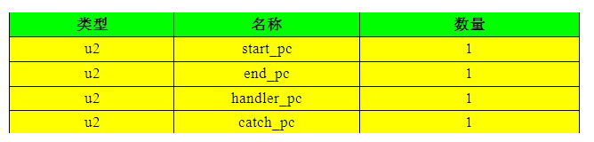

# JVM学习笔记

## class文件结构（二进制流）：整个Class文件本质上就是一张表，虚拟机在加载Class文件时才会进行动态连接
>1，Class文件格式采用一种类似于C语言结构体的 **伪结构**来存储，这种伪结构中只有两种数据类型：**无符号数和表**             
>2，无符号数属于基本数据类型，以u1、u2、u4、u8来分别代表1、2、4、8个字节的无符号数           
>3，表是由多个无符号数或其他表作为数据项构成的符合数据类型，所有的表都习惯性地以“_info”结尾         
>4，无论是无符号数还是表，当需要描述 **同一类型但数量不定的多个数据**时，经常会使用一个 **前置的容量计数器加若干个连续的该数据项的形式**，称这一系列连续的某一个类型的数据为某一类型的集合，比如，fields_count个field_info表数据构成了字段表集合        
>5，Class文件中的数据项，都是严格按照上表中的顺序和数量被严格限定的，每个字节代表的含义，长度，先后顺序等都不允许改变              
>6，每个Class文件的头4个字节称为魔数（magic），它的唯一作用是判断该文件是否为一个能被虚拟机接受的Class文件。它的值固定为0xCAFEBABE   
>7，紧接着magic的4个字节存储的是Class文件的次版本号和主版本号，高版本的JDK能向下兼容低版本的Class文件，但不能运行更高版本的Class文件   
>8，version之后是常量池（constant_pool）的入口，它是Class文件中与其他项目关联最多的数据类型，也是占用Class文件空间最大的数据项目之一     
>9，常量池中主要存放两大类常量：字面量（常量概念，如文本字符串、被声明为final的常量值等）和符号引用（1，类和接口的全限定名（即带有包名的Class名，如：org.lxh.test.TestClass）2，字段的名称和描述符（private、static等描述符）3，方法的名称和描述符（private、static等描述符））
>10，类索引（this_class）和父类索引（super_class）都是一个u2类型的数据，而接口索引集合（interfaces）则是一组u2类型的数据集合，**Class文件中由这三项数据来确定这个类的继承关系**
>11， access_flag:用于识别一些类或接口层次的访问信息，包括：这个Class是类还是接口，是否定义为public类型，abstract类型，如果是类的话，是否声明为final，等等
>12，字段表（field_info）用于描述接口或类中声明的变量。字段包括了类级变量或实例级变量，但不包括在方法内声明的变量
>13，方法表（method_info）的结构与属性表的结构相同, 与字段表集合相对应，如果父类方法在子类中没有被覆写，方法表集合中就不会出现来自父类的方法信息。但同样，有可能会出现由编译器自动添加的方法，最典型的便是类构造器“<clinit>”方法和实例构造器“<init>”方法
>14，在Class文件、字段表、方法表中都可以携带自己的属性表集合，以用于描述某些场景专有的信息

### class文件结构

### 常量类型

### 常量类型结构

>CONSTANT_Utf8_info型常量的结构中有一项length属性，它是u2类型的，即占用2个字节，因此，**Java程序中如果定义了超过64KB英文字符的变量或方法名，将会无法编译**

### 描述符类型含义

>数组类型，每一维度将使用一个前置的“[”字符来描述，如一个整数数组“int [][]”将为记录为“[[I”

### 属性表

>**Code属性：Java程序方法体中的代码讲过Javac编译后，生成的字节码指令便会存储在Code属性中，但并非所有的方法表都必须存在这个属性，比如接口或抽象类中的方法就不存在Code属性**
> **Code属性是Class文件中最重要的一个属性，如果把一个Java程序中的信息分为代码和元数据两部分，那么在整个Class文件里，Code属性用于描述代码，所有的其他数据项目都用于描述元数据** 
> **code_length和code用来存储Java源程序编译后生成的字节码指令**。code用于存储字节码指令的一系列字节流，它是u1类型的单字节，因此取值范围为0x00到0xFF，那么一共可以表达256条指令，目前，Java虚拟机规范已经定义了其中200条编码值对应的指令含义。code_length虽然是一个u4类型的长度值，理论上可以达到2^32-1，但是 **虚拟机规范中限制了一个方法不允许超过65535条字节码指令**，如果超过了这个限制，Javac编译器将会拒绝编译

>异常表实际上是Java代码的一部分，编译器使用异常表而不是简单的跳转命令来实现Java异常即finally处理机制，也因此，finally中的内容会在try或catch中的return语句之前执行，并且在try或catch跳转到finally之前，会将其内部需要返回的变量的值复制一份副本到最后一个本地表量表的Slot中

#### final、static、static final修饰的字段赋值的区别：

>1，**static**修饰的字段在 **类加载过程**中的 **准备阶段**被初始化为 **0或null**等默认值，而后在 **初始化阶段**（触发类构造器<clinit>）才会被赋予代码中设定的值，如果没有设定值，那么它的值就为默认值。
>2，final修饰的字段在 **运行时被初始化**（可以直接赋值，也可以在实例构造器中赋值），**一旦赋值便不可更改**；
>3，static final修饰的字段在Javac时生成ConstantValue属性，在 **类加载的准备阶段**根据ConstantValue的值为该字段赋值，**没有默认值，必须显式地赋值**，否则Javac时会报错。可以理解为在编译期即把结果放入了常量池中

### sun官方java技术体系：jdk（java development kit）（包括1，2，4），jre（java runtime environment）（包括java API子集合jvm）
>1，java程序语言
>2，jvm
>3，Class文件格式
>4，Java API类库
>5，第三方java类库

### java技术体系的4个平台
>1，java card:小内存平台
>2，java ME(micro edition)：移动终端平台
>3，java SE(standard edition)：桌面级应用
>4，java EE（enterprise edition）：多层架构的企业应用

## 内存管理与分配

### 并发内存分配，线程安全问题：同时对对象A，B分配内存，可能会争用同一块内存
>1，CAS失败重试机制，保持原子性
>2，按线程，在不同的内存空间分配内存，即为本地线程分配缓冲TLAB（thread local allocation buffer）

### 引用：强引用>软引用>弱引用>虚引用