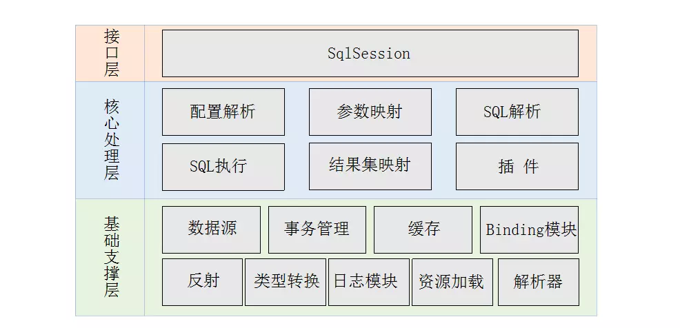
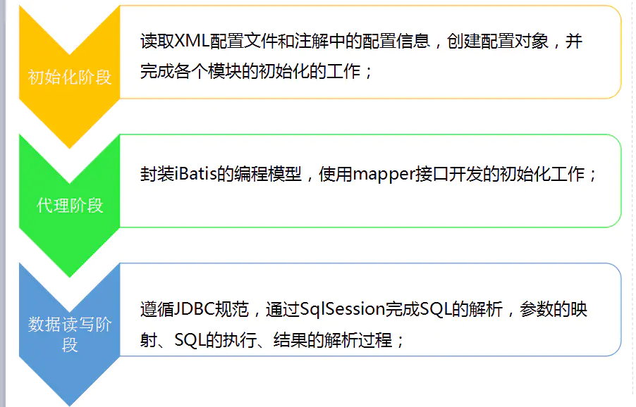
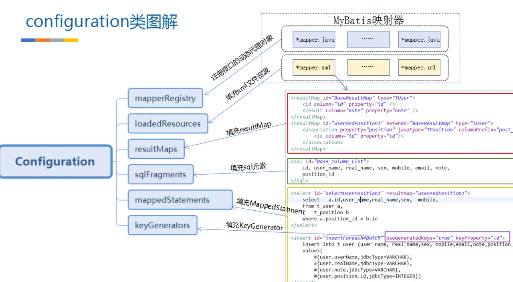
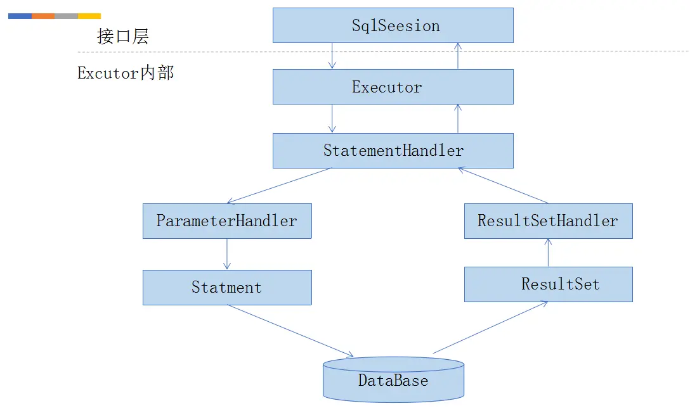
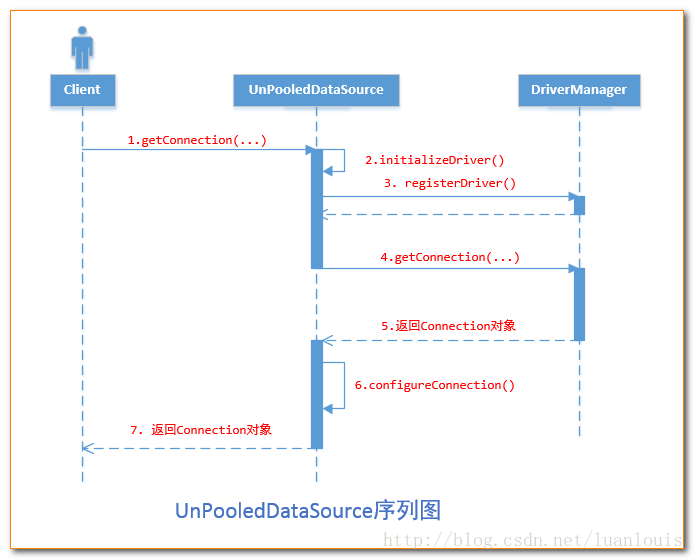
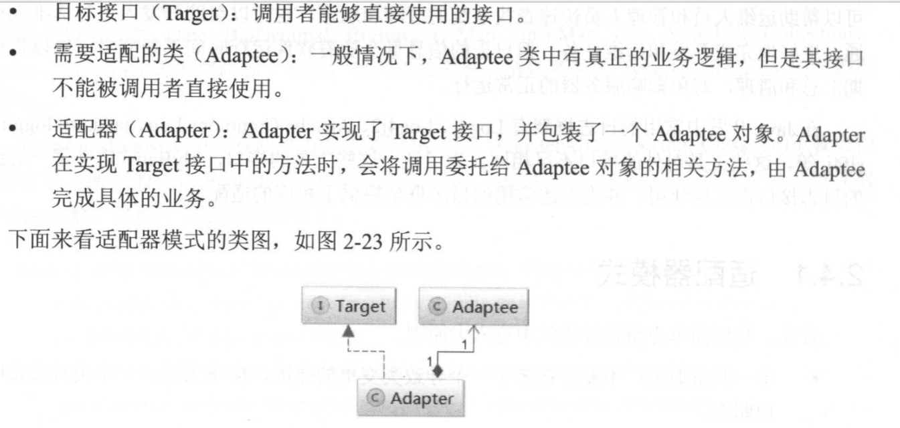
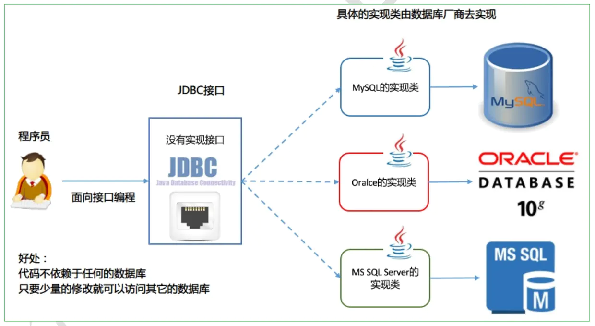
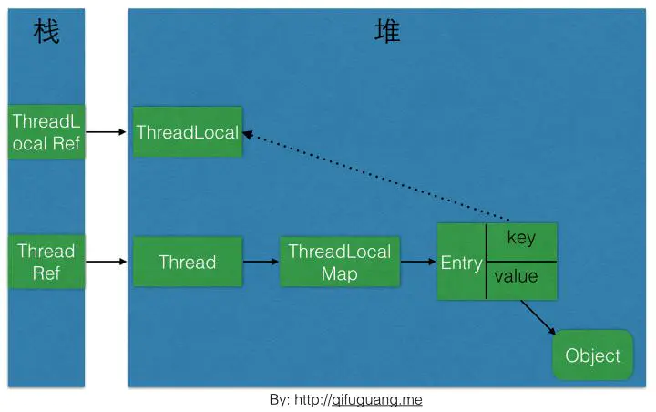

# Mybaits 学习

## idea导入mybatis
>1，git clone
>2，idea open
>3，config set maven project
>4，修改jdk 为1.8
>5，可以maven 打包和运行test下的文件

## 看官方文档，看源码
>1，抓主放次，梳理核心流程，整体到细节
>2，源码调试，核心数据结构和关键类
### JDBC操作数据库一般步骤
>1，注册数据库驱动类，明确指定数据库 URL 地址、数据库用户名、密码等连接信息。 
>2，通过 DriverManager 打开数据库连接
>3，通过数据库连接创建 Statement 对象
>4，通过 Statement 对象执行 SQL 语句，得到 ResultSet 对象。 
>5，通过 ResultSet 读取数据，并将数据转换成 JavaBean 对象。 
>6，关闭 ResultSet、 Statement 对象以及数据库连接，释放相关资源

>PS:ORM (Object Relational Mapping，对象－关系映射)框架是为了解决减少重复步骤，因为每次操作数据库都需要1，2，3，4，6步骤

>SAX 是基于事件模型的 XML 解析方式，它并不需要将整个 XML 文档加载到内存中，而 只需将 XML 文档的一部分加载到内存中，即可开始解析，在处理过程中井不会在内存中记录 XML 中的数据，所以占用的资源比较小

### 整体框架


### 初始化阶段-》代理阶段-》数据读写阶段




#### connection

>1，java.sql.Connection [Interface] -> com.mysql.jdbc.MySQLConnection [Interface] -> com.mysql.jdbc.ConnectionImpl [Class]
>2，在jdk里没有mysql.jdbc connection的实现，需要额外看mysql-connector-java这个项目源码

#### Executor的三个重要组件
>1，StatementHandler：它的作用是使用数据库的Statement或PrepareStatement执行操作，启承上启下作用；
>2，ParameterHandler：对预编译的SQL语句进行参数设置
>3，ResultSetHandler：对数据库返回的结果集（ResultSet）进行封装，返回用户指定的实体类型

### SqlSession->DefaultSqlSession->excutor


>4，mybatis大概的一个结构或过程：SqlSessionFactory->SqlSession->DefaultSqlSession{configuration,executor,autocommit,dirty,cursorlist}->executor{transaction,exectuor(this),configuration,deferredLoads,localCache,localOutout,paramterCache}->transaction{connection,autocommit,level,datasource}

>5,connection--->statement--->execute

>6，查询的一个大概过程：query{statementHandle->statement.execute()->connection.execute()}


* [mybatis源碼簡要介紹](https://juejin.im/post/5c04e6325188252e4c2e94ca)

#### interface没有具体实现，在别的类里拓展实现的，如何用interface调用到了具体的方法，如果有多个类拓展实现呢？
>1，和父类是一样的道理，就有类B拓展实现（implements）了接口A，我们可以把A=B，用A去调用B中的实现的A的方法

## datasource


### DataSource什么时候创建Connection对象
>1,MyBatis创建了DataSource实例后，会将其放到Configuration对象内的Environment对象中， 供以后使用。当我们需要创建SqlSession对象并需要执行SQL语句时，这时候MyBatis才会去调用dataSource对象来创建java.sql.Connection对象。也就是说，java.sql.Connection对象的创建一直延迟到执行SQL语句的时候。



* [mybatis数据源与链接池](https://yq.aliyun.com/articles/641401?spm=a2c4e.11153940.0.0.430d396fCekMrD)


## 设计模式

### 设计模式六原则
>1，单一职责原则：不要存在多于一个导致类变更的原因，简单来说，一个类只负责唯一项职责。 
>2，里氏替换原则：如果对每一个类型为Tl的对象 tl，都有类型为 T2 的对象 t2，使得以 Tl定义的所有程序 P 在所有的对象 tl 都代换成 t2 时，程序 P的行为没有发生变化，那么类型T2是类型Tl的子类型。遵守里氏替换则，可以帮助我们设计出更为合理的继承体系。 
>3，依赖倒置原则：系统的高层模块不应该依赖低层模块的具体实现，二者都应该依赖其抽象类或接口，抽象接口不应该依赖具体实现类，而具体实现类应该于依赖抽象。简单来说，我们要 **面向接口编程**。当需求发生变化时对外接口不变，只要提供新的实现类即可。 
>4，接口隔离原则：一个类对另一个类的依赖应该建立在最小的接口上。简单来说，我们在设计接口时，不要设计出庞大膝肿的接口，因为实现这种接口时需要实现很多不必要的方法。 我们要尽量设计出功能单一的接口，这样也能保证实现类的职责单一。 
>5，迪米特法则： 一个对象应该对其他对象保持最少的了解。 简单来说，就是要求我们减低类间耦合。 
>6，开放－封闭原则：程序要对扩展开放，对修改关闭。简单来说，当需求发生变化时，我们可以通过添加新的模块满足新需求，而不是通过修改原来的实现代码来满足新需求。 
>7，在这六条原则中，开放－封闭原则是最基础的原则，也是其他原则以及后文介绍的所有设计模式的最终目标。

### 工厂模式Factory

### 建造者模式Builder
>1,cache模块就是用的建造者模式设计的
>2，MapperBuilderAssistant.useNewCache（）这个方法里，演示了如何理解和使用建造者模式


### 适配器模式Adapter
>1,主要目的是解决由于接口不能兼容而导致类无法使用的问题，适配器模式会将需要适配的类转换成调用者能够使用的目标接口。



### 代理模式 proxy：静态代理和动态代理

### 装饰器模式

### 责任链模式

### 单例模式

### 策略模式

### 工厂模式

### 观察者模式

### mybatis模块介绍
|名称|作用|
| :----: | :----: |
|SqlSession|作为MyBatis工作的主要顶层API，表示和数据库交互的会话，完成必要数据库增删改查功能|
|Executor|MyBatis执行器,是MyBatis调度的核心，负责SQL语句的生成和查询缓存的维护|
|StatementHandler|封装了JDBC Statement操作，负责对JDBC statement的操作，如设置参数、将Statement结果集转换成List集合|
|ParameterHandler|负责对用户传递的参数转换成JDBC Statement 所需要的参数|
|ResultSetHandler|负责将JDBC返回的ResultSet结果集对象转换成List类型的集合|
|TypeHandler|负责java数据类型和jdbc数据类型之间的映射和转换|
|MappedStatement|MappedStatement维护了一条select|
|SqlSource|	负责根据用户传递的parameterObject，动态地生成SQL语句，将信息封装到BoundSql对象中，并返回|
|BoundSql|表示动态生成的SQL语句以及相应的参数信息|
|Configuration|MyBatis所有的配置信息都维持在Configuration对象之中|


## 插件

### 分页插件
>1，分页插件主要是通过拦截器修改当前线程指定的sql，添加limit参数
>2，pagehelper是通过ThreadLocal实现的分页标识传递（隐式传参），如果处理清理不当，可能导致线程污染
>3，因为有可能导致线程污染，PageHelper.start(offset,size)函数应该和mapper函数紧挨着，避免两者之间出异常，导致线程污染

### 延迟加载
>1，减轻DB服务器的压力,因为我们延迟加载只有在用到需要的数据才会执行查询操作
>2，在关联查询时，我们可能先只需要主表数据，而关联表的数据，等需要的时候，再查询数据库
>3，这个需要，这个时机怎么控制和实现    
```
<resultMap id="BaseResultMap" type="com.redstar.basemapper.pojo.User">
        <id column="id" jdbcType="VARCHAR" property="id"/>
        <result column="name" jdbcType="VARCHAR" property="name"/>
        <result column="age" jdbcType="INTEGER" property="age"/>
        <result column="role_id" jdbcType="INTEGER" property="roleId"/>
</resultMap>
<resultMap id="userRoleMapSelect" type="com.redstar.basemapper.pojo.UserVo">
        <association property="user" resultMap="BaseResultMap"/>
        <association property="role" fetchType="lazy" column="{id=role_id}"  //lazy:延迟加载
                     select="com.redstar.basemapper.dao.RoleMapper.getRoleById"/>//引用另外一个查询方法
</resultMap>
<sql id="Base_Column_List">
    id, `name`, age, role_id
</sql>
<select id="getUserVo" resultMap="userRoleMapSelect">
      select * from user where id=#{userId}
</select>
```
* [延迟加载举例](https://juejin.im/post/5c3d518df265da614171cabe)
>ps：许多对延迟加载原理不太熟悉的朋友会经常遇到一些莫名其妙的问题：有些时候延迟加载
可以得到数据，有些时候延迟加载就会报错，为什么会出现这种情况呢？
MyBatis 延迟加载是通过动态代理实现的，当调用配直为延迟加载的属性方法时， 动态代
理的操作会被触发，这些额外的操作就是通过 MyBatis 的 SqlSessio口去执行嵌套 SQL 的 。
由于在和某些框架集成时， SqlSession 的生命周期交给了框架来管理，因此当对象超出
SqlSession 生命周期调用时，会由于链接关闭等问题而抛出异常 。 在和 Spring 集成时，要
确保只能在 Service 层调用延迟加载的属性 。 当结果从 Service 层返回至 Controller 层时， 如果
获取延迟加载的属性值，会因为 SqlSessio口已经关闭而抛出异常 


## JDK sql
|接口或类|	作用|
| :----: | :----: |
|java.sql|	所有与JDBC访问数据库相关的接口和类|
|javax.sql|	数据库扩展包，提供数据库额外的功能。如：连接池|
|数据库的驱动|	由各大数据库厂商提供，需要额外去下载，是对JDBC接口实现的类，像我们常用的mysql，在pom中引用依赖mysql-connector-java，具体实现也在这个包里|

>1，JDBC规范定义接口，具体的实现由各大数据库厂商来实现



### JDBC规范定义接口
>1，具体的实现由各大数据库厂商来实现，通过数据库厂商提供的DriverManager类，使用接口以多态的形式调用对应的实现类

|接口或类|	作用|
| :----: | :----: |
|DriverManager类|管理和注册数据库驱动；得到数据库连接对象Connection的实现类|
|Connection接口|一个连接对象，可用于创建Statement和PreparedStatement对象|
|Statement接口|	一个SOL语句对象，用于将SQL语句发送给数据库服务器|
|PreparedStatement接口|	一个SQL语句对象，是Statement的子接口|
|ResultSet接口|	用于封装数据库查询的结果集，返回给客户端Java程序|

### 加载和注册驱动

### 事务提交
>1，mysql-connector：ConnectionImpl.setAutoCommit(){autoCommitFlag ? "SET autocommit=1" : "SET autocommit=0"}

### autocommit与显性事务的关系
>1,autocommit=1，自动提交;autocommit=0,手动提交；设置autocommit=0，执行语句，需要再执行commit语句，而autocommit=1，则是隐式自动提交了
>2,使用START TRANSACTION，自动提交将保持禁用状态，直到你使用COMMIT或ROLLBACK结束事务。 自动提交模式然后恢复到之前的状态（如果start transaction 前 autocommit = 1，则完成本次事务后 autocommit 还是 1。如果 start transaction 前 autocommit = 0，则完成本次事务后 autocommit 还是 0）

```
show session variables like 'autocommit';//会话变量，只对当前实例有效
show global variables like 'autocommit';//区分全局还是会话变量

session 1:
1:set autocommit =0;
2:update table1 set col=1 where id=1;
3:commit;

session 2:
1:select col from table1 where id=1;

ps:执行1.1,1.2，再执行2.1，是看不到1.2的操作的，只有再执行1.3之后，2.1才看看到修改
```

### ThreadLocal和Thread,ThreadLocal可以用来隐士传参数，线程间数据隔离   
>1，ThreadLocal内存泄漏的根源是：由于ThreadLocalMap的生命周期跟Thread一样长，如果没有手动删除对应key就会导致内存泄漏，而不是因为弱引用。想要避免内存泄露就要手动remove()掉




##

* [mybatis-不错](https://github.com/nero520/mybatis/tree/master/search-mybatis-mybatis/doc)

