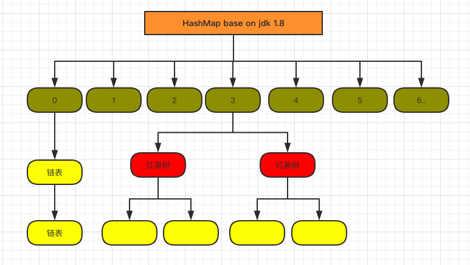

# jdk 源码阅读

>1，在读Spring源码前，一定要先看看《J2EE Design and Development》

## 相关链接
* [adopt openjdk](https://adoptopenjdk.gitbooks.io/adoptopenjdk-getting-started-kit/en/)
* [build openjdk](http://cr.openjdk.java.net/~ihse/demo-new-build-readme/common/doc/building.html)
* [jd-gui反汇编工具](https://github.com/java-decompiler/jd-gui/releases)

## 如何阅读jdk源码
>1，设有目的，带这问题去读
>2，多问为什么，看见不清楚的，就要搞清楚，不要假装清楚
>3，多比较(横向，纵向)，总结
>4，有重点的读
>5,带着问题阅读源码，忽略不必要的细节，死磕重要的细节

### 网友提出的几个问题举例：以ConcurrentHashMap为例
```
（1）ConcurrentHashMap与HashMap的数据结构是否一样？

（2）HashMap在多线程环境下何时会出现并发安全问题？

（3）ConcurrentHashMap是怎么解决并发安全问题的？

（4）ConcurrentHashMap使用了哪些锁？

（5）ConcurrentHashMap的扩容是怎么进行的？

（6）ConcurrentHashMap是否是强一致性的？

（7）ConcurrentHashMap不能解决哪些问题？

（8）ConcurrentHashMap除了并发安全，还有哪些与HashMap不同的地方，为什么要那么实现？

（9）ConcurrentHashMap中有哪些不常见的技术值得学习？
```

### 其他类如何隐性继承Object
>1，当一个类没有显式标明继承的父类时，虚拟机会为其指定一个默认的父类（一般为Object）,经过编译与反编译，可以排除不是编译器默认加上的，应该是 **虚拟机** 默认加上的

### 序列化是如何实现的，为什么implements java.io.Serializable

### 如何做一个maven依赖工具包啊，这样我们就不用总是重复造轮子了

### 字符和字符串编码与长度，GB2312,UTF-8,UTF-16

### volatile，原子性与并发
>1，volatile修饰的变量不允许线程内部缓存和重排序，即直接修改内存
>2，可见性，是指线程之间的可见性，一个线程修改的状态对另一个线程是可见的
>3，原子性：对任意单个volatile变量的读/写具有原子性，但类似于volatile++这种复合操作不具有原子性
>4，AtomicInteger.java里面封装的就是volatile类型的:private volatile int value
>5，当写一个volatile变量时，JMM会把该线程对应的本地内存中的共享变量值刷新到主内存
>6，当读一个volatile变量时，JMM会把该线程对应的本地内存置为无效。线程接下来将从主内存中读取共享变量,并更新本地内存的值.
>7，Lock前缀指令会引起处理器缓存回写到内存
>8，一个处理器的缓存回写到内存会导致其他处理器的缓存无效
>9，缓存一致性协议


### 字节对齐，字节填充，优化volatile的性能
>1，LinkedTransferQueue类的内部类PaddedAtomicReference相对于父类 AtomicReference只做了一件事情，就是将共享变量追加到64字节，因为cacheline缓存行大小64B

### 原子性：循环CAS和锁机制
>1，使用循环CAS实现原子操作：JVM中的CAS操作利用处理器提供的CMPXCHG指令实现。自旋CAS实现的基本思路就是循环进行CAS操作直到成功为止
>2，CAS仍然存在三大问题：1）ABA问题，2）循环时间长开销大，3）只能保证一个共享变量的原子操作
>3，使用锁机制实现原子操作（除了偏向锁，JVM实现锁的方式都用到的循环CAS）
>4，ABA问题：如果一个值原来是A，变成了B，又变成了A，那么使用CAS进行检查时会发现它的值没有发生变化，但是实际上却变化了。ABA问题的解决思路就是使用版本号
>5，循环时间长开销大，JVM能支持处理器提供的pause指令

* [原子操作原理-重要-讲到硬件和汇编指令](https://blog.csdn.net/a934270082/article/details/51133253)
>1，总线锁：LOCK#信号，使只有一个处理器占用共享内存
>2，缓存行锁：如果缓存在处理器缓存行中内存区域在LOCK操作期间被锁定，当它执行锁操作回写内存时，处理器不在总线上声言LOCK＃信号，而是修改内部的内存地址，并允许它的缓存一致性机制来保证操作的原子性，因为缓存一致性机制会阻止同时修改被两个以上处理器缓存的内存区域数据，当其他处理器回写已被锁定的缓存行的数据时会起缓存行无效，比如，当CPU1修改缓存行中的i时使用缓存锁定，那么CPU2就不能同时缓存了i的缓存行。

* [CompareAndSwapObject源码分析](https://blog.csdn.net/qqqqq1993qqqqq/article/details/75211993)

```openjdk/hotspot/src/share/vm/prims/unsafe.cpp
CAS大致的逻辑：一个旧值，一个新值，一个旧值的引用，先判断一下旧值和旧值应用指向的地方的值是否相等，如果相等，说明可以重新设置这个值为新值，这里就会有ABA的可能（版本号解决）。。。
问题1:如何保证这个逻辑步骤是原子的
答：根据当前处理器的类型来决定是否为cmpxchg指令添加lock前缀 ，并发编程的艺术里说，是因为volatile关键字引入的lock前缀指令 

UNSAFE_ENTRY(jboolean, Unsafe_CompareAndSwapObject(JNIEnv *env, jobject unsafe, jobject obj, jlong offset, jobject e_h, jobject x_h))
  UnsafeWrapper("Unsafe_CompareAndSwapObject");
  oop x = JNIHandles::resolve(x_h);// 新值
  oop e = JNIHandles::resolve(e_h);// 预期值
  oop p = JNIHandles::resolve(obj);
  HeapWord* addr = (HeapWord *)index_oop_from_field_offset_long(p, offset);// 在内存中的具体位置
  oop res = oopDesc::atomic_compare_exchange_oop(x, addr, e, true);
  jboolean success  = (res == e);// 如果返回的res等于e，则判定满足compare条件（说明res应该为内存中的当前值），但实际上会有ABA的问题
  if (success)// success为true时，说明此时已经交换成功（调用的是最底层的cmpxchg指令）
    update_barrier_set((void*)addr, x);// 每次Reference类型数据写操作时，都会产生一个Write Barrier暂时中断操作，配合垃圾收集器
  return success;
UNSAFE_END

1，如何，或者为什么要通过CAS来实现原子性，怎么理解？JVM中的CAS操作利用处理器提供的CMPXCHG指令实现，而程序根据当前处理器的类型来决定是否为cmpxchg指令添加lock前缀，用了总线锁或者缓存锁，达到原子性的目标
2，什么地方发生了自旋CAS
3，当if success=false，怎么办，会发生什么?自旋CAS,直到为true
```
``` 自旋CAS举例：
1，openjdk/jdk/src/classes/java/util/concurrent/atomic/AtomicInteger.java
 public final int incrementAndGet() {
        return unsafe.getAndAddInt(this, valueOffset, 1) + 1;
    }

2，openjdk/jdk/src/classes/sun/misc/unsafe.java
 public final int getAndAddInt(Object o, long offset, int delta) {
        int v;
        do {
            v = getIntVolatile(o, offset);
        } while (!compareAndSwapInt(o, offset, v, v + delta));//自旋CAS
        return v;
    }
```

### hashmap & concurrenthashmap（并发，多线程安全）
>1，注意点1：在自定义数据类型中，需要override覆盖equal和hashcode方法
>2，初始是16个node节点（桶）数组，默认负载因子0.75
>3，当node节点下，拉链元素超过默认的8个且当hash表不断扩容，一个桶（node）的下属元素个数超过64，则链表转为红黑树，当红黑树中节点数小于6个则转为链表
>4，jdk1.8版本的hashmap和concurrenthashmap的结构是差不多的，如图。
>5，concurrenthashmap中的val和next是volatile的，并且用上了CAS


### 静态内部类和普通内部类
>1，内部静态类不需要有指向外部类的引用。但非静态内部类需要持有对外部类的引用
>2，非静态内部类能够访问外部类的静态和非静态成员。静态类不能访问外部类的非静态成员。他只能访问外部类的静态成员
>3，一个非静态内部类不能脱离外部类实体被创建，一个非静态内部类可以访问外部类的数据和方法，因为他就在外部类里面

## 异常处理

>1，在工作中 catch 时也应该多用 Throwable，少用 Exception，比如对于异步线程抛出来的异常，Exception 是捕捉不住的，Throwable 却可以

### @FunctionalInterface注解 函数式接口&Lambda
>1，只能有一个抽象方法

### jdk native本地方法命名规则
>1，native中的函数命名规则Java_包名_类名_自定义函数名_签名。其中包名中的“.”，需要修改成“_”
>2，举例：找 pack=java.lang,class=Throwable,func=getStackTraceElement,jdk源码项目中全局搜Java_java_lang_Throwable_getStackTraceElement，可以得到jdk/src/share/native/java/lang/Throwable.c 函数Java_java_lang_Throwable_getStackTraceElement

* [Oracle-native命名规则](https://docs.oracle.com/javase/7/docs/technotes/guides/jni/spec/design.html )

### 线程池的使用
* [线程池源码介绍和使用](https://www.cnblogs.com/dafanjoy/p/9729358.html)
* [线程池源码解读](https://mp.weixin.qq.com/s/4LP-kIVUGPe8H8nBB6-HQA)
* [线程池源码解读-有图示，更详细](https://www.cnblogs.com/KingJack/p/9595621.html)
#### 线程数的设定
``` 
            /**
             * Nthreads=CPU数量
             * Ucpu=目标CPU的使用率，0<=Ucpu<=1
             * W/C=任务等待时间与任务计算时间的比率
             */
            Nthreads = Ncpu*Ucpu*(1+W/C)
```
#### ThreadPoolExecutor扩展
>1、beforeExecute：线程池中任务运行前执行
>2、afterExecute：线程池中任务运行完毕后执行
>3、terminated：线程池退出后执行
>4，在Worker类中，run()->runWorker()->{beforeExecute();task.run();afterExecute();},在ThreadPoolExecutor类中，这三个函数式空函数，可以拓展，以实现工作线程前后和线程终结时机的操作
>5，execute(Runnable command)->addWorker(command, true)->{workers.add(w);final Thread t = w.thread;t.start();//这个地方执行了线程，worker->run()->runWorker()->{beforeExecute();task.run();afterExecute();}}
>6,shutdownNow()会中断所有的存活线程，不论这些线程是否空闲，因此可能会导致任务在执行的过程中抛出异常，这点需要注意
>7,shutdown()方法只会中断空闲线程，但是非空闲的线程不会被中断，即使该线程被阻塞，因此该方法有可能无法关闭那些一直处在等待状态的非空闲线程，这一点在使用时需要注意
>8,threadFactory:线程工厂, 如果没有设定线程工厂，那会使用DefaultThreadFactory，在Executor.java中有实现ThreadFactory接口的 newThread 
>9，**线程异常，会使得不能捕获从线程中逃逸（抛出）的异常，要额外使用Thread.UncaughtExceptionHandler.uncaughtException** ，不过还不太懂

#### 几种常用的线程池
>1，newScheduledThreadPool：创建一个定长的线程池，而且支持定时的以及周期性的任务执行，支持定时及周期性任务执行 
>2，newSingleThreadExecutor：只创建唯一的工作者线程来执行任务，它只会用唯一的工作线程来执行任务，保证所有任务按照指定顺序
>3，newFixedThreadPool：指定工作线程数量的线程池。每当提交一个任务就创建一个工作线程，如果工作线程数量达到线程池初始的最大数，则将提交的任务存入到池队列中。
>4，newCachedThreadPool：创建一个可缓存线程池，如果线程池长度超过处理需要，可灵活回收空闲线程，若无可回收，则新建线程

### 锁
>1，锁的实现，AQS（AbstractQueuedSynchronizer）类中有一个 private volatile int state，锁的获取和释放是通过修改 AQS 的 state 变量来实现的
>2，lock()->{acquire(int arg)},acquire(int arg)在AbstractQueuedSynchronizer类中
>3，unlock()->{release(int arg)},同上
>4，FairSync(NonFairSync)->Sync->AbstractQueuedSynchronizer->AbstractOwnableSynchronizer->Sericalizable
>5，公平锁会先判断当前线程是否为在锁的等待队列的头结点，由于该队列是一个FIFO队列
>6，ReentrantLock时，默认是使用非公平锁，因为在实际情况中，公平锁往往没有非公平锁的效率高。非公平锁的吞吐量更高一些
>7，waitStatus，该Node节点规定了6种状态
>8，获得AQS的同步状态就代表着线程获取了锁
>9，对于同步队列，每一个节点之间是没有感知的，每个线程在尝试获取同步状态失败后，都会走一遍独占式获取同步状态的流程，包括加入队列尾部，进入等待状态，或者被前驱唤醒等，各个队列节点的独立工作，构成了多线程争抢设置AQS同步状态的场景，获得AQS的同步状态就代表着线程获取了锁
``` 读写锁：
public class CacheData {

    Object data; // 正真的数据
    volatile boolean cacheValid; // 缓存是否有效
    final ReentrantReadWriteLock rwl = new ReentrantReadWriteLock();

    void processCacheDate(){
        rwl.readLock().lock(); // 1\. 先获取 readLock
        if(!cacheValid){       // 2\. 发现数据不有效
            // Must release read lock before acquiring write lock
            rwl.readLock().unlock(); // 3\. 释放 readLock
            rwl.writeLock().lock();  // 4\. 获取 writeLock
            try{
                // Recheck state because another thread might have
                // acquired write lock and changed state before we did
                if(!cacheValid){            // 5\. 重新确认数据是否真的无效
                    // data = ...           // 6\. 进行数据 data 的重新赋值
                    cacheValid = true;      // 7\. 重置标签 cacheValid
                }
                // Downgrade by acquiring read lock before releasing write lock
                rwl.readLock().lock();      // 8\. 在获取 writeLock 的前提下, 再次获取 readLock
            }finally{
                rwl.writeLock().unlock(); // Unlock write, still hold read // 9\. 释放 writeLock, 完成锁的降级
            }
        }

        try{
            // use(data);
        }finally{
            rwl.readLock().unlock(); // 10\. 释放 readLock
        }
    }

}
```
* [读写锁源码以及使用介绍](https://www.jianshu.com/p/5083f22af55f)

* [锁的详细介绍](https://tech.meituan.com/2018/11/15/java-lock.html)


### 并发编程的艺术
>1，Java的并发采用的是共享内存模型，Java线程之间的通信总是隐式进行
>2，在Java中，所有实例域、静态域和数组元素都存储在堆内存中，堆内存在线程之间共享 

#### happens-before
>1，在JMM中，如果一 个操作执行的结果需要对另一个操作可见，那么这两个操作之间必须要存在happens-before关系
>2，程序顺序规则：一个线程中的每个操作，happens-before于该线程中的任意后续操作。
>3，监视器锁规则：对一个锁的解锁，happens-before于随后对这个锁的加锁。
>4，volatile变量规则：对一个volatile域的写，happens-before于任意后续对这个volatile域的读
>5，传递性：如果A happens-before B，且B happens-before C，那么A happens-before 

#### 数据依赖关系，控制依赖关系

#### as-if-serial
>1，语义是：不管怎么重排序（编译器和处理器为了提高并行度），**（单线程） 程序的执行结果不能被改变**
>2，在单线程程序中，对存在控制依赖的操作重排序，不会改变执行结果（这也是as-if-serial语义允许对存在控制依赖的操作做重排序的原因）；但在多线程程序中，对存在控制依赖的操作重排序，可能会改变程序的执行结果


##### 举例
>1，flag变量是个标记，用来标识变量a是否已被写入。这里假设有两个线程A和B，A首先执行 writer()方法，随后B线程接着执行reader()方法。线程B在执行操作4时，能否看到线程A在操作 1对共享变量a的写入呢？ 答案是：**不一定能看到，于操作1和操作2没有数据依赖关系，编译器和处理器可以对这两个操作重排序**，
```
class ReorderExample {      
    int a = 0;       
    boolean flag = false;      
    public void writer() {          
           a = 1;                  // 1           
           flag = true;            // 2       
    }       
    Public void reader() {           
        if (flag) {            // 3               
            int i =  a * a;     // 4              
            ……          
        }       
    } 
}
```

### 顺序一致性
>1，常用同步原语 （synchronized、volatile和final）
>2，如果程序是正确同步的，程序的执行将具有顺序一致性（Sequentially Consistent）——即程序的执行结果与该程序在顺序一致性内存模型中的执行结果相同
>3，处理器的内存模型和编程语言的内存模型都会以顺序一致性内存模型作为参照

### 顺序一致性内存模型
>1，一个线程中的所有操作必须按照程序的顺序来执行
>2，（不管程序是否同步）所有线程都只能看到一个单一的操作执行顺序。在顺序一致性内
存模型中，每个操作都必须原子执行且立刻对所有线程可见


#### 未同步程序的执行特性
>1，对于未同步或未正确同步的多线程程序，JMM只提供最小安全性：线程执行时读取到的 值，要么是之前某个线程写入的值，要么是默认值（0，Null，False），JMM保证线程读操作读取 到的值不会无中生有（Out Of Thin Air）的冒出来。为了实现最小安全性，JVM在堆上分配对象 时，首先会对内存空间进行清零，然后才会在上面分配对象（JVM内部会同步这两个操作）。因 此，在已清零的内存空间（Pre-zeroed Memory）分配对象时，域的默认初始化已经完成了。

### 线程
>1，设置线程优先级时，针对频繁阻塞（休眠或者I/O操 作）的线程需要设置较高优先级，而偏重计算（需要较多CPU时间或者偏运算）的线程则设置较 低的优先级，确保处理器不会被独占
>2，优先级决定了操作系统分配的资源情况，有些操作系统会忽略对线程优先级的设定


## 反射
>1，sun.reflect.MethodAccessor->MethodAccessorImpl->NativeMethodAccessorImpl->{invoke->invoke0 是一个native方法} 中实现了反射method的invoke方法


* [反射-讲的不错](https://juejin.im/entry/5b3d6e2fe51d45199940bd39)