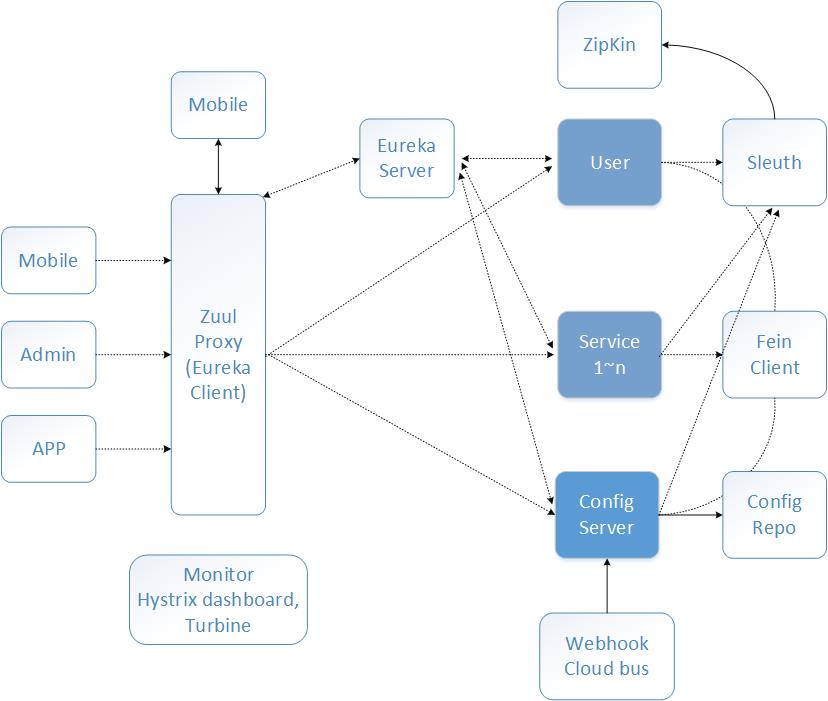

# Spring Boot 实战

## Spring Boot精要
>1，自动配置：针对很多Spring应用程序常见的应用功能，Spring Boot能自动提供相关配置      
>2，起步依赖：告诉Spring Boot需要什么功能，它就能引入需要的库。Spring Boot通过起步依赖为项目的依赖管理提供帮助。起步依赖其实就是特殊的Maven依赖和Gradle依赖，利用了传递依赖解析，把常用库聚合在一起，组成了几个为特定功能而定制的依赖           
>3，命令行界面：这是Spring Boot的可选特性，借此你只需写代码就能完成完整的应用程序，无需传统项目构建        
>4，actuator：Actuator：让你能够深入运行中的Spring Boot应用程序，一探究竟    

## 专有名词
>1，POJO:简单老式java对象 Plain Old Java Object
>2，DI：依赖注入，小明和iPhone6，iPhoneX的故事，即小明只要关心iPhone这个接口类就好了，是iPhone6还是iPhoneX就不要过度的关注，这样就实现了解耦，参照：https://www.zhihu.com/question/32108444        
>3，IOC:控制反转

## Spring四种关键策略
>1，基于POJO的轻量级和最小侵入性编程     
>2，通过依赖注入和面向接口实现松耦合：DI最大收益是松耦合      
>3，基于切面和惯例进行声明式编程          
>4，通过切面和模板减少样板式代码    

## DI：有利于在不改变所依赖的类的情况下，修改依赖关系
>1，依赖注入之一：**构造器注入**构造器中传递interface参数，各种类继承并实现这个接口类      
>2，XML装配        
>3，bean java装配     

### 创建应用组件之间协作的行为通常称为装配

## AOP:aspect-oriented programming,面向切面编程

### 常用AOP通知类型
>1，before(前置通知)：  在方法开始执行前执行
>2，after(后置通知)：  在方法执行后执行
>3，afterReturning(返回后通知)：   在方法返回后执行
>4，afterThrowing(异常通知)： 在抛出异常时执行
>5，around(环绕通知)：  在方法执行前和执行后都会执行

### 执行顺序
>around > before > around > after > afterReturning

## 容器：Spring框架的核心
>1，在基于Spring的应用中，你的应用对象生存于Spring容器（container）中   
>2，Spring容器负责创建对象，装配它们，配置它们并管理它们的整个生命周期，从生存到死亡    

### 两类容器：应用上下文要比bean工厂更受欢迎
>1，bean工厂（由org.springframework.beans.factory.eanFactory接口定义）是最简单的容器，提供基本的DI支持       
>2，应用上下文（由org.springframework.context.ApplicationContext接口定义）基于BeanFactory构建，并提供应用框架级别的服务，例如从属性文件解析文本信息以及发布应用事件给感兴趣的事件监听者      

#### 应用上下文（Application Context）装载bean的定义并把它们组装起来
>1，AnnotationConfigApplicationContext：从一个或多个基于Java的配置类中加Spring应用上下文              
>2，AnnotationConfigWebApplicationContext：从一个或多个基于Java的配置类中加载Spring Web应用上下文        
>3，ClassPathXmlApplicationContext：从类路径下的一个或多个XML配置文件中加载上下文定义，把应用上下文的定义文件作为类资源           
>4，FileSystemXmlapplicationcontext：从文件系统下的一个或多个XML配置文件中加载上下文定义                 
>5，XmlWebApplicationContext：从Web应用下的一个或多个XML配置文件中加载上下文定义                      


## Bean生命周期
>1，@Bean是一个方法级别上的注解，主要用在@Configuration注解的类里，也可以用在@Component注解的类里。添加的bean的id为方法名   
>2，@SessionScope 
>3，@RequestScope       
>4，@Scope and scoped-proxy


## spring框架模块


## 装配bean

### 三种主要装配bean的机制
>1，在XML中进行显式配置    
>2，在Java中进行显式配置   
>3，隐式的bean发现机制和自动装配         

### 装配bean方式的建议    
>1，建议是尽可能地使用自动配置的机制       
>2，显式配置越少越好          
>3，当你必须要显式配置bean的时候（比如，有些源码不是由你来维护的，而当你需要为这些代码配置bean的时候），我推荐使用类型安全并且比XML更加强大的JavaConfig          

### 自动化装配
>1，组件扫描（component scanning）：Spring会自动发现应用上下文中所创建的bean      
>2，自动装配（autowiring）：Spring自动满足bean之间的依赖        

### 自动化装配的歧义性：即一个接口类，有多个实现类，如果装配的是这个接口类，则会NoUniqueBeanDefinitionException
>1，明确装配的是哪个类        
>2，@Primary明示装配的首选     
>3，@Qualifier限定装配的bean     

### bean作用域 @Scope

>1，单例（Singleton）：在整个应用中，只创建bean的一个实例                       
>2，原型（Prototype）：每次注入或者通过Spring应用上下文获取的时候，都会创建一个新的bean实例                
>3，会话（Session）：在Web应用中，为每个会话创建一个bean实例               
>4，请求（Rquest）：在Web应用中，为每个请求创建一个bean实例               
>5，在默认情况下，Spring应用上下文中所有bean都是作为以单例（singleton）的形式创建的。也就是说，不管给定的一个bean被注入到其他bean多少次，每次所注入的都是同一个实例      


### bean作用域代理：ScopedProxyMode.TARGET_CLASS  ScopedProxyMode.INTERFACES


### SpEL：Spring表达式语言，装配

#### SpEL特性
>1，使用bean的ID来引用bean          
>2，调用方法和访问对象的属性        
>3，对值进行算术、关系和逻辑运算          
>4，正则表达式匹配         
>5，集合操作   


## 切面：通知（advice）、切点（pointcut）和连接点（join point）：切面也需要注入
>1，继承，委托，切面         
>2，通常情况下，Spring bean由Spring容器初始化，但是AspectJ切面是由AspectJ在运行期创建的。等到Spring有机会为CriticAspect注入CriticismEngine时，CriticAspect已经被实例化
>3，Spring只支持方法级别的连接点       


### 五种切面类型
>1，前置通知（Before）：在目标方法被调用之前调用通知功能            
>2，后置通知（After）：在目标方法完成之后调用通知，此时不会关心方法的输出是什么         
>3，返回通知（After-returning）：在目标方法成功执行之后调用通知        
>4，异常通知（After-throwing）：在目标方法抛出异常后调用通知                 
>5，环绕通知（Around）：通知包裹了被通知的方法，在被通知的方法调用之前和调用之后执行自定义的行为          


### 切面AspectJ注解五种通知方法


### 引入（Introduction）：引入允许我们向现有的类添加新方法或属性

### 织入（Weaving）：织入是把切面应用到目标对象并创建新的代理对象的过程
>1，编译期：切面在目标类编译时被织入。这种方式需要特殊的编译器。AspectJ的织入编译器就是以这种方式织入切面的                       
>2，类加载期：切面在目标类加载到JVM时被织入。这种方式需要特殊的类加载器（ClassLoader），它可以在目标类被引入应用之前增强该目标类的字节码。AspectJ 5的加载时织入（load-time weaving，LTW）就支持以这种方式织入切面           
>3，运行期：切面在应用运行的某个时刻被织入。一般情况下，在织入切面时，AOP容器会为目标对象动态地创建一个代理对象。Spring AOP就是以这种方式织入切面的   


### Spring在运行时通知对象

>1，通过在代理类中包裹切面，Spring在运行期把切面织入到Spring管理的bean中        
>2，代理类封装了目标类，并拦截被通知方法的调用，再把调用转发给真正的目标bean          
>3，当代理拦截到方法调用时，在调用目标bean方法之前，会执行切面逻辑 
>4，直到应用需要被代理的bean时，Spring才创建代理对象       


## JDBC数据库

>DAO：data access object

### 数据访问层设计


### 设计模式
>1，模板方法模式   

### 基于JDBC驱动的数据源
>1，DriverManagerDataSource：**在每个连接请求时都会返回一个新建的连接**。与DBCP的BasicDataSource不同，由DriverManagerDataSource提供的连接并没有进行池化管理            
>2，SimpleDriverDataSource：与DriverManagerDataSource的工作方式类似，但是它直接使用JDBC驱动，来解决在特定环境下的类加载问题，这样的环境包括OSGi容器         
>3，SingleConnectionDataSource：**在每个连接请求时都会返回同一个的连接**。尽管SingleConnectionDataSource不是严格意义上的连接池数据源，但是你可以将其视为 **只有一个连接的池**     
### Spring JDBC模板
>1，JdbcTemplate：最基本的Spring JDBC模板，这个模板支持简单的JDBC数据库访问功能以及基于索引参数的查询       
>2，NamedParameterJdbcTemplate：使用该模板类执行查询时可以将值以命名参数的形式绑定到SQL中，而不是使用简单的索引参数   
>3，SimpleJdbcTemplate：该模板类利用Java 5的一些特性如自动装箱、泛型以及可变参数列表来简化JDBC模板的使用


## 缓存（Spring对缓存的支持有两种方式）
```
Spring的缓存抽象在很大程度上是围绕切面构建的。在Spring中启用缓存时，会创建一个切面，它触发一个或更多的Spring的缓存注解
可以考虑将注解添加到方法声明上，而不是放在实现类
```

>1，注解驱动的缓存（@EnableCaching{会创建一个切面（aspect）并触发Spring缓存注解的切点（pointcut）},@Cacheable和@CacheEvict）        
>2，XML声明的缓存   

### Spring 5个缓存管理器
>1，SimpleCacheManager
>2，NoOpCacheManager
>3，ConcurrentMapCacheManager
>4，CompositeCacheManager
>5，EhCacheCacheManager

>6，RedisCacheManager（来自于Spring Data Redis项目）
>7，GemfireCacheManager（来自于Spring Data GemFire项目）


## Spring Security

### 三种不同的安全注解
>1，Spring Security自带的@Secured注解                                              
>2，JSR-250的@RolesAllowed注解        
>3，表达式驱动的注解，包括@PreAuthorize、@PostAuthorize、@PreFilter和@PostFilter             


## 远程调用RPC，类似异地打电话


### 几种RPC方式的优缺点
>1，RMI（remote method invo）：使用任意端口交互，很难穿越防火墙，基于java序列化，交互两端必须java开发    
>2，Hessian（二进制，可移植到其他非java语言中）或Burlap(基于XML)：基于http，没有防火墙渗透问题，但是私有序列化机制      
>3，http invoker：基于http，又使用java序列化         

### 远程调用RPC-HttpInvoker-通信机制


### SOA（面向服务的架构）：TLA

## REST：（Representational State Transfer，以信息为中心的表述性状态转移），关注的核心是事物，而不是行为，REST面向资源
>1，RESTful URL的结构并没有严格的规则，但是URL应该能够识别资源        
>2，注解@PathVariable，@ResponseBody，HttpMethodConverter，RestTemplate          


### REST中行为，通过http方法来定义：CRUD动作和http方法
>1，Create：POST
>2，Read：GET
>3，Update：PUT或PATCH
>4，Delete：DELETE

### 表述是REST中很重要的一个方面：内容协商视图：两种方法将资源的java表述形式转换为发送给客户端的表述形式
>1，内容协商（Content negotiation）：选择一个视图，它能够将模型渲染为呈现给客户端的表述形式      
>2，消息转换器（Message conversion）：通过一个消息转换器将控制器所返回的对象转换为呈现给客户端的表述形式          

#### ContentNegotiatingViewResolver
>1，根据Accept返回数据形式，但是 **Accept头部信息不总是可靠**       
>2，根据请求的拓展名返回数据形式

#### @ResponseBody注解：可以用ResponseEntity替代
>1，@ResponseBody注解会告知Spring，我们要将返回的对象作为资源发送给客户端，并将其转换为客户端可接受的表述形式   

#### @ExceptionHandler

### @ResponseStatus 指定状态码

## Spring消息机制


## 数据库

### 事务
>1，Transactional 注解只能应用到 public 方法才有效     
>2，在默认的代理模式下，只有目标方法由外部调用，才能被 Spring 的事务拦截器拦截。在同一个类中的两个方法直接调用，是不会被 Spring 的事务拦截器拦截
>3，可以使用 AspectJ 取代 Spring AOP 代理       


### 多数据源

#### 启动页
```
@SpringBootApplication(
		exclude = { DataSourceAutoConfiguration.class, 
					HibernateJpaAutoConfiguration.class,
					DataSourceTransactionManagerAutoConfiguration.class })
@EnableTransactionManagement
public class SpringbootMultipleDatasourcesApplication {

	public static void main(String[] args) {
		SpringApplication.run(SpringbootMultipleDatasourcesApplication.class, args);
	}
}
```
#### properties配置文件
```
datasource.security.driver-class-name=com.mysql.jdbc.Driver
datasource.security.url=jdbc:mysql://localhost:3306/test
datasource.security.username=root
datasource.security.password=root

datasource.security.initialize=true

datasource.orders.driver-class-name=com.mysql.jdbc.Driver
datasource.orders.url=jdbc:mysql://localhost:3306/orders
datasource.orders.username=root
datasource.orders.password=root

datasource.orders.initialize=true
```

#### config配置层
```
@Configuration
@EnableJpaRepositories(
		basePackages = "net.guides.springboot.springbootmultipledatasources.orders.repositories",
        entityManagerFactoryRef = "ordersEntityManagerFactory",
        transactionManagerRef = "ordersTransactionManager"
)
public class OrdersDataSourceConfig {
    @Bean
    @ConfigurationProperties(prefix="datasource.orders")
    public DataSourceProperties ordersDataSourceProperties() {
        return new DataSourceProperties();
    }
}
```
#### service层
```
    @Transactional(transactionManager="securityTransactionManager")
	public List<User> getUsers()
	{
		return userRepository.findAll();
	}
	
	@Transactional(transactionManager="ordersTransactionManager")
	public List<Order> getOrders()
	{
		return orderRepository.findAll();
	}
```


## 微服务
* [还不错的学习资源](https://github.com/forezp/SpringCloudLearning)

>1，在微服务架构中，需要几个基础的服务治理组件，包括 **服务注册与发现、服务消费、负载均衡、断路器、智能路由、配置管理**等，由这几个基础组件相互协作，共同组建了一个简单的微服务系统       
>2，eureka是一个服务注册和发现模块 
>3，ribbon是一个负载均衡客户端（ribbon+restTemplate），Feign是一个声明式的伪Http客户端，它使得写Http客户端变得更简单，Feign默认集成了ribbon 
>4，Zuul的主要功能是路由转发和过滤器，API Gateway，可以作为资源的统一访问入口，同时也可以在网关做一些权限校验等类似的功能         
>5，Spring Cloud Sleuth 主要功能就是在分布式系统中提供追踪解决方案，并且兼容支持了zipkin
>6，Hystrix：服务之间调用，一个服务失效导致其他服务也不可用，服务雪崩效应，Hystrix提供熔断机制，当调用一个服务N次，不响应，则避免调用端持续等待     
>7，Sleuth和Zipkin：为服务之间调用提供链路追踪




### 配置服务中心


### 拦截器和过滤器
>1，过滤器和拦截器触发时机不一样，过滤器是在请求进入容器后，但请求进入servlet之前进行预处理的。请求结束返回也是，是在servlet处理完后，返回给前端之前  
>2，拦截器可以获取IOC容器中的各个bean，而过滤器就不行，因为拦截器是spring提供并管理的，spring的功能可以被拦截器使用，在拦截器里注入一个service，可以调用业务逻辑。而过滤器是JavaEE标准，只需依赖servlet api ，不需要依赖spring    
>3，如果是非spring项目，那么拦截器不能用，只能使用过滤器。
>4，如果是处理controller前后，既可以使用拦截器也可以使用过滤器。
>5，如果是处理dispaterServlet前后，只能使用过滤器


## 注解篇（重点）
>1，框架提供的系统注解
>2，自定义注解


### @Profile
>1，@Profile("development")      
>2，@Profile("qa")        
>3，@Profile("production")          

### @Service:使用在class上，声明此类是一个服务类，执行业务逻辑、计算、调用内部api等。是@Component注解的一种具体形式

###@Repository：用于对DAO实现类进行标注；
###@Service：用于对Service实现类进行标注；
###@Controller：用于对Controller实现类进行标注；

### @Resource

### @Component:此注解使用在class上来声明一个Spring组件(Bean), 将其加入到应用上下文中
### @Bean
>1，@Bean是一个方法级别上的注解，主要用在@Configuration注解的类里，也可以用在@Component注解的类里。添加的bean的id为方法名 

### @Component

### @CookieValue:用在@RequestMapping声明的方法的参数上，可以获取HTTP cookie中相应名称的cookie  
```
@ReuestMapping("/cookieValue")
   public void getCookieValue(@CookieValue "JSESSIONID" String cookie){
}
```
### @CrossOrigin：用在class和method上用来支持跨域请求，是Spring 4.2后引入的

### @PropertySource("classpath:mine.properties")  @ConfigurationProperties(prefix=“authot”，locations={"classpath"})

### @EnableCaching,@Cacheable和@CacheEvict

### @Transactional：此注解使用在接口定义、接口中的方法、类定义或者类中的public方法上。需要注意的是此注解并不激活事务行为，它仅仅是一个元数据，会被一些运行时基础设施来消费

###@Scheduled：此注解使用在方法上，声明此方法被定时调度。使用了此注解的方法返回类型需要是Void，并且不能接受任何参数

### @Async：此注解使用在方法上，声明此方法会在一个单独的线程中执行，可接收参数，返回类型可以是Void也可是返回值。但是返回值的类型必须是一个Future

### @Id 和 @GeneratedValue  @Table(name="xx")
>1，@Id 标注用于声明一个实体类的属性映射为数据库的主键列
>2，@GeneratedValue 用于标注主键的生成策略，通过strategy 属性指定。默认情况下，JPA 自动选择一个最适合底层数据库的主键生成策略：SqlServer对应identity，MySQL 对应 auto increment  

```
@Table(name="CUSTOMERS")
@Entity
public class Customer {
    @GeneratedValue(strategy=GenerationType.AUTO)
    @Id
    private Integer id;
}

```