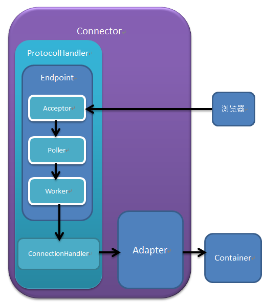

# Tomcat

## tomcat 阅读源码准备工作
>1，git fork到自己目录
>2，git clone到本地
>3，导入intellij，但是可能会can not resolve symbol
>4，在tomcat文件夹下，java module，右击，选择mark directory as source root

## tomcat

>PS:HTTP服务器不直接调用业务类,而是把请求交给容器来处理,容器通过servlet接口调用业务类。因此servlet接口和Servlet容器的出现,达到了HTTP服务器与业务类解耦的目的。而servlet接口和servlet容器这一整套规范叫作Servlet规范。Tomcat按照servlet规范的要求实现了servlet容器,同时它们也具有HTTP服务器的功能。作为Java程序员,如果我们要实现新的业务功能,只需要实现一个Servlet ,并把它注册到Tomcat(Servlet容器)中,剩下的事情就由Tomcat帮我们处理了
## 主要框架
>1，coyote是Tomcat的连接器框架的名称,是Tomcat服务器提供的供客户端访问的外部接口。客户端通过coyote与服务器建立连接、发送请求并接受响应
>2，coyote封装了底层的网络通信(Socket请求及响应处理) ,为catalina容器提供了统一的接口,使catalina容器与具体的请求协议及IO操作方式完全解耦。coyote将socket输入转换封装为Request对象,交由Catalina容器进行处理,处理请求完成后,Catalina通过coyote提供的Response对象将结果写入输出流。
>3，coyote作为独立的模块,只负责具体协议和IO的相关操作, 与Servlet规范实现没有直接关系,因此即便是Request和Response对象也并未实现servlet规范对应的接口,而是在catalina中将他们进一步封装为ServletRequest和ServletResponse

* [tomcat讲的很详细](https://zhuanlan.zhihu.com/p/149833905)

## TOMCAT 结构
$$catalina->server->\begin{cases}
                Container->engine->host->context->wrapper \\
                Connector \\
                \end{cases}$$

## 问题
>1，http如何基于TCP得到有效数据？
>2，tomcat源码如何学习和阅读，有什么方法?

## 设计模式

### 组合模式 也有人说是责任链模式

## TCP

### 半包&粘包
>1，半包：发送方发送的包太大，接收方没有接收完一个完整的包
>2，粘包：发送方和接收方都可能导致粘包。1）Nagle算法造成的发送端的粘包。2）接收方接收不及时
>3，解决办法：1，基于TLV封包，固定长度的包头（TL，type，length）和随机长度的数据Value，先提取包头，得到包长，得到有效包数据

### Nagle算法
>1，solve Small Packet Problem：有效数据部分一个字节，TCP头部20B，IP头部20B，为了1B，发送头部40B，导致拥塞
>2，**agle算法主要是避免发送小的数据包，要求TCP连接上最多只能有一个未被确认的小分组，在该分组的确认到达之前不能发送其他的小分组**
>3，linux提供了TCP_NODELAY的选项来禁用Nagle算法：setsockopt(client_fd, SOL_TCP, TCP_NODELAY,(int[]){1}, sizeof(int));
>4，禁止Nagle算法，每一次send，都会组一个包进行发送，不用等待ACK，可以连续发送

### Delay ACK and Nagle 导致死锁
>举一个场景：PC1和PC2进行通信，PC1发数据给PC2，PC1使用Nagle算法，PC2有delay ACK机制：
>1. PC1发送一个数据包给PC2，PC2会先不回应，delay ACK
>2. PC1再次调用send函数发送小于MSS的数据，这些数据会被保存到Buffer中，等待ACK，才能再次被发送
>从上面的描述看，显然已经死锁了，PC1在等待ACK，PC2在delay ACK，那么解锁的代价就是Delay ACK的Timer到期,40ms~500ms不等