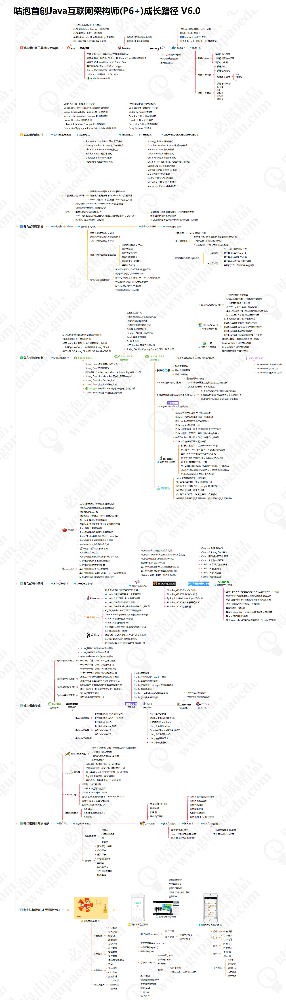

# 分布式必备

## 分布式成长路线

## 中台和微服务
>1，单的理解就是把传统的前后台体系中的后台进行了细分
>2，阿里巴巴提出了大中台小前台的战略。就是强化业务和技术中台，把前端的应用变得更小更灵活。当中台越强大，能力就越强，越能更好的快速响应前台的业务需求

## CAP

*[CAP](https://xie.infoq.cn/article/7b483385fbdeec4578c40e594)

## 中间件
消息中间件的五大核心组成
>1，协议
>2，持久化机制
>3，消息分发机制
>4，高可用设计：主从共享数据，主从同步，Broker-Cluster多主集群同步部署方式，Broker-Cluster多主集群转发部署方式，Master-Slave与Broker-Cluster结合
>5，高可靠设计

* [中间件介绍](https://xie.infoq.cn/article/b216f0107236d39ceb3887e03)
  
## 协议
>协议三要素：
>1）语法：即数据与控制信息的结构或格式
>2）语义：即需要发出何种控制信息，完成何种动作以及做出何种响应
>3）时序：即事件实现顺序的详细说明

>HTTP协议三要素举例：
>语法：http规定了请求报文和响应报文的具体格式
>语义：客户端主动发起的操作称为请求，比如get put post等
>时序：一个请求对应一个响应

## 架构演变
>  1，DNS轮询来做负载均衡：DNS服务器软件（bind）和DHCP软件（dhcpd）
> 2,如何动态更新DNS记录，比如一个域名对应的多个A记录，其中有ip服务器，已经下线了，如何更新这个ip：DDNS（Dynamic Domain Name Server）是动态域名服务
> 3，LVS、F5,NGINX,HAproxy

## 负载均衡
>四层负载均衡：基于IP+端口的负载均衡：从传输层开始是，使用“ip + port”接受请求，在转发到对应的服务器

>七层负载均衡：基于虚拟的URL或主机IP的负载均衡，在四层负载均衡的基础上，通过应用层协议实现负载均衡
* [负载均衡](https://zhuanlan.zhihu.com/p/103107389)