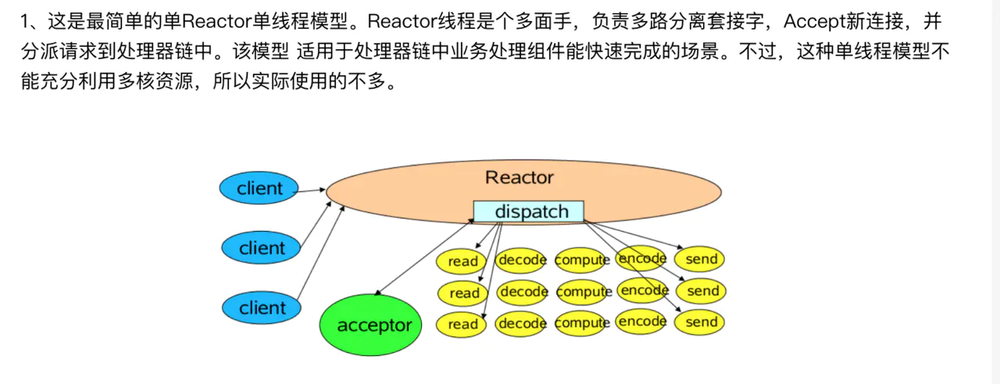

# 网络包与网络模型

## 内容概要
>1，网络包从发送到接收的过程
>2，网络包性能优化技术(零拷贝，DPDK大页技术等)
>3，常用协议栈：UDP,TCP,IP和HTTP（1.1，2.0）,HTTPS
>4，网络模型：阻塞与非阻塞，多路复用，NIO等
>5，select & epoll
>6，Restfull & RPC
>7，工作中的应用：定位问题与分析

>爲什麽三次，兩次，四次爲什麽不可以

>爲什麽四次


##### 为什么 TIME-WAIT 状态必须等待 2MSL 的时间呢？
>1. 为了保证 A 发送的最后一个 ACK 报文段能够到达 B。这个 ACK 报文段有可能丢失，因而使处在 LAST-ACK 状态的 B 收不到对已发送的 FIN + ACK 报文段的确认。B 会超时重传这个 FIN+ACK 报文段，而 A 就能在 2MSL 时间内（超时 + 1MSL 传输）收到这个重传的 FIN+ACK 报文段。接着 A 重传一次确认，重新启动 2MSL 计时器。最后，A 和 B 都正常进入到 CLOSED 状态。如果 A 在 TIME-WAIT 状态不等待一段时间，而是在发送完 ACK 报文段后立即释放连接，那么就无法收到 B 重传的 FIN + ACK 报文段，因而也不会再发送一次确认报文段，这样，B 就无法按照正常步骤进入 CLOSED 状态。
>2. 防止已失效的连接请求报文段出现在本连接中。A 在发送完最后一个 ACK 报文段后，再经过时间 2MSL，就可以使本连接持续的时间内所产生的所有报文段都从网络中消失。这样就可以使下一个连接中不会出现这种旧的连接请求报文段。

##### 保活計時器
>1，服务器每收到一次客户的数据，就重新设置保活计时器，时间的设置通常是两个小时。若两个小时都没有收到客户端的数据，服务端就发送一个探测报文段，以后则每隔  75 秒钟发送一次。若连续发送 10个 探测报文段后仍然无客户端的响应，服务端就认为客户端出了故障，接着就关闭这个连接。

##### TCP 协议是如何保证可靠传输的
>1，数据包校验，对失序数据包重排序，丢弃重复数据，应答机制（停止等待协议，连续 ARQ 协议），超时重发，流量控制（滑动窗口）
>2，TCP 拥塞控制（慢开始（2N），拥塞避免（+1），快重传与快恢复（1/2N））
##### TCP 黏包
>1，TCP 是基于字节流的,无结构的字节流，没有边界
>2，发送方产生粘包：当发送的数据包比較小时，那么 TCP 协议默认的会启用 Nagle 算法，将这些较小的数据包进行合并发送
>3，接收方产生粘包：放数据的速度 > 应用层拿数据速度
>4，解决方案:TLV,即type，length，value
### 发送网络包

发送：

应用程序调用系统调用，将数据发送给socket
socket检查数据类型，调用相应的send函数
send函数检查socket状态、协议类型，传给传输层
tcp/udp（传输层协议）为这些数据创建数据结构，加入协议头部，比如端口号、检验和，传给下层（网络层）
ip（网络层协议）添加ip头，比如ip地址、检验和
如果数据包大小超过了mtu（最大数据包大小），则分片；ip将这些数据包传给链路层
链路层写到网卡队列
网卡调用响应中断驱动程序，发送到网络

接收：
数据包从网络到达网卡，网卡接收帧，放入网卡buffer，在向系统发送中断请求
cpu调用相应中断函数，这些中断处理程序在网卡驱动中
中断处理函数从网卡读入内存，交给链路层
链路层将包放入自己的队列，置软中断标志位
进程调度器看到了标志位，调度相应进程
该进程将包从队列取出，与相应协议匹配，一般为ip协议，再将包传递给该协议接收函数
ip层对包进行错误检测，无错，路由
路由结果，packet被转发或者继续向上层传递
如果发往本机，进入链路层
链路层再进行错误侦测，查找相应端口关联socket，包被放入相应socket接收队列
socket唤醒拥有该socket的进程，进程从系统调用read中返回，将数据拷贝到自己的buffer，返回用户态

#### 传统方式
>1，四次数据拷贝和四次上下文切换。磁盘读取->内核的read buffer->用户缓冲区->内核的socket buffer->网卡接口（硬件）的缓冲区

#### 零拷贝
>1，数据由DMA引擎拷贝->内核read buffer->DMA从内核read buffer将数据拷贝到网卡接口buffer

### 阻塞式BIO：blocking io
客户端监听（Listen）时，Accept是阻塞的，只有新连接来了，Accept才会返回，主线程才能继读写socket时，Read是阻塞的，只有请求消息来了，Read才能返回，子线程才能继续处理读写socket时，Write是阻塞的，只有客户端把消息收了，Write才能返回，子线程才能继续读取下一个请求


### NIO:IO多路复用，设计Reactor模式


``` 
while true {
    events = takeEvents(fds)  // 获取事件，如果没有事件，线程就休眠
    for event in events {
        if event.isAcceptable {
            doAccept() // 新链接来了
        } elif event.isReadable {
            request = doRead() // 读消息
            if request.isComplete() {
                doProcess()
            }
        } elif event.isWriteable {
            doWrite()  // 写消息
        }
    }
}
``` 

### Netty

#### NIO & Reactor模式

##### reactor单线程模型

##### reactor多线程模型

##### reactor主从模型
