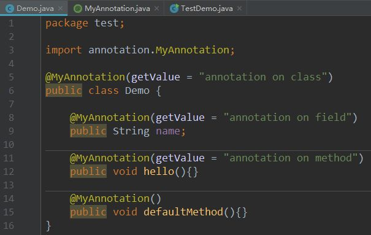
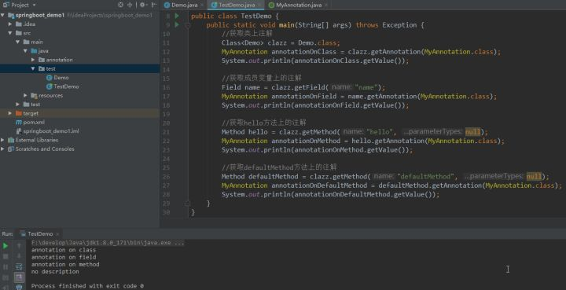
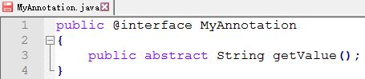
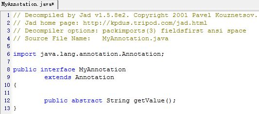
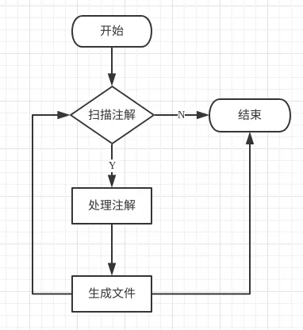
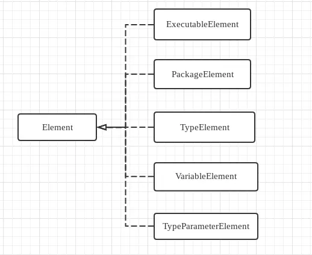
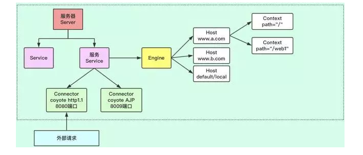

# Java，spring和springboot学习中的核心问题
>1，多阅读官网上的文档：https://spring.io/projects/spring-boot          
>2,https://docs.spring.io/spring/docs/4.3.13.RELEASE/spring-framework-reference/htmlsingle/#transaction-declarative-annotations                     
>3，太习以为常了，以至于觉得它应该就是如此---需要多琢磨，知其然知其所以然           

### 1，注解
>1，注解是表述代码的代码，例如注释是向人解释代码的意思，注解是向编译器虚拟机解释说明，比如@Override，是告诉编译器它所注解的的方法是重写父类中的方法，这样编译器会去检查父类是否存在这个方法，以及方法签名                  
>2，注解是一种”被动“的信息，必须由编译器或虚拟机来“主动”解析它，它才能发挥自己的作用                                   
>3，除了向编译器等传递一些信息，我们也可以使用注解生成代码。比如我们可以使用注解来描述我们的意图，然后让注解解析工具来解析注解，以此来生成一些”模板化“的代码，来避免一些重复的工作                          
>4，注解是向编译器虚拟机解释说明，目的是为当前读取该注解的程序提供判断依据，比如程序只要读到加了@Test的方法，就知道该方法是待测试方法，又比如@Before注解，程序看到这个注解，就知道该方法要放在@Test方法之前执行。                               

#### 参考链接：
* [注解详解](https://www.zhihu.com/question/47449512) 
* [深入理解注解与自定义](https://www.cnblogs.com/peida/archive/2013/04/24/3036689.html)
* [编译时注解](https://juejin.im/post/5d1c6806f265da1b8608a2a8) 
* [编译时注解](https://blog.csdn.net/fei20121106/article/details/73742537) 

#### 分类
>1，自定义注解、JDK内置注解、还有第三方框架提供的注解

#### 创建一个注解类：
>1，所有的方法均没有方法体且只允许public和abstract这两种修饰符号（不加修饰符缺省为public），注解方法不允许有throws子句 
>2，注解方法的返回值只能为以下几种：原始数据类型, String, Class, 枚举类型，注解和它们的一维数组，可以为方法指定默认返回值          

#### 注解类元素
>1，@Retention(RetentionPolicy.RUNTIME) //@Retention用来说明该注解类的生命周期                 
>2，@Target({ElementType.FIELD,ElementType.METHOD}) //@Target来声明注解目标              
>public @interface Seven { //创建一个注解,用关键字@interface来声明            
>          
>    public String value() default "小黑";            
>            
>    public String Property() default "无属性";          
>}             
>3，@Documented：标注为公共API，因此可以被例如javadoc此类的工具文档化    
>4，@Inherited：阐述了某个被标注的类型是被继承的，子类可以继承这个annotation      

>@Seven(value = "Lumia")         
>private String name;               

#### 注解的本质：接口，又和接口有区别---@interface 和interface
>1,定义注解，编译生成.class

>2,XJad工具反编译.class文件：

### 元注解
>1，元注解即用来描述注解的注解

#### @Retention 说明该注解类的生命周期 RetentionPolicy枚举类型
>1,SOURCE：表示在编译时这个注解会被移除，不会包含在编译后产生的class文件中               
>2,CLASS：表示这个注解会被包含在class文件中，但在运行时会被移除            
>3,RUNTIME：表示这个注解会被保留到运行时，在运行时可以JVM访问到，我们可以在运行时通过反射解析这个注解。                   

### 注解处理器
>1，运行时注解是在程序运行时通过反射获取注解然后处理的
>2，编译时注解是程序在编译期间通过注解处理器处理的

#### 注解处理器-Element 
>1，所有被注解标注的部分都会被解析成element
>2，roundEnvironment的getElementsAnnotatedWith方法就可以获取到element的set，element既可能是类，也可能是类属性，还可能是方法，和ElementType对应      

#### @Target 声明注解目标 ElementType枚举类型
>1,TYPE：表示可以用来修饰类、接口、注解类型或枚举类型             
>2,PACKAGE：可以用来修饰包           
>3,PARAMETER：可以用来修饰参数           
>4,ANNOTATION_TYPE：可以用来修饰注解类型             
>5,METHOD：可以用来修饰方法           
>6,FIELD：可以用来修饰属性（包括枚举常量）           
>7,CONSTRUCTOR：可以用来修饰构造器              
>8,LOCAL_VARIABLE：可用来修饰局部变量               

#### @Documented Javadoc工具文档化

#### 为什么要有注解，没有注解会怎么样，有什么样的替代方式，C++和java的区别

#### 注解与反射
>1，注解主要被反射读取                
>2，反射只能读取内存中的字节码信息           
>3，RetentionPolicy.CLASS指的是保留到字节码文件，它在磁盘内，而不是内存中。虚拟机将字节码文件加载进内存后注解会消失      
>4，要想被反射读取，保留策略只能用RUNTIME，即运行时仍可读取              

### 2，反射

#### 反射与Mirror机制
>1，传统的反射机制将自描述与其他操作合并在一起    
>2，Mirror机制将自描述跟其他操作隔离，自描述部分是Meta level,其他部分是Base level     

### 3，AOP,面向切面编程怎么实现？

### 4，单元测试怎么做，可以对每个函数进行测试

### 5，ThreadLocal怎么用

### 6，spring boot中常规开发规范有哪些

### 7，spring boot中常规项目架构是怎么样的

### 8，异常捕获与处理

### 事务@Transactional
>1，spring boot 会自动配置一个 DataSourceTransactionManager，我们只需在方法（或者类）加上 @Transactional 注解，就自动纳入 Spring 的事务管理了     
>2，@Transactional 注解只能应用到 public 方法才有效         
>3，在类上加了注解@Transactional("transactionManager") 和@Service，才让加在类中方法上的事务生效       

## 并发：异步和响应式微服务，线程安全，资源共享
>1，默认设置中，Tomcat的最大线程数是200，最大连接数是10000，最佳线程数目 = （（线程等待时间+线程CPU时间）/线程CPU时间 ）* CPU数目
>2，并发量指的是连接数
>3，Tomcat有两种处理连接的模式，一种是BIO，一个线程只处理一个Socket连接，另一种就是NIO，一个线程处理多个Socket连接。由于HTTP请求不会太耗时，而且多个连接一般不会同时来消息，所以一个线程处理多个连接没有太大问题
>4，CPU密集型：操作内存处理的业务，一般线程数设置为：CPU核数 + 1 或者 CPU核数*2。核数为4的话，一般设置 5 或 8
>5，IO密集型：文件操作，网络操作，数据库操作，一般线程设置为：cpu核数 / (1-0.9)，核数为4的话，一般设置 40

## tomcat

## java语法糖，了解语言外衣之后的真相（反编译）

* [不了解这12个语法糖，别说你会Java](https://mp.weixin.qq.com/s?__biz=MzI1NDQ3MjQxNA==&mid=2247489107&idx=1&sn=d0a60ad989170900e4ba802d522a8e22&chksm=e9c5efe2deb266f441851120cb2476b8246fabfc4596769cd4e6852ea3fee99d813b17c5cd4a&scene=21#wechat_redirect)

### 微服务与DDD(领域驱动设计，domain drive design)
>**目前微服务的划分方法里全球共识的就是DDD**，但 DDD 的核心思想并不仅仅局限于微服务本身，因为微服务是一种架构风格，而 DDD 是一种思想。**微服务定义的九大核心特质**，跟 DDD 的原则是完全一致的，这在某种程度上也是业界愿意在微服务上下文中采用 DDD 方法和实践的原因

### 零拷贝
*[零拷贝](https://mp.weixin.qq.com/s?__biz=MzI1NDQ3MjQxNA==&mid=2247488928&idx=1&sn=6820fbaae5d8d0ca7f077e726815cd9f&chksm=e9c5ec11deb26507242a9ea3197d65454905c2d36e4a469497d9736f41a84ab8a31b198d921d&scene=21#wechat_redirect)