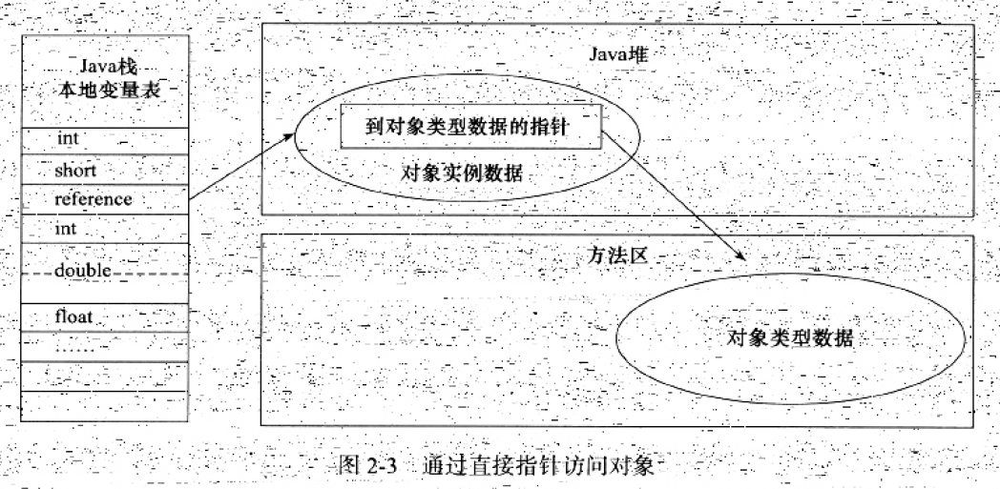

## 码出高效：java开发手册

* [阿里巴巴java开发手册链接](https://www.kancloud.cn/kanglin/java_developers_guide/539177)

>1，**洞悉语言的共性和编程语言思想，跨越语言的抽象思维和架构掌控力。但是掌握不等于精通，真正的大师，需要醉心在某种语言，不断研究、不断打磨、不断回炉，才能达到炉火纯青、登峰造极的境界**     
>2，优秀的开发工程师用面向过程的语言也能把程序写得非常内聚，可扩展性好，具备定的复用性；而平庸程序员用面向对象语言一样能把程序写得松散随意、毫无抽象与建模、模块间藕合严重、维护性差  
>3，计算机工程领域的任何问题都可以通过增加个中间层来解决           
>4，帕金森琐碎定律是指团队成员往往会把过多的精力花费在些琐碎的争论上，而真正重要的决议反而可以轻松通过        
>5，只有把学习和思考结合起来，才能把知识转为己用。笔者很喜欢在学习的同时作 **深度总结**，至今沉淀了超过2000 页的笔记     
>6，祸乱生于疏忽，单元测试先于交付   

### 学而思：别只是学习，信息输入，也要总结，思考和输出  
>1，**理一理一个java程序的一生**         

### 代码规约：规约依次分级为强制、推荐、参考三大类
>( I ）码出高效。标准统一， 提升沟通效率和协作效率，促使研发效能的提升        
>( 2 ）码出质量。防患未然， 提升质量意识，降低故障率和维护成本，快速定位问题            
>( 3 ）码出情怀。追求卓越的工匠精神，打磨精品代码            

### 继承
>1，代码复用
>2，方法污染，例如，鸵鸟继承鸟，但是鸵鸟不会飞     
>3，方法爆炸，随着层层继承，继承树不断扩大，方法众多   

### 研究一下版本变迁历史与特性，知其然，知其所以然


### 面向对象四大特性（抽象、封装、继承、多态）

### 抽象类是模板式设计，而接口是契约式设计
>1，接口继承接口，关键字是extends ，而不是implements,允许多重继承，是因为接口有契约式的行为约定，没有任何具体实现和属性，某个实体类在实现多重继承后的接口时，只是说明Can do many things 。当纠结定义接口还是抽象类时，优先推荐定义为接口，遵循接口隔离原则，按某个维度划分成多个接口，然后再用抽象类去imp lements 某些接口，这样做可方便后续的扩展和重构        

### 内部类中还可以定义内部类，形成多层嵌套


### 在定义类时，推荐访问控制级别从严处理
>I ）如果不允许外部直接通过new 创建对象，构造方法必须是private                
>2 ）工具类不允许有public或default构造方法               
>3 ）类非static成员变量并且与子类共享，必须是protected        
>4 ）类非static成员变量并且仅在本类使用，必须是private          
>5 ）类static成员变量如果仅在东类使用，必须是private            
>6 ）若是static成员变量，必须考虑是否为final          
>7 ）类成员方法只供类内部调用，必须是private                
>8 ）类成员方法只对继承类公开，那么限制为protected  

### this和super 


### 5种类关系
>1 ）·［ 继承］ extends (is-a）   
>2 ）·［ 实现］ implements (can - do）   
>3 ）·［ 组合］ 类是成员变量（contains-a）    
>4 ）·｛ 聚合｝ 类是成员变量（has-a）
>5 ）·［ 依赖］ import 类（use-a）

### 序列化
>1，内存中的数据对象只有转换为二进制流才可以进行数据持久化和网络传输。将数据对象转换为二进制流的过程称为对象的序列化（ Serialization ）。反之，将二进制流恢复为数据对象的过程称为反序列化（ Deserialization ）    
>2，java原生序列化：Java 类通过实现S erializable 接口来实现该类对象的序列化，这个接口非常特殊，没有任何方法，只起标识作用。Java 序列化保留了对象类的元数据（如类、成员变量、继承类信息等），以及对象数据等，兼容性最好，但不支持跨语言，而且性能一般。                       
>3，Hessian 序列化是一种支持动态类型、跨语言、基于对象传输的网络协议。Java 对象序列化的二进制流可以被其他语言（ 如C＋＋、Python ）反序列化  
>4，JSON 序列化就是将数据对象转换为JSON 字符串。在序列化过程中抛弃了类型信息，所以反序列化时只有提供类型信息才能准确地反序列化。相比前两种方式，JSON 可读性比较好，方便调试。
>5，protobuffer                 

### 方法签名
>1，方法签名包括方法名称和参数列表，是JVM标识方法的唯一索引， 不包括返回值，更加不包括访问权限控制符、异常类型等

### 参数校验
>1，入参保护，对服务提供方进行处理能力保护，比如批量处理接口，服务端的处理能力是有限的，应该对传入的参数的数据量进行判断和控制，数据量怎么控制？ 安全性倒是可以计算请求数据块的md5
>2，参数校验，默认是对输入数据的理性不信任，对有效性进行判断，准确给出异常提示，客户端依据异常提示，修改代码，服务端考虑周全，减少返工，提高效率

### 对象生命周期
>1，静态代码块（static {...}）>父类构造方法>子类构造方法（本身这个类）
>2，因为有些子类是延迟加载的，甚至是网络加载的，所以最终的实现需要在运行期判断，这就是所谓的动态绑定           

### 类内方法定义顺序依次是
>1，公有方法或保护方法＞私有方法＞ getter/setter 方法                

### POJO ( Plain Ordinary Java Object，简单的Java 对象）
>1，POJO主要只包含getter,setter,toString方法的简单类。常见的POJO类包括DO(Domain Object),BO(Business Object),DTO(Data Transfer Object),VO(View Object),AO(Application Object)                               

### override(覆写：动态绑定，子类覆写父类方法),overwrite（重写：派生类方法屏蔽了基类同名方法） and overload（重载：方法名同，函数签名不同）
>1,覆写：一大两小两同：一大，子类的方法访问权限控制符只能相同或变大。两小，抛出异常和返回值只能变小， 能够转型成父类对象。子类的返回值、抛出异常类型必须与父类的返回值、抛出异常类型存在继承关系。两同，方法名和参数必须完全相同                   

### Java命名规范
>1，包名统使用小写，点分隔符之间有且仅有个自然语义的英语单词。包名统一使用单数形式，但是类名如果有复数含义，则可以使用复数形式      
>2，抽象类命名使用Abstract或Base开头            
>3，异常类命名使用Exception结尾           
>4，测试类命名以它要测试的类名开始，以Test 结尾   
>5，类型与中括号紧挨相连来定义数组              
>6，枚举类名带上Enum后缀，枚举成员名称需要全大写，单词间用下画线隔开      
>7，常量的命名方式比较特殊，字母全部大写，单词之间用下画线连接   
>8，变量包括参数、成员变量、局部变量等， 也采用小驼峰形式           
>9，常量命名应该全部大写，单词间用下画线隔开，力求语义表达完整清楚          
>10，针对布尔类型的变量，命名不要加is前缀，否则部分框架解析会引起序列化错误        
>11，推荐采用 **4个空格缩进，禁止使用Tab键**，由于不同编辑器对Tab的解析不一致，而空格在编辑器之间是兼容的               
>12，多层嵌套不超过3层    
>13，方法行数不超过80，因为人的短期记忆极限是3个屏幕的内容      
>14，在命名时，应当在不影响表意的情况下适当精简描述语旬长度（**通常控制在5 个单词内**）       

### 异常分类：主流观点是，可恢复的、业务类的异常用checked exception，不可恢复的异常用unchecked exception，如数据库连接失败、http调用超时   
>1，Throwable---》1）Error（致命错误，OutofMemoryError）和Exception（非致命错误），Exception---》checked异常和unchecked异常（RuntimeException）
>2，当遇到需要处理异常的场景时，要明确该异常属于哪种类型，是需要调用方关注并处理的checked 异常， 还是由更高层次框架处理的unchecked 异常   
>3，try-catch-finally，注意， **finally是在return表达式运行后执行的**， 此时将要return 的结果已经被暂存起来， 待finally 代码块执行结束后再将之前暂存的结果返回     
>4，Error由虚拟机生成并抛出，，属于JVM系统内部错误或者资源耗尽等严重情况，属于JVM需要担负的责任，这一类异常事件是无法恢复或者不可能捕获的，将导致应用程序中断，但是自定义Error是可以捕获的        


### 日志规范
>1)**记录异常时一定要输出异常堆栈**， 例如logger.error("xxx"＋e.getMessage(), e)                
>2)**曰志中如果输出对象实例，要确保实例类重写了toString方法**，否则只会输出对象的hashCode值， 没有实际意义     
>3)ERROR级别只记录系统逻辑错误、异常或者违反重要的业务规则， 其他错误都可以归为WARN级别                


### JVM：编译 & 解释

>全小写的class 是关键字，用来定义类，而首字母大写的Class，它是所有class的类    
>类加载是一个将.class字节码文件实例化成Class对象并进行相关初始化的过程         

* [jvm重点学习](https://www.zhihu.com/question/20097631)


#### 源码转字节码过程


>1，词法解析是通过空格分隔出单词、操作符、控制符等信息， 将其形成token 信息流，传递给语法解析器           
>2，在语法解析时，把词法解析得到的token 信息流按照Java 语法规则组装成一棵语法树， 如图虚线框所示     
>3，在语义分析阶段， 需要检查关键字的使用是否合理、类型是否匹配、作用域是否正确等      
>4，当语义分析完成之后，即可生成字节码   

#### JIT即时编译流程
>1，字节码必须通过类加载过程加载到JVM 环境后，才可以执行
>2，执行有三种模式：**第一，解释执行，第二， JIT 编译执行,第三， JIT 编译与解释混合执行（主流JVM默认执行模式）**        
>3，混合执行模式的优势在于解释器在启动时先解释执行，省去编译时间。随着时间推进， **JVM 通过热点代码统计分析**， 识别高频的方法调用、循环体、公共模块等，基于强大的JlT 动态编译技术，热点代码转换成机器码，直接交给CPU执行。JIT 的作用是将Java 字节码动态地编译成可以直接发送给处理器指令执行的机器码         


### JVM运行时数据区
>1，方法区：线程共享，存储jvm加载的类信息，常亮，静态变量，即时编译后的代码等数据，JVM堆的一个逻辑部分
>2，jvm栈：线程私有，存储局部变量表，操作数栈，动态链接，方法出口等信息
>3，本地方法栈：native方法服务
>4，jvm堆：新生代+老生代
>5，程序计数器：当前线程执行的字节码的行号指示器，线程私有
>6，StackOverflowErr：递归深度大于jvm允许的最大值
>7，OOM：堆内存分配不足
>8，运行时常量池：方法区的一部分，存放各种字面量和符号引用
>9，直接内存


### JVM 内存布局（程序计数器，本地方法栈，虚拟机栈，java堆，元数据区（方法区，运行时常量池））
>直接内存：不是jvm规范中的内存区域，在jdk1.4中更新接入了NIO（New Input/Output），引入了基于通道和缓冲区的I/O方式，可以通过Native函数库有直接分配堆外内存，用过一个存储在java堆中的DirectByteBuffer对象引用操作，在某些场景下能显著提高性能


>1，**Heap是OOM故障最主要的发源地**，它存储着几乎所有的实例对象，堆由垃圾收集器自动回收，堆区由各子线程共享使用   
>2，在通常情况下，服务器在运行过程中，堆空间不断地扩容与回缩，势必形成不必要的系统压力，所以在线上生产环境中，JVM的Xms和Xmx设置成1样大小，避免在GC后调整堆大小时带来的额外压力  
>3，**新生代＝1个Eden区＋2个Survivor区 （据统计，Eden：Survivor=8：1）**
>4，**绝大部分对象在Eden区生成**
>5，当 **Eden区装填满**的时候，会触发YoungGarbage Collection，即YGC，**垃圾回收的时候，在Eden区实现清除策略**，**没有被引用的对象则直接回收，依然存活的对象会被移送到Survivor区**
>6，JVM中的虚拟机栈是描述Java方法执行的内存区域，它是 **线程私有的**，栈中的元素用于支持虚拟机进行方法调用，每个方法从开始调用到执行完成的过程，就是栈帧从入栈到出栈的过程        

#### 对象分配与简要GC流程
**对象主要在新生代的Eden区上分配，如果启用了本地线程分配缓冲，将按线程优先在TLAB上分配，少数情况会在老年代上分配，分配规则不是固定的，取决于当前使用哪一种垃圾收集器组合，以及虚拟机和内存的相关参数**


>1，如果Survivor区无法放下，或者超大对象的阈值超过上限，则尝试在老年代中进行分配        
>2，**如果老年代也无法放下，则会触发Full Garbage Collection ，即FGC**       
>3，如果依然无法放下，则抛出OOM     
>4，堆内存出现OOM 的概率是所有内存耗尽异常中最高的    
>5，出错时的堆内信息对解决问题非常有帮助，所以给JVM设置运行参数－XX:+HeapDumpOnOutOfMemoryError，让JVM遇到OOM异常时能输出堆内信息，特别是对相隔数月才出现的OOM 异常尤为重要      
>6，**在不同的JVM实现及不同的回收机制中，堆内存的划分方式是不一样的**

### 判断对象是否可回收
>1，引用计数算法
>2，可达性分析算法：1，对执行时间敏感，这项工作必须在能确保 **一致性的快照**中进行，不可以出现分析过程中对象引用关系还在不断变化的情况，不然无法保证分析结果的准确性，即GC进行时，必须停顿所有java执行线程（stop the world），即使号称不会发生停顿的CMS收集器中，枚举根节点也必须要停顿

###安全点 解决如何进入GC的问题
>1，Hotspot使用一组OopMap的数据结构来获知哪些地方存放着对象引用，在类加载完成的时候，HotSpot就把对象内什么偏移量上是什么类型的数据计算出来，用以检查执行上下文和全局引用情况
>2，在这特定的位置，即安全点，才能停顿下来开始GC

>3，问题1：其实还是不太明白为什么，只知道是这样，不知道为什么，应该要研究一下jvm，知其然知其所以然，能理解并想明白为什么，方证大道

### 安全区域
>1，当线程处于sleep或Block状态，线程无法响应JVM的中断请求，跑去安全点中断挂起，JVM也不太可能等线程获得CPU，则需要安全区域来解决这个问题
>2，线程执行到safe region中的代码，先标识自己进入了safe region，JVM在GC时，不管safe region的线程，线程要离开safe region时，检查系统是否完成了GC，完成了则继续执行，否则，等待可以安全离开safe region的信号

### 两种方案，在GC时让所有线程都跑到安全点
>1，抢先式中断：几乎没有虚拟机在采用。GC时，1，所有线程中断，不在安全点上，恢复线程，让其跑到安全点上
>2，主动式中断：需要GC时，设置一个标志，各个线程主动轮询这个标志，发现中断标志位真则自己挂起

### gc算法
>1，标记-清除：内存碎片
>2，复制算法：内存分配时，分配两块一样大小的内存，只使用一块，当回收时，拷贝一块中的存活对象到另一块中，再把刚使用的那一块内存一次清理掉
>3，标记-整理：所有存活对象，向一端移动
>4，分代收集算法

### 垃圾收集器
>1，serial
>2，parnew
>3，parallel scavenge：目标是可控制吞吐量（=运行用户代码时间/（运行用户代码时间+垃圾收集时间）），其他垃圾收集器是为了缩短垃圾收集停顿时间（stop the world），新生代的parallel scavenge垃圾收集器处于比较尴尬状态，因为如果新生代垃圾收集器是parallel scavenge，那老年代只能是serial old，没法和CMS配合工作
>4，serial old
>5，parallel old
>6，cms：concurrent mark sweep（并发标记-清除）：垃圾收集线程和用户线程基本同时工作，并发手机，低停顿，也叫Concurrent Low Pause Collector
>7,G1


 

#### CMS步骤
**初始标记--->并发标记--->重新标记--->并发清除**
>1，初始标记：标记一下GC Roots能直接关联的对象，需要stop the world
>2，并发标记：GC Roots Tracing
>3，重新标记：为了 **修正并发标记** 期间因用户程序继续运作导致的标记产生变动的那部分对象的标记记录，需要stop the world
>4，并发标记和并发清除耗时较长，并且可以与用户程序并发执行


#### CMS的三个缺点
>1，对CPU资源敏感，虽然并发，但是也可能和用户程序抢占CPU等资源，导致用户程序执行速度忽然很慢
>2，无法处理浮动垃圾，可能出现Concurrent Mode Failure，而导致Full GC。浮动垃圾：在标记过程之后，用户程序运行导致的新的垃圾。在垃圾收集阶段，用户程序还在运行，需要给用户程序预留空间供其使用，当预留的内存，无法满足程序需要的时候，就会 **Concurrent Mode Failure**，则会临时启动Serial old重新来对老年代进行垃圾收集，停顿时间长
>3，空间碎片，这是由标记-清除算法，所遗留的问题

#### G1步骤：初始标记--->并发标记--->最终标记--->筛选回收
>1，初始标记：标记一下GC Roots能直接关联的对象并修改TAMS值（Next top at mark start），需要stop the world
>2，并发标记：GC Roots对堆中对象可达性分析，找出活的对象，可并发执行
>3，最终标记：为了 **修正并发标记** 期间因用户程序继续运作导致的标记产生变动的那部分对象的标记记录，需要stop the world，可并发执行
>4，筛选回收：首先对Region进行回收价值和成本排序，根据用户期望的GC停顿时间，制定回收计划


#### 理解GC日志
>1，[ParNew: 352257K->20422K(368640K), 0.0321769 secs] ：GC区域和GC收集器，GC前该内存区域已使用容量->GC后该内存区域已使用容量（该内存区域总容量），gc时间
>2，[Times: user=0.12 sys=0.00, real=0.03 secs] ：user：用户态消耗CPU时间，内核态消耗CPU时间，事件从开始到结束所经过的墙钟时间

### JNI 与 native 关键字


### linux下编译jni
#### 1.编写带有native声明的java类，HelloWorld.java 
```
public class HelloWorld{
    public native void sayHelloWorld();

    static {
        System.loadLibrary("HelloWorldImpl");//加载动态文件
    }
    
    public static void main(String[] args){
        HelloWorld helloWorld=new HelloWorld();
        helloWorld.sayHelloWorld();
    
    }

}
```
#### 2.使用javac生成HelloWorld.class
>1，javac  HelloWorld.class  或者  javac -classpath . HelloWorld.class

#### 3.使用javah -jni java类生成扩展名为h的头文件
>1,javah -jni -verbose -classpath . HelloWorld  得到HelloWorld.h
>2，总结：当我们熟悉了 JNI 的 native 函数命名规则之后，就可以不用通过javah命令去生成相应 java native方法的函数原型了，只需要按照函数命名规则编写相应的函数原型和实现即可


#### 4使用C/C++实现本地方法，创建HelloWorldImpl.cpp
```
#include"jni.h"
#include"HelloWorld.h"
#include<stdio.h>

JNIEXPORT void JNICALL Java_HelloWorld_sayHelloWorld(JNIEnv *, jobject){
        printf("hello world!\n");
        return;
}
```
#### 5 将本地方法编写的文件生成动态链接库
>1，gcc  -I/$JAVA_HOME/include -I/$JAVA_HOME/include/darwin/ -I/$JAVA_HOME/include/linux/ -fPIC -shared HelloWorldImpl.cpp -o libHelloWorldImpl.so  
>2，这个动态so文件名和HelloWorld.java 中System.loadLibrary 一致，按照linux中的约定lib会被忽略

#### 6执行HelloWorld
>1，java -Djava.library.path=/home/liujun/testjni/test2/ -classpath . HelloWorld   
>2，/home/liujun/testjni/test2/是写HelloWorld.java的文件夹也是动态库所在文件夹，要么就把动态so文件拷到虚拟机默认的java.library.path文件夹下

#### Java类加载器：加载，链接，初始化  

**类加载是一个将.class字节码文件实例化成Class对象并进行相关初始化的过程**

>类加载器类似于原始部落结构，存在权力等级制度，但并非继承关系                  
>最高的层是家族中威望最高的 **Bootstrap**，它是在JVM启动时创建的，通常由与操作系统相关的本地代码实现，是 **最根基的类加载器，负责装载最核心Java类，比如Object、System、String**   
>第二层是在JDK9版本中，称为Platform ClassLoader ，即 **平台类加载器**，用以加载一些扩展的系统类，比如XML，加密、压缩相关的功能类等，而K9之前的加载器是Extension ClassLoader      
>第三层是 **Application ClassLoader的应用类加载器**，主要是加载用户定义的CLASS PATH路径下的类       
>第二、三层类加载器为Java 语言实现，用户也可以自定义类加载器       

>1，第一步， Load 阶段读取类文件产生二进制流，并转化为特定的数据结构，初步校验cafe babe 魔法数、常量池、文件长度、是否有父类等，然后创建对应类的java.Jang.Class实例     
>2，第二步， Link 阶段包括验证、准备、解析三个步骤。验证是更详细的校验，比如final 是否合规、类型是否正确、静态变量是否合理等i 准备阶段是为静态变量分配内存，并设定默认值，解析类和方法确保类与类之间的相互引用正确性，完成内存结构布局          
>3，第三步， Init 阶段执行类构造器＜clinit>方法，如果赋值运算是通过其他类的静态方法来完成的，那么会马上解析另外一个类，在虚拟机栈中执行完毕后通过返回值进行赋值             


>如果想在启动时观察加载了哪个包中的哪个类， 可以java：TrashClassLoading参数， 此参数在解决类冲突时非常实用， 毕竟不同的JVM 环境对于加载类的顺序并非是一致的  

**查看Bootstrap 所有已经加载的类库：**
```
URL[] urLs=sun.misc.Launcher.getBootstrapClassPath().getURLs();
for (java.net.URL url : urLs) {
    System.out.println(url.toExternalForm()) ;
}
```
**实现自定义类加载器的步骤继承ClassLoader，重写findClass()方法，调用defineClass()方法。一个简单的类加载器实现的示例代码如下**

```
public class CustomClassLoader extends ClassLoader {
    @Override
    protected Class<?> findClass(String name) throws ClassNotFoundException {
        try {
            byte []] result = getClassFromCustomPath(name);
            if (result == null) {
                throw new FileNotFoundException();
            } else {
                return defineClass(name,result,0,result.length) ;
            }catch (Exception e) {
                e.printStackTrace();
                throw new ClassNotFoundException(name);
            }
        }
    }b
    private byte [] getClassFromCustomPath(String name) {
        //从自定义路径中加载指定类
    }
    public static void main(String[] args) {
        CustomClassLoader customClassLoader = new CustomClassLoader();
        try {
            Class <?> clazz = C lass.forName("one",true,customClassLoader);
            Object obj = clazz.newinstance() ;
            System.out.println (obj.getClass().getClassLoader()) ;
        } catch (Exception e) {
            e . printStackTrace ();
        }
    }
}
```
>由于中间件一般都有自己的依赖jar 包，在同个工程内引用多个框架时， 往往被迫进行类的仲裁。按某种规则jar 包的版本被统一指定，导致某些类存在包路径、类名相同的情况， 就会引起类冲突，导致应用程序出现异常。主流的容器类框架都会自定义类加载器，实现不同中间件之间的类隔离， 有效避免了类冲突。

### 线程与内存
>从线程共享的角度来看，堆和元空间是所有线程共享的，而虚拟机枝、本地方法枝、程序计数器是线程内部私有的，从这个角度看下Java 内存结构   


### 对象实例化过程：内存分配：指针碰撞，空闲列表

**从执行步骤的角度来分析：**
>1.1，确认类元信息是否存在。当 **JVM接收到new 指令**时，首先在metaspace 内检查需要创建的类元信息是否存在                        
>1.2，若不存在，那么在双亲委派模式下，使用当前类加载器以 **ClassLoader＋包名＋类名为Key 进行查找对应的.class 文件**                
>1.3，如果没有找到文件，则抛出ClassNotFoundException 异常，如果找到，则进行类加载，并生成对应的Class 类对象           
>2，分配对象内存。首先计算对象占用空间大小，如果实例成员变量是引用变量，仅分配引用变量空间即可，即4 个字节大小，接着在堆中划分一块内存给新对象。在分配内存空间时，需要进行同步操作，比如**采用CAS(CompareAnd Swap）失败重试、区域加锁等方式保证分配操作的原子性**                
>3，设定默认值。成员变量值都需要设定为默认值，即各种不同形式的零值         
>4，设置对象头。设置新对象的hash码、GC信息、锁信息、对象所属的类元信息等,这个过程的具体设置方式取决于JVM实现    
>5，执行init方法。初始化成员变量，执行实例化代码块，调用类的构造方法，并把堆内对象的首地址赋值给引用变量         

### 对象内存布局
>1，对象头（header）：1，用于存储自身运行时数据，例如，hash码，锁状态标志，线程持有的锁，偏向线程ID，偏向时间戳，GC分代年龄
>2，实例数据（instance data）：父类继承，子类定义的字段内容。存储顺序会受JVM分配策略参数和字段定义的顺序，一般分配策略是相同宽度的字段被分配在一起
>3，对齐填充（padding）：不是必然存在，8B对齐


### 对象访问定位：（基本类型和引用类型）
>1，目前主流访问方式是使用句柄和直接指针   
>2，句柄最大好处是reference中存储的是稳定的句柄地址，对象移动（垃圾回收时，移动对象很普遍）只会改变句柄中实例数据指针，而reference本身不需要修改
>3，直接指针访问最大好处是速度快，节省了一次指针定位的开销
#### 句柄访问对象
>句柄访问：在java堆中分配一块内存作为句柄池，reference存储的是对象的句柄地址，句柄中包含了对象的实例数据和类型数据各自的具体地址信息


#### 直接指针访问对象
>直接指针访问：reference存储的对象地址



####  类的加载顺序
>1，父类静态域——父类静态块——子类静态域——子类静态块——父类成员变量及代码块——父类构造器——子类成员变量及代码块——子类构造器    

#### 静态绑定和动态绑定
>1， 程序在JVM运行过程中，会把类的类型信息、static属性和方法、final常量等元数据加载到方法区，这些在类被加载时就已经知道，不需对象的创建就能访问的，就是静态绑定的内容；需要等对象创建出来，使用时根据堆中的实例对象的类型才进行取用的就是动态绑定的内容 

### 垃圾回收
what：哪些内存需要回收
when：什么时候回收
how：怎么回收
who：
where：

**垃圾回收算法**

>1，标记-清除算法：从每个GC Roots出发，依次标记有引用关系的对象，最后清除没有被标记的对象。导致空间碎片   
>2，标记-整理算法：从每个GC Roots出发，标记存活的对象，将存活对象拷贝到内存空间的一端，形成连续已使用空间，再把已使用空间之外的空间全部清理。不会产生空间碎片   
>3，Mark-Copy算法：Eden+s0+s1

**回收器**

>1，Serial回收器是一个主要应用于YGC的垃圾回收器，采用串行单线程的方式完成GC任务，其中“ Stop The World ”简称STW，即垃圾回收的某个阶段会暂停整个应用程序的执行。FGC 的时间相对较长，频繁FGC 会严重影响应用程序的性能     
>2，**CMS 回收器（ Concurrent Mark Sweep Collector ）是回收停顿时间比较短、目前比较常用的垃圾回收器**，它通过初始标记（Initial Mark）、并发标记（Concurrent Mark）、重新标记（Remark）、并发清除（Concurrent Sweep）四个步骤完成垃圾回收工作。第1 、3 步的初始标记和重新标记阶段依然会引发STW ，而第2，4步的并发标记和并发清除两个阶段可以和应用程序并发执行，也是比较耗时的操作， 但并不影响应用程序的正常执行。**由于CMS 采用的是“标记一清除算法” ，因此产生大量的空间碎片**。为了解决这个问题，CMS可以通过配置－XX :+UseCMSCompactAtFul!Collection参数，强制JVM在FGC完成后对老年代进行压缩，执行一次空间碎片整理，但是空间碎片整理阶段也会引发STW。为了减少STW次数，CMS还可以通过配置一XX : +CMSFul!GCsBeforeCompaction=n参数，在执行了n次FGC后，JVM 再在老年代执行空间碎片整理     
>3，G1( Garbage-First Garbage Collector）垃圾回收，通过去X:+UseGIGC参数启用。和CMS相比，**G1具备压缩功能，能避免碎片问题，G1的暂停时间更加可控** 。G1将Java 堆空间分割成了若干相同大小的区域，即region ，包括 **Eden 、Survivor、Old 、Humongous四种类型**。其中，Humongous是特殊的Old类型，专门放置大型对象。这样的划分方式意昧着不需要一个连续的内存空间管理对象。G1将空间分为多个区域，优先回收垃圾最多的区域。 **G1采用的是“Mark-Copy”，有非常好的空间整合能力’不会产生大量的空间碎片**。G1的一大优势在于可预测的停顿时间，能够尽可能快地在指定时间内完成垃圾回收任务。在JDK11中，已经将G1设为默认垃圾回收器，通过jstat命令可以查看垃圾回收情况。在YGC时SO/SI并不会交换。SO/SI的功能由G1中的Survivor region来承载      


### 单元测试
>1，编写单元测试时要保证测试粒度足够小， 这样有助于精确定位问题，单元测试用例默认是方法级别的

### 单元测试原则 AIR
>• A : Automatic （自动化）:如果单元测试的输出结果需要人工介入检查，那么它一定是不合格的
>• I : Independent （独立性）:为了保证单元测试稳定可靠且便于维护， 需要保证其独立性。用例之间不允许互相调用， 也不允许出现执行次序的先后依赖       
>• R : Repeatable （可重复）


#### 单元测试质量保证：BCDE原则
>• B: Border,边界值测试，包括循环边界、特殊取值、特殊时间点、数据顺序等。      
>• C: Correct，正确的输入，并得到预期的结果。      
>• D: Design，与设计文档相结合，来编写单元测试。       
>• E : Error，单元测试的目标是证明程序有错，而不是程序无错。为了发现代码中潜在的错误，我们需要在编写测试用例时有一些强制的错误输入（如非法数据、异常流程、非业务允许输入等）来得到预期的错误结果            


#### 细粒度覆盖
>1，行覆盖，语句覆盖          
>2，分支覆盖：(a= =1&&b= =2||c= =3) 整个条件为一个判定，测试数据应至少保证此判定为真和为假的情况都被覆盖到             
>3，条件判定覆盖：(a= =1&&b= =2||c= =3),a= =1,b= =2和c= =3都需要执行到 
>4，条件组合覆盖           
>5，路径覆盖            
>6，@ParameterizedTest

### JUnit 测试

### 断言assert